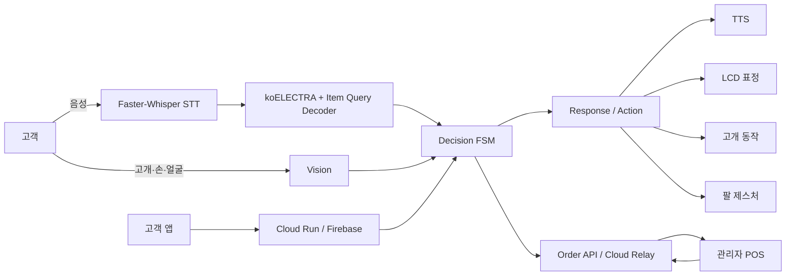
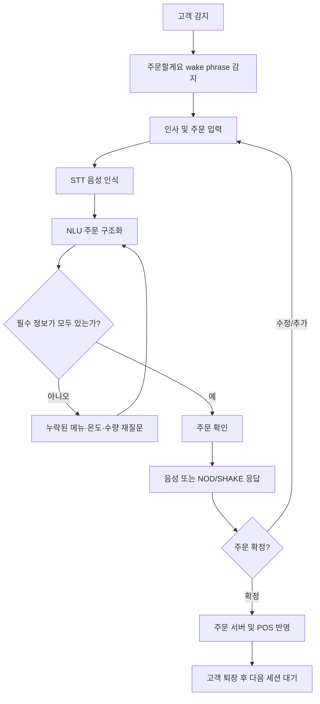

# 🎃 Pumpkin | 디지털 소외계층을 위한 Physical AI 무인매장 응대 로봇

> 2026년 한이음 드림업 공모전 프로젝트  
> 복잡한 키오스크 조작 대신 **음성·비언어 표현·얼굴 인식**을 활용해 자연스럽게 주문하고 안내받을 수 있는 ROS2 기반 Physical AI 카페 응대 로봇입니다.

---

## **🔎 평가용 저장소 빠른 안내**

- **통합 시연 실행**: `scripts/run_robot_with_monitor.sh`
- **ROS2 인식–판단–행동 파이프라인**: `ros2_ws/src/robot_controller/`
- **현재 NLU 추론 코드**: `nlu/`
- **KIPS Item Query 비교 실험**: `experiments/nlu/kips_2026_item_query/`
- **TOD SLM 학습·평가 코드**: `experiments/tod_slm/`
- **고객 앱**: `apps/customer-mobile/`
- **주문·고객·얼굴 API**: `api/`
- **서비스 메뉴 기준**: `config/menu_catalog.json`

> 제출용 공개 저장소에서는 임시 staging 파일, 중복 노트북, 과거 archive/legacy 코드, 재생성 가능한 중간 산출물을 제외했습니다.

---

## **💡1. 프로젝트 개요**

### **1-1. 프로젝트 소개**

- **프로젝트 명** : Pumpkin — 디지털 소외계층을 위한 Physical AI 무인매장 응대 로봇
- **프로젝트 정의** : 사용자의 음성, 고개 움직임, 손 제스처, 얼굴 정보를 인식하고 현재 대화 상태를 판단하여 주문·안내·개인화 서비스를 제공하는 Physical AI 기반 무인매장 응대 시스템
- **핵심 목표** : 사람이 기계 사용법을 익히는 대신, 로봇이 사람이 평소 사용하는 말과 행동을 이해하는 주문 인터페이스 구현

### **1-2. 개발 배경 및 필요성**

무인매장의 키오스크는 빠르고 효율적이지만, 화면 구성과 단계별 조작에 익숙하지 않은 사용자에게는 주문 과정 자체가 진입 장벽이 될 수 있습니다. Pumpkin은 이러한 문제를 줄이기 위해 사용자가 복잡한 UI를 직접 조작하지 않아도 **말하고, 끄덕이고, 손으로 표현하는 자연스러운 방식**으로 주문할 수 있도록 설계했습니다.

또한 단순 음성 주문에 그치지 않고, 주문 정보가 부족하면 다시 질문하고, 고객의 비언어적 반응을 현재 대화 맥락과 함께 해석하며, 로봇의 LCD 표정·고개·팔 동작과 고객 앱·POS까지 하나의 서비스 흐름으로 연결하는 것을 목표로 합니다.

### **1-3. 프로젝트 특장점**

- **멀티모달 상호작용** : 음성, NOD/SHAKE, 손 제스처를 하나의 주문 대화에서 함께 활용
- **자체 주문 NLU** : 직접 구축한 한국어 주문 데이터와 `koELECTRA + Item Query Decoder`를 이용해 복수 메뉴의 메뉴·온도·수량을 항목별로 구조화
- **FSM 기반 대화 제어** : 누락된 주문 정보를 임의로 채우지 않고 필요한 항목만 재질문하며, 현재 상태에 맞는 입력만 허용
- **Physical Interaction** : TTS뿐 아니라 LCD 표정, 고개 방향 전환, NOD/SHAKE, 팔 제스처를 함께 출력
- **얼굴 인식 기반 개인화** : 등록 고객을 실시간 식별하고 선호 메뉴 및 사전주문 정보를 연계
- **서비스 통합** : 고객 앱, Cloud Run/Firebase, Jetson 로봇, 관리자 POS의 주문 상태를 하나의 흐름으로 연결

### **1-4. 주요 기능**

- **일반 음성 주문** : Faster-Whisper STT와 NLU를 이용해 자연어 주문 인식
- **복수 주문 구조화** : 한 문장 안의 여러 메뉴를 각각의 메뉴·온도·수량으로 분리
- **누락 정보 재질문** : 메뉴, 온도, 수량 중 필요한 정보가 빠진 경우 해당 항목만 다시 질문
- **주문 확인·수정·취소** : FSM을 이용해 주문 확인, 수정, 추가 주문, 취소 흐름 관리
- **비언어 입력** : 주문 확인 단계의 NOD/SHAKE, 수량 질문 단계의 손가락 제스처를 실제 입력으로 사용
- **공간 안내** : 화장실·픽업대 등 위치를 음성과 고개·팔 동작으로 함께 안내
- **단골 고객 개인화** : 얼굴 임베딩 기반 고객 식별 후 선호 주문 제안
- **사전주문 픽업** : 앱 사전주문 상태를 조회하고 준비 완료 주문의 픽업 위치 안내
- **관리자 POS 연동** : `RECEIVED → PREPARING → READY → PICKED_UP` 주문 상태 관리

### **1-5. 기대 효과 및 활용 분야**

- **기대 효과**
  - 디지털 기기 사용에 익숙하지 않은 사용자의 무인매장 접근성 향상
  - 음성과 비언어 표현을 함께 활용한 자연스러운 주문 경험 제공
  - 반복적인 주문·안내 업무를 자동화하여 매장 운영 부담 완화
  - 고객 앱과 얼굴 인식을 연계한 개인화 서비스 제공

- **활용 분야**
  - 무인 카페 및 프랜차이즈 매장
  - 베이커리·편의점 등 반복적인 고객 응대가 필요한 리테일 매장
  - 도서관·병원·주민센터·터미널 등 공공시설 안내 서비스

### **1-6. 기술 스택**

| 구분 | 기술 |
|---|---|
| **Edge / Robot** | NVIDIA Jetson Orin Nano, ROS2 Humble, Python |
| **STT / TTS** | Faster-Whisper, VAD, eSpeak-NG |
| **NLU** | koELECTRA, PyTorch, Item Query Transformer Decoder |
| **Vision** | OpenCV, MediaPipe, InsightFace `buffalo_l` |
| **Robot UI / Control** | ESP32 LCD, Head Motion, Arm Gesture, ROS2 Topic |
| **Customer App** | React Native, Expo, TypeScript |
| **POS Web** | React, Vite, Express |
| **Backend / Cloud** | FastAPI, Google Cloud Run, Firebase Authentication, Firestore, Firebase Storage |
| **Data / Service** | Menu Catalog, Order API, Cloud Relay |

---

## **💡2. 팀원 소개(이름 기재 X)**

> 개인정보를 기재하지 않고 프로젝트의 주요 역할 영역을 중심으로 정리했습니다.

| 역할 영역 | 주요 담당 |
|---|---|
| **AI / NLU** | 주문 데이터 구축·전처리, koELECTRA 학습, Item Query Decoder, 주문 슬롯 검증 |
| **Robot / ROS2** | Decision FSM, Action Node, TTS/LCD/고개·팔 동작 통합, 실물 로봇 시연 |
| **Vision / Personalization** | 사람·고개·손 제스처 인식, 얼굴 임베딩 등록·식별, 개인화 응대 |
| **App / Cloud / POS** | 고객용 사전주문 앱, Firebase·Cloud Run 연동, 관리자 POS 및 주문 상태 관리 |
| **Mentoring** | 시스템 설계 및 기술 자문 |

---

## **💡3. 시스템 구성도**

### **3-1. 서비스 전체 구성**



### **3-2. 주문 처리 흐름**



### **3-3. 얼굴 등록 및 개인화 흐름**


---

## **💡4. 작품 소개영상**

> **작품 소개영상 공개 URL은 현재 저장소에서 확인되지 않아 아래 위치만 마련했습니다. 최종 제출 영상 URL 확정 후 링크를 교체하면 됩니다.**

**[🎬 Pumpkin 작품 소개영상 링크 추가 예정](영상_URL_입력)**

---

## **💡5. 핵심 소스코드**

### **5-1. FSM 기반 비언어 응답 처리**

- **소스 위치** : [`ros2_ws/src/robot_controller/robot_controller/decision_node_order_handoff.py`](ros2_ws/src/robot_controller/robot_controller/decision_node_order_handoff.py)
- **설명** : 사용자의 NOD/SHAKE를 항상 주문 입력으로 사용하는 것이 아니라, 주문 확인과 같은 **확인 상태에서만** 각각 `AFFIRM` / `DENY` 입력으로 변환합니다. 이를 통해 자연스러운 몸동작이 주문 흐름을 잘못 변경하는 것을 방지합니다.

```python
def make_user_gesture_decision(self, gesture: str):
    normalized = str(gesture or "").strip().upper()

    if normalized not in self.USER_GESTURES:
        return None
    if self.state not in self.CONFIRMATION_STATES:
        return None

    synthetic_input = {
        "intent": "AFFIRM" if normalized == "NOD" else "DENY",
        "input_modality": "VISION_GESTURE",
        "user_gesture": normalized,
        "confidence": 1.0,
    }

    if normalized == "NOD":
        return self.handle_affirm_intent(synthetic_input)
    return self.handle_deny_intent(synthetic_input)
```

### **5-2. 주문 NLU 모델**

- **비교 실험 및 재현 코드** : [`experiments/nlu/kips_2026_item_query/`](experiments/nlu/kips_2026_item_query/)
- **현재 추론 코드** : [`nlu/`](nlu/)
- **설명** : koELECTRA Encoder가 문장의 문맥 특징을 추출하고, 학습 가능한 Item Query를 Transformer Decoder에 입력하여 복수 주문의 **메뉴·온도·수량을 항목별로 예측**합니다.

### **5-3. 얼굴 등록 및 실시간 식별**

- **고객 앱** : [`apps/customer-mobile/`](apps/customer-mobile/)
- **Face Backend** : [`face_backend/`](face_backend/)
- **Jetson 실시간 인식** : [`ros2_ws/src/robot_controller/robot_controller/realtime_face_recognition.py`](ros2_ws/src/robot_controller/robot_controller/realtime_face_recognition.py)
- **설명** : 앱에서 촬영한 5방향 얼굴을 Cloud Run에서 512차원 임베딩으로 변환하고 평균 centroid를 Firestore에 저장합니다. Jetson은 실시간 얼굴 임베딩과 등록 정보를 비교하여 고객을 식별합니다.

---

## **📁 주요 디렉터리**

```text
pumpkin_public/
├── api/             # FastAPI 주문·고객·얼굴 API
├── apps/
│   ├── customer-mobile/  # 고객 앱
│   ├── pos-web/          # 관리자 POS
│   └── monitor-web/      # 로봇 5인치 고객 화면
├── cloud_relay/     # Cloud Run 주문 Relay
├── config/          # 메뉴 카탈로그 및 공통 설정
├── data/            # 제출본에 필요한 학습·테스트 데이터
├── experiments/     # KIPS NLU 비교 실험 및 TOD SLM 학습·평가
├── face_backend/    # 얼굴 임베딩 Cloud Run Backend
├── nlu/             # 현재 NLU 추론 코드
├── robot_face/      # ESP32 LCD 및 얼굴 표시 제어
├── ros2_ws/         # ROS2 기반 로봇 통합 Runtime
└── scripts/         # 실행·테스트·시연 스크립트
```

---

## **🔎 프로젝트 핵심 흐름 요약**

```text
고객 음성 / 비언어 입력
→ STT / Vision
→ NLU
→ FSM 기반 대화 상태 판단
→ TTS + LCD + 고개·팔 동작
→ 주문 서버 / POS

고객 앱 얼굴 등록 / 사전주문
→ Firebase / Cloud Run
→ Jetson 얼굴 인식 및 고객 식별
→ 개인화 주문 제안 / 사전주문 픽업 안내
```


---

## **🚀 실물 로봇 시연 실행**

Jetson Orin Nano에서 5인치 고객 화면과 ROS2 로봇 파이프라인을 함께 실행하는 최종 시연 진입점입니다.

```bash
cd ~/pumpkin
bash scripts/run_robot_with_monitor.sh
```

현재 production runtime은 STT, Vision, NLU, Decision FSM, TTS, LCD 표정, 고개·팔 제어를 ROS2로 통합합니다.

---

## **📚 전체 파일 가이드**

현재 `cleanup-hanium-submission` 브랜치에서 Git이 추적하는 **577개 파일 전체**를 폴더별로 정리했습니다. 각 파일명을 누르면 실제 소스로 이동합니다. 파일 역할은 현재 제출본의 코드 구조와 실행 경로를 기준으로 설명합니다.

<details>
<summary><strong>최상위(root)/</strong> — 저장소 전체 설정, 실행 환경, 최상위 문서 (13개)</summary>

| 파일 | 역할 | 크기 |
|---|---|---:|
| [`.dockerignore`](.dockerignore) | Docker 이미지 빌드 시 컨텍스트에서 제외할 파일/폴더 규칙입니다. | 97 B |
| [`.gitignore`](.gitignore) | Git에 추적하지 않을 가상환경, 모델 가중치, 빌드 산출물, 재생성 데이터 등을 정의합니다. | 1.2 KB |
| [`Dockerfile`](Dockerfile) | 기본 Python/백엔드 실행 환경을 컨테이너 이미지로 만드는 Dockerfile입니다. | 325 B |
| [`Dockerfile.face`](Dockerfile.face) | 얼굴 인식/임베딩 백엔드용 별도 Docker 이미지 정의입니다. | 946 B |
| [`firebase.json`](firebase.json) | Firebase CLI가 사용할 프로젝트 배포 설정입니다. | 56 B |
| [`firestore.rules`](firestore.rules) | Firestore 데이터 접근 권한을 제어하는 보안 규칙입니다. | 547 B |
| [`JETSON_RUNTIME_README.md`](JETSON_RUNTIME_README.md) | Jetson Orin Nano에서 Pumpkin runtime을 준비하고 실행하는 방법을 정리한 문서입니다. | 3.1 KB |
| [`pixi.lock`](pixi.lock) | Pixi 환경의 의존성 버전을 고정한 lock 파일입니다. | 514.6 KB |
| [`pixi.toml`](pixi.toml) | Pixi 기반 개발 환경과 의존성 정의 파일입니다. | 1.6 KB |
| [`README.md`](README.md) | 한이음 제출용 프로젝트 소개, 구조, 핵심 기능과 전체 파일 가이드를 담는 최상위 문서입니다. | 11.9 KB |
| [`requirements-face-recognition.txt`](requirements-face-recognition.txt) | 얼굴 인식 기능에 필요한 Python 의존성 목록입니다. | 279 B |
| [`requirements.txt`](requirements.txt) | 저장소 공통 Python 의존성 목록입니다. | 205 B |
| [`run_customer_mobile_windows.cmd`](run_customer_mobile_windows.cmd) | Windows에서 고객 모바일 앱 실행 절차를 시작하는 편의 실행 파일입니다. | 339 B |

</details>

<details>
<summary><strong>.github/</strong> — GitHub Actions 자동 검증/CI (4개)</summary>

| 파일 | 역할 | 크기 |
|---|---|---:|
| [`.github/workflows/customer-mobile-check.yml`](.github/workflows/customer-mobile-check.yml) | 고객 모바일 앱의 설치·TypeScript·Expo 환경을 자동 검증하는 GitHub Actions workflow입니다. | 808 B |
| [`.github/workflows/demo-web-check.yml`](.github/workflows/demo-web-check.yml) | 시연용 웹 애플리케이션의 빌드/정적 검사를 자동 수행하는 GitHub Actions workflow입니다. | 1.2 KB |
| [`.github/workflows/face-backend-check.yml`](.github/workflows/face-backend-check.yml) | 얼굴 임베딩 백엔드의 코드와 의존성을 자동 검증하는 GitHub Actions workflow입니다. | 781 B |
| [`.github/workflows/validate_tod_training.yml`](.github/workflows/validate_tod_training.yml) | TOD SLM 학습·평가 코드의 문법과 데이터 계약을 자동 검증하는 GitHub Actions workflow입니다. | 1.8 KB |

</details>

<details>
<summary><strong>api/</strong> — FastAPI 기반 주문·고객·얼굴 관련 백엔드 API (22개)</summary>

| 파일 | 역할 | 크기 |
|---|---|---:|
| [`api/__init__.py`](api/__init__.py) | 이 디렉터리를 Python 패키지로 인식시키고 패키지 초기화를 담당합니다. | 55 B |
| [`api/customer_store.py`](api/customer_store.py) | customer store 관련 주문·고객·얼굴 백엔드 로직을 구현한 Python 모듈입니다. | 5.3 KB |
| [`api/face_embedding_service.py`](api/face_embedding_service.py) | face embedding service 관련 주문·고객·얼굴 백엔드 로직을 구현한 Python 모듈입니다. | 11.9 KB |
| [`api/face_enrollment_store.py`](api/face_enrollment_store.py) | face enrollment store 관련 주문·고객·얼굴 백엔드 로직을 구현한 Python 모듈입니다. | 8.5 KB |
| [`api/face_pipeline.py`](api/face_pipeline.py) | face pipeline 관련 주문·고객·얼굴 백엔드 로직을 구현한 Python 모듈입니다. | 2.3 KB |
| [`api/firebase_face_backend.py`](api/firebase_face_backend.py) | firebase face backend 관련 주문·고객·얼굴 백엔드 로직을 구현한 Python 모듈입니다. | 5.5 KB |
| [`api/main.py`](api/main.py) | FastAPI 애플리케이션의 주요 엔트리포인트로 주문·고객·얼굴 관련 API를 구성합니다. | 10.8 KB |
| [`api/repositories/__init__.py`](api/repositories/__init__.py) | 이 디렉터리를 Python 패키지로 인식시키고 패키지 초기화를 담당합니다. | 0 B |
| [`api/repositories/base.py`](api/repositories/base.py) | base 데이터 저장소 접근을 캡슐화하여 API와 DB 구현을 분리하는 repository 계층입니다. | 581 B |
| [`api/repositories/sqlite_order_repository.py`](api/repositories/sqlite_order_repository.py) | sqlite order repository 데이터 저장소 접근을 캡슐화하여 API와 DB 구현을 분리하는 repository 계층입니다. | 7.5 KB |
| [`api/requirements.txt`](api/requirements.txt) | 이 기능/실험을 실행하는 데 필요한 Python 패키지 의존성을 정의합니다. | 155 B |
| [`api/ros_bridge.py`](api/ros_bridge.py) | ros bridge 관련 주문·고객·얼굴 백엔드 로직을 구현한 Python 모듈입니다. | 11.7 KB |
| [`api/ros_process_manager.py`](api/ros_process_manager.py) | ros process manager 관련 주문·고객·얼굴 백엔드 로직을 구현한 Python 모듈입니다. | 3.3 KB |
| [`api/routers/__init__.py`](api/routers/__init__.py) | 이 디렉터리를 Python 패키지로 인식시키고 패키지 초기화를 담당합니다. | 0 B |
| [`api/routers/face_embeddings.py`](api/routers/face_embeddings.py) | face embeddings 기능의 FastAPI HTTP endpoint를 정의하는 router입니다. | 1.8 KB |
| [`api/routers/faces.py`](api/routers/faces.py) | faces 기능의 FastAPI HTTP endpoint를 정의하는 router입니다. | 1020 B |
| [`api/routers/orders.py`](api/routers/orders.py) | orders 기능의 FastAPI HTTP endpoint를 정의하는 router입니다. | 2.0 KB |
| [`api/schemas/__init__.py`](api/schemas/__init__.py) | 이 디렉터리를 Python 패키지로 인식시키고 패키지 초기화를 담당합니다. | 0 B |
| [`api/schemas/order.py`](api/schemas/order.py) | order 관련 주문·고객·얼굴 백엔드 로직을 구현한 Python 모듈입니다. | 1.8 KB |
| [`api/services/__init__.py`](api/services/__init__.py) | 이 디렉터리를 Python 패키지로 인식시키고 패키지 초기화를 담당합니다. | 0 B |
| [`api/services/order_service.py`](api/services/order_service.py) | order service 관련 주문·고객·얼굴 백엔드 로직을 구현한 Python 모듈입니다. | 1.5 KB |
| [`api/web_main.py`](api/web_main.py) | web main 관련 주문·고객·얼굴 백엔드 로직을 구현한 Python 모듈입니다. | 2.2 KB |

</details>

<details>
<summary><strong>apps/</strong> — 고객 모바일 앱, POS, 로봇 모니터 등 사용자 애플리케이션 (145개)</summary>

| 파일 | 역할 | 크기 |
|---|---|---:|
| [`apps/customer-mobile/.env.example`](apps/customer-mobile/.env.example) | 실제 비밀값 없이 필요한 환경변수 이름과 공개 설정 예시를 제공합니다. | 896 B |
| [`apps/customer-mobile/.gitignore`](apps/customer-mobile/.gitignore) |  프로젝트에서 사용하는 소스·설정·데이터 파일입니다. | 8 B |
| [`apps/customer-mobile/app.json`](apps/customer-mobile/app.json) | Expo/React Native 앱의 이름, 플랫폼, 권한 등 앱 설정을 정의합니다. | 737 B |
| [`apps/customer-mobile/App.tsx`](apps/customer-mobile/App.tsx) | 고객 모바일 앱의 App React Native 화면 또는 앱 진입 컴포넌트입니다. | 50 B |
| [`apps/customer-mobile/ATTRIBUTIONS.md`](apps/customer-mobile/ATTRIBUTIONS.md) | ATTRIBUTIONS 관련 프로젝트 문서입니다. | 290 B |
| [`apps/customer-mobile/FaceEnrollmentDemoApp.tsx`](apps/customer-mobile/FaceEnrollmentDemoApp.tsx) | 고객 모바일 앱의 FaceEnrollmentDemoApp React Native 화면 또는 앱 진입 컴포넌트입니다. | 9.5 KB |
| [`apps/customer-mobile/guidelines/Guidelines.md`](apps/customer-mobile/guidelines/Guidelines.md) | Guidelines 관련 프로젝트 문서입니다. | 2.5 KB |
| [`apps/customer-mobile/index.html`](apps/customer-mobile/index.html) | index 웹 화면의 HTML 문서입니다. | 701 B |
| [`apps/customer-mobile/index.ts`](apps/customer-mobile/index.ts) | 고객 모바일 앱에서 사용하는 index TypeScript 로직/타입 모듈입니다. | 487 B |
| [`apps/customer-mobile/package.json`](apps/customer-mobile/package.json) | 해당 JavaScript/TypeScript 앱의 npm 의존성과 실행 명령을 정의합니다. | 920 B |
| [`apps/customer-mobile/postcss.config.mjs`](apps/customer-mobile/postcss.config.mjs) | postcss.config 프로젝트에서 사용하는 소스·설정·데이터 파일입니다. | 68 B |
| [`apps/customer-mobile/README.md`](apps/customer-mobile/README.md) | 해당 애플리케이션의 역할, 설정과 실행 방법을 설명합니다. | 4.4 KB |
| [`apps/customer-mobile/src/api/faceEnrollmentApi.ts`](apps/customer-mobile/src/api/faceEnrollmentApi.ts) | 고객 모바일 앱에서 faceEnrollmentApi 백엔드 API를 호출하기 위한 클라이언트 모듈입니다. | 3.0 KB |
| [`apps/customer-mobile/src/api/faceProfileApi.ts`](apps/customer-mobile/src/api/faceProfileApi.ts) | 고객 모바일 앱에서 faceProfileApi 백엔드 API를 호출하기 위한 클라이언트 모듈입니다. | 3.7 KB |
| [`apps/customer-mobile/src/api/orderApi.ts`](apps/customer-mobile/src/api/orderApi.ts) | 고객 모바일 앱에서 orderApi 백엔드 API를 호출하기 위한 클라이언트 모듈입니다. | 3.3 KB |
| [`apps/customer-mobile/src/app/App.tsx`](apps/customer-mobile/src/app/App.tsx) | 고객 모바일 앱의 App React Native 화면 또는 앱 진입 컴포넌트입니다. | 275 B |
| [`apps/customer-mobile/src/app/Attributions.md`](apps/customer-mobile/src/app/Attributions.md) | Attributions 관련 프로젝트 문서입니다. | 289 B |
| [`apps/customer-mobile/src/app/components/AboutUs.tsx`](apps/customer-mobile/src/app/components/AboutUs.tsx) | 고객 모바일 앱의 AboutUs 재사용 컴포넌트입니다. | 6.6 KB |
| [`apps/customer-mobile/src/app/components/AdvancedProductCatalog.tsx`](apps/customer-mobile/src/app/components/AdvancedProductCatalog.tsx) | 고객 모바일 앱의 AdvancedProductCatalog 재사용 컴포넌트입니다. | 22.4 KB |
| [`apps/customer-mobile/src/app/components/AuthScreen.tsx`](apps/customer-mobile/src/app/components/AuthScreen.tsx) | 고객 모바일 앱의 AuthScreen 재사용 컴포넌트입니다. | 20.6 KB |
| [`apps/customer-mobile/src/app/components/BlogSection.tsx`](apps/customer-mobile/src/app/components/BlogSection.tsx) | 고객 모바일 앱의 BlogSection 재사용 컴포넌트입니다. | 14.1 KB |
| [`apps/customer-mobile/src/app/components/BottomNavigation.tsx`](apps/customer-mobile/src/app/components/BottomNavigation.tsx) | 고객 모바일 앱의 BottomNavigation 재사용 컴포넌트입니다. | 2.5 KB |
| [`apps/customer-mobile/src/app/components/Cart.tsx`](apps/customer-mobile/src/app/components/Cart.tsx) | 고객 모바일 앱의 Cart 재사용 컴포넌트입니다. | 5.0 KB |
| [`apps/customer-mobile/src/app/components/Checkout.tsx`](apps/customer-mobile/src/app/components/Checkout.tsx) | 고객 모바일 앱의 Checkout 재사용 컴포넌트입니다. | 7.2 KB |
| [`apps/customer-mobile/src/app/components/Contact.tsx`](apps/customer-mobile/src/app/components/Contact.tsx) | 고객 모바일 앱의 Contact 재사용 컴포넌트입니다. | 6.2 KB |
| [`apps/customer-mobile/src/app/components/EnhancedHomeScreen.tsx`](apps/customer-mobile/src/app/components/EnhancedHomeScreen.tsx) | 고객 모바일 앱의 EnhancedHomeScreen 재사용 컴포넌트입니다. | 16.2 KB |
| [`apps/customer-mobile/src/app/components/EnhancedProductDetails.tsx`](apps/customer-mobile/src/app/components/EnhancedProductDetails.tsx) | 고객 모바일 앱의 EnhancedProductDetails 재사용 컴포넌트입니다. | 23.4 KB |
| [`apps/customer-mobile/src/app/components/figma/ImageWithFallback.tsx`](apps/customer-mobile/src/app/components/figma/ImageWithFallback.tsx) | 고객 모바일 앱의 ImageWithFallback 재사용 컴포넌트입니다. | 1.1 KB |
| [`apps/customer-mobile/src/app/components/Footer.tsx`](apps/customer-mobile/src/app/components/Footer.tsx) | 고객 모바일 앱의 Footer 재사용 컴포넌트입니다. | 21.8 KB |
| [`apps/customer-mobile/src/app/components/Header.tsx`](apps/customer-mobile/src/app/components/Header.tsx) | 고객 모바일 앱의 Header 재사용 컴포넌트입니다. | 14.5 KB |
| [`apps/customer-mobile/src/app/components/HomeScreen.tsx`](apps/customer-mobile/src/app/components/HomeScreen.tsx) | 고객 모바일 앱의 HomeScreen 재사용 컴포넌트입니다. | 5.9 KB |
| [`apps/customer-mobile/src/app/components/LoyaltyProgram.tsx`](apps/customer-mobile/src/app/components/LoyaltyProgram.tsx) | 고객 모바일 앱의 LoyaltyProgram 재사용 컴포넌트입니다. | 6.5 KB |
| [`apps/customer-mobile/src/app/components/ProductCatalog.tsx`](apps/customer-mobile/src/app/components/ProductCatalog.tsx) | 고객 모바일 앱의 ProductCatalog 재사용 컴포넌트입니다. | 7.3 KB |
| [`apps/customer-mobile/src/app/components/ProductDetails.tsx`](apps/customer-mobile/src/app/components/ProductDetails.tsx) | 고객 모바일 앱의 ProductDetails 재사용 컴포넌트입니다. | 9.3 KB |
| [`apps/customer-mobile/src/app/components/ui/accordion.tsx`](apps/customer-mobile/src/app/components/ui/accordion.tsx) | 고객 모바일 앱에서 재사용하는 accordion UI 컴포넌트입니다. | 2.0 KB |
| [`apps/customer-mobile/src/app/components/ui/alert-dialog.tsx`](apps/customer-mobile/src/app/components/ui/alert-dialog.tsx) | 고객 모바일 앱에서 재사용하는 alert dialog UI 컴포넌트입니다. | 3.8 KB |
| [`apps/customer-mobile/src/app/components/ui/alert.tsx`](apps/customer-mobile/src/app/components/ui/alert.tsx) | 고객 모바일 앱에서 재사용하는 alert UI 컴포넌트입니다. | 1.6 KB |
| [`apps/customer-mobile/src/app/components/ui/aspect-ratio.tsx`](apps/customer-mobile/src/app/components/ui/aspect-ratio.tsx) | 고객 모바일 앱에서 재사용하는 aspect ratio UI 컴포넌트입니다. | 290 B |
| [`apps/customer-mobile/src/app/components/ui/avatar.tsx`](apps/customer-mobile/src/app/components/ui/avatar.tsx) | 고객 모바일 앱에서 재사용하는 avatar UI 컴포넌트입니다. | 1.1 KB |
| [`apps/customer-mobile/src/app/components/ui/badge.tsx`](apps/customer-mobile/src/app/components/ui/badge.tsx) | 고객 모바일 앱에서 재사용하는 badge UI 컴포넌트입니다. | 1.6 KB |
| [`apps/customer-mobile/src/app/components/ui/breadcrumb.tsx`](apps/customer-mobile/src/app/components/ui/breadcrumb.tsx) | 고객 모바일 앱에서 재사용하는 breadcrumb UI 컴포넌트입니다. | 2.3 KB |
| [`apps/customer-mobile/src/app/components/ui/button.tsx`](apps/customer-mobile/src/app/components/ui/button.tsx) | 고객 모바일 앱에서 재사용하는 button UI 컴포넌트입니다. | 2.2 KB |
| [`apps/customer-mobile/src/app/components/ui/calendar.tsx`](apps/customer-mobile/src/app/components/ui/calendar.tsx) | 고객 모바일 앱에서 재사용하는 calendar UI 컴포넌트입니다. | 2.9 KB |
| [`apps/customer-mobile/src/app/components/ui/card.tsx`](apps/customer-mobile/src/app/components/ui/card.tsx) | 고객 모바일 앱에서 재사용하는 card UI 컴포넌트입니다. | 1.9 KB |
| [`apps/customer-mobile/src/app/components/ui/carousel.tsx`](apps/customer-mobile/src/app/components/ui/carousel.tsx) | 고객 모바일 앱에서 재사용하는 carousel UI 컴포넌트입니다. | 5.5 KB |
| [`apps/customer-mobile/src/app/components/ui/chart.tsx`](apps/customer-mobile/src/app/components/ui/chart.tsx) | 고객 모바일 앱에서 재사용하는 chart UI 컴포넌트입니다. | 9.6 KB |
| [`apps/customer-mobile/src/app/components/ui/checkbox.tsx`](apps/customer-mobile/src/app/components/ui/checkbox.tsx) | 고객 모바일 앱에서 재사용하는 checkbox UI 컴포넌트입니다. | 1.2 KB |
| [`apps/customer-mobile/src/app/components/ui/collapsible.tsx`](apps/customer-mobile/src/app/components/ui/collapsible.tsx) | 고객 모바일 앱에서 재사용하는 collapsible UI 컴포넌트입니다. | 812 B |
| [`apps/customer-mobile/src/app/components/ui/command.tsx`](apps/customer-mobile/src/app/components/ui/command.tsx) | 고객 모바일 앱에서 재사용하는 command UI 컴포넌트입니다. | 4.6 KB |
| [`apps/customer-mobile/src/app/components/ui/context-menu.tsx`](apps/customer-mobile/src/app/components/ui/context-menu.tsx) | 고객 모바일 앱에서 재사용하는 context menu UI 컴포넌트입니다. | 8.1 KB |
| [`apps/customer-mobile/src/app/components/ui/dialog.tsx`](apps/customer-mobile/src/app/components/ui/dialog.tsx) | 고객 모바일 앱에서 재사용하는 dialog UI 컴포넌트입니다. | 3.8 KB |
| [`apps/customer-mobile/src/app/components/ui/drawer.tsx`](apps/customer-mobile/src/app/components/ui/drawer.tsx) | 고객 모바일 앱에서 재사용하는 drawer UI 컴포넌트입니다. | 4.0 KB |
| [`apps/customer-mobile/src/app/components/ui/dropdown-menu.tsx`](apps/customer-mobile/src/app/components/ui/dropdown-menu.tsx) | 고객 모바일 앱에서 재사용하는 dropdown menu UI 컴포넌트입니다. | 8.1 KB |
| [`apps/customer-mobile/src/app/components/ui/form.tsx`](apps/customer-mobile/src/app/components/ui/form.tsx) | 고객 모바일 앱에서 재사용하는 form UI 컴포넌트입니다. | 3.7 KB |
| [`apps/customer-mobile/src/app/components/ui/hover-card.tsx`](apps/customer-mobile/src/app/components/ui/hover-card.tsx) | 고객 모바일 앱에서 재사용하는 hover card UI 컴포넌트입니다. | 1.5 KB |
| [`apps/customer-mobile/src/app/components/ui/input-otp.tsx`](apps/customer-mobile/src/app/components/ui/input-otp.tsx) | 고객 모바일 앱에서 재사용하는 input otp UI 컴포넌트입니다. | 2.2 KB |
| [`apps/customer-mobile/src/app/components/ui/input.tsx`](apps/customer-mobile/src/app/components/ui/input.tsx) | 고객 모바일 앱에서 재사용하는 input UI 컴포넌트입니다. | 963 B |
| [`apps/customer-mobile/src/app/components/ui/label.tsx`](apps/customer-mobile/src/app/components/ui/label.tsx) | 고객 모바일 앱에서 재사용하는 label UI 컴포넌트입니다. | 620 B |
| [`apps/customer-mobile/src/app/components/ui/menubar.tsx`](apps/customer-mobile/src/app/components/ui/menubar.tsx) | 고객 모바일 앱에서 재사용하는 menubar UI 컴포넌트입니다. | 8.2 KB |
| [`apps/customer-mobile/src/app/components/ui/navigation-menu.tsx`](apps/customer-mobile/src/app/components/ui/navigation-menu.tsx) | 고객 모바일 앱에서 재사용하는 navigation menu UI 컴포넌트입니다. | 6.5 KB |
| [`apps/customer-mobile/src/app/components/ui/pagination.tsx`](apps/customer-mobile/src/app/components/ui/pagination.tsx) | 고객 모바일 앱에서 재사용하는 pagination UI 컴포넌트입니다. | 2.7 KB |
| [`apps/customer-mobile/src/app/components/ui/popover.tsx`](apps/customer-mobile/src/app/components/ui/popover.tsx) | 고객 모바일 앱에서 재사용하는 popover UI 컴포넌트입니다. | 1.6 KB |
| [`apps/customer-mobile/src/app/components/ui/progress.tsx`](apps/customer-mobile/src/app/components/ui/progress.tsx) | 고객 모바일 앱에서 재사용하는 progress UI 컴포넌트입니다. | 749 B |
| [`apps/customer-mobile/src/app/components/ui/radio-group.tsx`](apps/customer-mobile/src/app/components/ui/radio-group.tsx) | 고객 모바일 앱에서 재사용하는 radio group UI 컴포넌트입니다. | 1.5 KB |
| [`apps/customer-mobile/src/app/components/ui/resizable.tsx`](apps/customer-mobile/src/app/components/ui/resizable.tsx) | 고객 모바일 앱에서 재사용하는 resizable UI 컴포넌트입니다. | 2.0 KB |
| [`apps/customer-mobile/src/app/components/ui/scroll-area.tsx`](apps/customer-mobile/src/app/components/ui/scroll-area.tsx) | 고객 모바일 앱에서 재사용하는 scroll area UI 컴포넌트입니다. | 1.6 KB |
| [`apps/customer-mobile/src/app/components/ui/select.tsx`](apps/customer-mobile/src/app/components/ui/select.tsx) | 고객 모바일 앱에서 재사용하는 select UI 컴포넌트입니다. | 6.1 KB |
| [`apps/customer-mobile/src/app/components/ui/separator.tsx`](apps/customer-mobile/src/app/components/ui/separator.tsx) | 고객 모바일 앱에서 재사용하는 separator UI 컴포넌트입니다. | 713 B |
| [`apps/customer-mobile/src/app/components/ui/sheet.tsx`](apps/customer-mobile/src/app/components/ui/sheet.tsx) | 고객 모바일 앱에서 재사용하는 sheet UI 컴포넌트입니다. | 4.0 KB |
| [`apps/customer-mobile/src/app/components/ui/sidebar.tsx`](apps/customer-mobile/src/app/components/ui/sidebar.tsx) | 고객 모바일 앱에서 재사용하는 sidebar UI 컴포넌트입니다. | 21.2 KB |
| [`apps/customer-mobile/src/app/components/ui/skeleton.tsx`](apps/customer-mobile/src/app/components/ui/skeleton.tsx) | 고객 모바일 앱에서 재사용하는 skeleton UI 컴포넌트입니다. | 275 B |
| [`apps/customer-mobile/src/app/components/ui/slider.tsx`](apps/customer-mobile/src/app/components/ui/slider.tsx) | 고객 모바일 앱에서 재사용하는 slider UI 컴포넌트입니다. | 2.0 KB |
| [`apps/customer-mobile/src/app/components/ui/sonner.tsx`](apps/customer-mobile/src/app/components/ui/sonner.tsx) | 고객 모바일 앱에서 재사용하는 sonner UI 컴포넌트입니다. | 583 B |
| [`apps/customer-mobile/src/app/components/ui/switch.tsx`](apps/customer-mobile/src/app/components/ui/switch.tsx) | 고객 모바일 앱에서 재사용하는 switch UI 컴포넌트입니다. | 1.2 KB |
| [`apps/customer-mobile/src/app/components/ui/table.tsx`](apps/customer-mobile/src/app/components/ui/table.tsx) | 고객 모바일 앱에서 재사용하는 table UI 컴포넌트입니다. | 2.4 KB |
| [`apps/customer-mobile/src/app/components/ui/tabs.tsx`](apps/customer-mobile/src/app/components/ui/tabs.tsx) | 고객 모바일 앱에서 재사용하는 tabs UI 컴포넌트입니다. | 1.9 KB |
| [`apps/customer-mobile/src/app/components/ui/textarea.tsx`](apps/customer-mobile/src/app/components/ui/textarea.tsx) | 고객 모바일 앱에서 재사용하는 textarea UI 컴포넌트입니다. | 767 B |
| [`apps/customer-mobile/src/app/components/ui/toggle-group.tsx`](apps/customer-mobile/src/app/components/ui/toggle-group.tsx) | 고객 모바일 앱에서 재사용하는 toggle group UI 컴포넌트입니다. | 1.9 KB |
| [`apps/customer-mobile/src/app/components/ui/toggle.tsx`](apps/customer-mobile/src/app/components/ui/toggle.tsx) | 고객 모바일 앱에서 재사용하는 toggle UI 컴포넌트입니다. | 1.5 KB |
| [`apps/customer-mobile/src/app/components/ui/tooltip.tsx`](apps/customer-mobile/src/app/components/ui/tooltip.tsx) | 고객 모바일 앱에서 재사용하는 tooltip UI 컴포넌트입니다. | 1.9 KB |
| [`apps/customer-mobile/src/app/components/ui/use-mobile.ts`](apps/customer-mobile/src/app/components/ui/use-mobile.ts) | 고객 모바일 앱에서 재사용하는 use mobile UI 컴포넌트입니다. | 585 B |
| [`apps/customer-mobile/src/app/components/ui/utils.ts`](apps/customer-mobile/src/app/components/ui/utils.ts) | 고객 모바일 앱에서 재사용하는 utils UI 컴포넌트입니다. | 169 B |
| [`apps/customer-mobile/src/app/components/UserProfile.tsx`](apps/customer-mobile/src/app/components/UserProfile.tsx) | 고객 모바일 앱의 UserProfile 재사용 컴포넌트입니다. | 21.0 KB |
| [`apps/customer-mobile/src/app/src/context/CartContext.tsx`](apps/customer-mobile/src/app/src/context/CartContext.tsx) | 고객 모바일 앱의 CartContext React Native 화면 또는 앱 진입 컴포넌트입니다. | 1.6 KB |
| [`apps/customer-mobile/src/app/src/data/menu.ts`](apps/customer-mobile/src/app/src/data/menu.ts) | 고객 모바일 앱에서 사용하는 menu TypeScript 로직/타입 모듈입니다. | 2.0 KB |
| [`apps/customer-mobile/src/app/src/layouts/MobileLayout.tsx`](apps/customer-mobile/src/app/src/layouts/MobileLayout.tsx) | 고객 모바일 앱의 MobileLayout React Native 화면 또는 앱 진입 컴포넌트입니다. | 3.8 KB |
| [`apps/customer-mobile/src/app/src/pages/Cart.tsx`](apps/customer-mobile/src/app/src/pages/Cart.tsx) | 고객 모바일 앱의 Cart React Native 화면 또는 앱 진입 컴포넌트입니다. | 7.0 KB |
| [`apps/customer-mobile/src/app/src/pages/Home.tsx`](apps/customer-mobile/src/app/src/pages/Home.tsx) | 고객 모바일 앱의 Home React Native 화면 또는 앱 진입 컴포넌트입니다. | 5.2 KB |
| [`apps/customer-mobile/src/app/src/pages/Order.tsx`](apps/customer-mobile/src/app/src/pages/Order.tsx) | 고객 모바일 앱의 Order React Native 화면 또는 앱 진입 컴포넌트입니다. | 3.2 KB |
| [`apps/customer-mobile/src/app/src/pages/ProductDetail.tsx`](apps/customer-mobile/src/app/src/pages/ProductDetail.tsx) | 고객 모바일 앱의 ProductDetail React Native 화면 또는 앱 진입 컴포넌트입니다. | 7.5 KB |
| [`apps/customer-mobile/src/app/src/routes.tsx`](apps/customer-mobile/src/app/src/routes.tsx) | 고객 모바일 앱의 routes React Native 화면 또는 앱 진입 컴포넌트입니다. | 1020 B |
| [`apps/customer-mobile/src/assets/a036880becd196a5d2e97bf1f820e1310f4579dc.png`](apps/customer-mobile/src/assets/a036880becd196a5d2e97bf1f820e1310f4579dc.png) | a036880becd196a5d2e97bf1f820e1310f4579dc UI/문서에서 사용하는 이미지 자산입니다. | 7.8 KB |
| [`apps/customer-mobile/src/auth/AuthProvider.tsx`](apps/customer-mobile/src/auth/AuthProvider.tsx) | 고객 모바일 앱의 AuthProvider 인증 상태와 로그인 흐름을 관리합니다. | 2.7 KB |
| [`apps/customer-mobile/src/components/FaceCameraView.tsx`](apps/customer-mobile/src/components/FaceCameraView.tsx) | 고객 모바일 앱의 FaceCameraView 재사용 컴포넌트입니다. | 8.4 KB |
| [`apps/customer-mobile/src/components/FaceGuideOverlay.tsx`](apps/customer-mobile/src/components/FaceGuideOverlay.tsx) | 고객 모바일 앱의 FaceGuideOverlay 재사용 컴포넌트입니다. | 2.0 KB |
| [`apps/customer-mobile/src/components/RegistrationStatusBadge.tsx`](apps/customer-mobile/src/components/RegistrationStatusBadge.tsx) | 고객 모바일 앱의 RegistrationStatusBadge 재사용 컴포넌트입니다. | 1.4 KB |
| [`apps/customer-mobile/src/CustomerMobileApp.tsx`](apps/customer-mobile/src/CustomerMobileApp.tsx) | 고객 모바일 앱의 CustomerMobileApp React Native 화면 또는 앱 진입 컴포넌트입니다. | 28.0 KB |
| [`apps/customer-mobile/src/firebase/config.ts`](apps/customer-mobile/src/firebase/config.ts) | 고객 모바일 앱의 config Firebase 연동 로직을 구현합니다. | 1.2 KB |
| [`apps/customer-mobile/src/firebase/faceEmbeddingBackend.ts`](apps/customer-mobile/src/firebase/faceEmbeddingBackend.ts) | 고객 모바일 앱의 faceEmbeddingBackend Firebase 연동 로직을 구현합니다. | 2.3 KB |
| [`apps/customer-mobile/src/firebase/faceEnrollment.ts`](apps/customer-mobile/src/firebase/faceEnrollment.ts) | 고객 모바일 앱의 faceEnrollment Firebase 연동 로직을 구현합니다. | 5.2 KB |
| [`apps/customer-mobile/src/FirebaseAuthRoot.tsx`](apps/customer-mobile/src/FirebaseAuthRoot.tsx) | 고객 모바일 앱의 FirebaseAuthRoot React Native 화면 또는 앱 진입 컴포넌트입니다. | 1.3 KB |
| [`apps/customer-mobile/src/main.tsx`](apps/customer-mobile/src/main.tsx) | 고객 모바일 앱의 main React Native 화면 또는 앱 진입 컴포넌트입니다. | 183 B |
| [`apps/customer-mobile/src/native/CareScreen.tsx`](apps/customer-mobile/src/native/CareScreen.tsx) | 고객 모바일 앱의 네이티브 주문 화면에서 사용하는 CareScreen 데이터/타입/기능입니다. | 11.1 KB |
| [`apps/customer-mobile/src/native/menuData.ts`](apps/customer-mobile/src/native/menuData.ts) | 고객 모바일 앱의 네이티브 주문 화면에서 사용하는 menuData 데이터/타입/기능입니다. | 1.6 KB |
| [`apps/customer-mobile/src/native/theme.ts`](apps/customer-mobile/src/native/theme.ts) | 고객 모바일 앱의 네이티브 주문 화면에서 사용하는 theme 데이터/타입/기능입니다. | 325 B |
| [`apps/customer-mobile/src/native/types.ts`](apps/customer-mobile/src/native/types.ts) | 고객 모바일 앱의 네이티브 주문 화면에서 사용하는 types 데이터/타입/기능입니다. | 741 B |
| [`apps/customer-mobile/src/screens/AuthScreen.tsx`](apps/customer-mobile/src/screens/AuthScreen.tsx) | 고객 모바일 앱의 AuthScreen 화면 UI와 사용자 상호작용을 구현합니다. | 5.1 KB |
| [`apps/customer-mobile/src/screens/FaceCaptureScreen.tsx`](apps/customer-mobile/src/screens/FaceCaptureScreen.tsx) | 고객 모바일 앱의 FaceCaptureScreen 화면 UI와 사용자 상호작용을 구현합니다. | 8.8 KB |
| [`apps/customer-mobile/src/screens/FaceConsentScreen.tsx`](apps/customer-mobile/src/screens/FaceConsentScreen.tsx) | 고객 모바일 앱의 FaceConsentScreen 화면 UI와 사용자 상호작용을 구현합니다. | 11.7 KB |
| [`apps/customer-mobile/src/screens/FaceRegistrationResultScreen.tsx`](apps/customer-mobile/src/screens/FaceRegistrationResultScreen.tsx) | 고객 모바일 앱의 FaceRegistrationResultScreen 화면 UI와 사용자 상호작용을 구현합니다. | 3.4 KB |
| [`apps/customer-mobile/src/screens/ProfileScreen.tsx`](apps/customer-mobile/src/screens/ProfileScreen.tsx) | 고객 모바일 앱의 ProfileScreen 화면 UI와 사용자 상호작용을 구현합니다. | 10.5 KB |
| [`apps/customer-mobile/src/styles/default_theme.css`](apps/customer-mobile/src/styles/default_theme.css) | 고객 모바일 앱 웹 렌더링에 사용하는 default theme 스타일 정의입니다. | 4.2 KB |
| [`apps/customer-mobile/src/styles/globals.css`](apps/customer-mobile/src/styles/globals.css) | 고객 모바일 앱 웹 렌더링에 사용하는 globals 스타일 정의입니다. | 7.7 KB |
| [`apps/customer-mobile/src/styles/index.css`](apps/customer-mobile/src/styles/index.css) | 고객 모바일 앱 웹 렌더링에 사용하는 index 스타일 정의입니다. | 156 B |
| [`apps/customer-mobile/src/types/faceProfile.ts`](apps/customer-mobile/src/types/faceProfile.ts) | 고객 모바일 앱에서 사용하는 faceProfile TypeScript 로직/타입 모듈입니다. | 2.1 KB |
| [`apps/customer-mobile/src/utils/imageValidation.ts`](apps/customer-mobile/src/utils/imageValidation.ts) | 고객 모바일 앱에서 사용하는 imageValidation TypeScript 로직/타입 모듈입니다. | 796 B |
| [`apps/customer-mobile/tsconfig.json`](apps/customer-mobile/tsconfig.json) | TypeScript 컴파일 및 타입 검사 옵션을 정의합니다. | 429 B |
| [`apps/customer-mobile/vite.config.ts`](apps/customer-mobile/vite.config.ts) | Vite 개발 서버와 프런트엔드 빌드 설정을 정의합니다. | 764 B |
| [`apps/demo-web/app.js`](apps/demo-web/app.js) | app 기능을 구현하는 JavaScript 소스 파일입니다. | 11.4 KB |
| [`apps/demo-web/index.html`](apps/demo-web/index.html) | index 웹 화면의 HTML 문서입니다. | 2.9 KB |
| [`apps/demo-web/README.md`](apps/demo-web/README.md) | 해당 애플리케이션의 역할, 설정과 실행 방법을 설명합니다. | 7.6 KB |
| [`apps/demo-web/server.py`](apps/demo-web/server.py) | server 기능을 구현하는 Python 소스 파일입니다. | 21.2 KB |
| [`apps/demo-web/styles.css`](apps/demo-web/styles.css) | styles 화면 스타일을 정의하는 CSS 파일입니다. | 9.6 KB |
| [`apps/monitor-web/app.js`](apps/monitor-web/app.js) | 로봇 5인치 고객 모니터의 app 표시/상태 갱신 로직입니다. | 8.7 KB |
| [`apps/monitor-web/index.html`](apps/monitor-web/index.html) | 로봇 5인치 고객 모니터의 화면 진입 HTML입니다. | 3.1 KB |
| [`apps/monitor-web/monitor_state.py`](apps/monitor-web/monitor_state.py) | monitor state 기능을 구현하는 Python 소스 파일입니다. | 8.4 KB |
| [`apps/monitor-web/README.md`](apps/monitor-web/README.md) | 해당 애플리케이션의 역할, 설정과 실행 방법을 설명합니다. | 2.9 KB |
| [`apps/monitor-web/requirements.txt`](apps/monitor-web/requirements.txt) | 이 기능/실험을 실행하는 데 필요한 Python 패키지 의존성을 정의합니다. | 58 B |
| [`apps/monitor-web/server.py`](apps/monitor-web/server.py) | server 기능을 구현하는 Python 소스 파일입니다. | 5.4 KB |
| [`apps/monitor-web/styles.css`](apps/monitor-web/styles.css) | 로봇 5인치 고객 모니터 화면의 styles 스타일 정의입니다. | 6.7 KB |
| [`apps/monitor-web/test_monitor_state.py`](apps/monitor-web/test_monitor_state.py) | monitor state 기능의 동작과 회귀 오류를 자동 검증하는 테스트 코드입니다. | 3.6 KB |
| [`apps/pos-web/.env.example`](apps/pos-web/.env.example) | 실제 비밀값 없이 필요한 환경변수 이름과 공개 설정 예시를 제공합니다. | 575 B |
| [`apps/pos-web/HANDOFF.md`](apps/pos-web/HANDOFF.md) | HANDOFF 관련 프로젝트 문서입니다. | 7.6 KB |
| [`apps/pos-web/index.html`](apps/pos-web/index.html) | 관리자 POS 웹 애플리케이션의 HTML 진입 문서입니다. | 348 B |
| [`apps/pos-web/package-lock.json`](apps/pos-web/package-lock.json) | npm 의존성의 정확한 버전과 무결성 정보를 고정합니다. | 163.7 KB |
| [`apps/pos-web/package.json`](apps/pos-web/package.json) | 해당 JavaScript/TypeScript 앱의 npm 의존성과 실행 명령을 정의합니다. | 757 B |
| [`apps/pos-web/README.md`](apps/pos-web/README.md) | 해당 애플리케이션의 역할, 설정과 실행 방법을 설명합니다. | 5.2 KB |
| [`apps/pos-web/server/index.mjs`](apps/pos-web/server/index.mjs) | index 프로젝트에서 사용하는 소스·설정·데이터 파일입니다. | 11.4 KB |
| [`apps/pos-web/src/App.tsx`](apps/pos-web/src/App.tsx) | 관리자 POS 웹의 App 화면/상태/클라이언트 로직을 구현합니다. | 35.5 KB |
| [`apps/pos-web/src/main.tsx`](apps/pos-web/src/main.tsx) | 관리자 POS 웹의 main 화면/상태/클라이언트 로직을 구현합니다. | 267 B |
| [`apps/pos-web/src/manufacturing-board.css`](apps/pos-web/src/manufacturing-board.css) | 관리자 POS 웹의 manufacturing board 스타일을 정의합니다. | 7.3 KB |
| [`apps/pos-web/src/passwordless.css`](apps/pos-web/src/passwordless.css) | 관리자 POS 웹의 passwordless 스타일을 정의합니다. | 114 B |
| [`apps/pos-web/src/styles.css`](apps/pos-web/src/styles.css) | 관리자 POS 웹의 styles 스타일을 정의합니다. | 18.5 KB |
| [`apps/pos-web/tsconfig.json`](apps/pos-web/tsconfig.json) | TypeScript 컴파일 및 타입 검사 옵션을 정의합니다. | 527 B |
| [`apps/pos-web/vite.config.ts`](apps/pos-web/vite.config.ts) | Vite 개발 서버와 프런트엔드 빌드 설정을 정의합니다. | 228 B |

</details>

<details>
<summary><strong>arduino/</strong> — 마이크로컨트롤러 펌웨어 (1개)</summary>

| 파일 | 역할 | 크기 |
|---|---|---:|
| [`arduino/motor_controller/motor_controller.ino`](arduino/motor_controller/motor_controller.ino) | motor controller Arduino 계열 보드에서 모터/서보 제어를 수행하는 펌웨어입니다. | 2.5 KB |

</details>

<details>
<summary><strong>cloud_relay/</strong> — 클라우드 주문 상태 중계 서비스 (4개)</summary>

| 파일 | 역할 | 크기 |
|---|---|---:|
| [`cloud_relay/__init__.py`](cloud_relay/__init__.py) | 이 디렉터리를 Python 패키지로 인식시키고 패키지 초기화를 담당합니다. | 43 B |
| [`cloud_relay/main.py`](cloud_relay/main.py) | 앱·클라우드·로봇 사이의 주문 상태를 중계하는 Cloud Relay 서비스 엔트리포인트입니다. | 11.2 KB |
| [`cloud_relay/requirements.txt`](cloud_relay/requirements.txt) | 이 기능/실험을 실행하는 데 필요한 Python 패키지 의존성을 정의합니다. | 77 B |
| [`cloud_relay/tests/test_auto_prepare.py`](cloud_relay/tests/test_auto_prepare.py) | auto prepare 기능의 동작과 회귀 오류를 자동 검증하는 테스트 코드입니다. | 1.3 KB |

</details>

<details>
<summary><strong>config/</strong> — 서비스 공통 설정과 메뉴 카탈로그 (1개)</summary>

| 파일 | 역할 | 크기 |
|---|---|---:|
| [`config/menu_catalog.json`](config/menu_catalog.json) | 메뉴명, 가격, 허용 온도, 별칭 등 서비스 메뉴의 Single Source of Truth입니다. | 2.1 KB |

</details>

<details>
<summary><strong>data/</strong> — NLU/TOD 학습·검증·테스트 데이터와 통계 (12개)</summary>

| 파일 | 역할 | 크기 |
|---|---|---:|
| [`data/single_menu_quantity_1_20_augmented.csv`](data/single_menu_quantity_1_20_augmented.csv) | single menu quantity 1 20 augmented 학습 데이터 또는 실험 결과를 표 형식으로 저장한 CSV 파일입니다. | 2.3 MB |
| [`data/structure_b_test.jsonl`](data/structure_b_test.jsonl) | structure b test 최종 성능 평가용 고정 JSON Lines 데이터셋입니다. | 552.3 KB |
| [`data/structure_b_train_valid.jsonl`](data/structure_b_train_valid.jsonl) | structure b train valid 모델 학습용 JSON Lines 데이터셋입니다. | 7.5 MB |
| [`data/tod/pumpkin_tod_v1_multiturn_stats.json`](data/tod/pumpkin_tod_v1_multiturn_stats.json) | pumpkin tod v1 multiturn stats 데이터셋 통계·설정·요약 정보를 저장한 JSON 파일입니다. | 2.5 KB |
| [`data/tod/pumpkin_tod_v1_review_results.jsonl`](data/tod/pumpkin_tod_v1_review_results.jsonl) | pumpkin tod v1 review results 사람이 라벨/대화 흐름을 검수하기 위한 표본 또는 검수 결과 데이터입니다. | 72.4 KB |
| [`data/tod/pumpkin_tod_v1_review_sample.jsonl`](data/tod/pumpkin_tod_v1_review_sample.jsonl) | pumpkin tod v1 review sample 사람이 라벨/대화 흐름을 검수하기 위한 표본 또는 검수 결과 데이터입니다. | 280.3 KB |
| [`data/tod/pumpkin_tod_v1_review_stats.json`](data/tod/pumpkin_tod_v1_review_stats.json) | pumpkin tod v1 review stats 데이터셋 통계·설정·요약 정보를 저장한 JSON 파일입니다. | 1.3 KB |
| [`data/tod/pumpkin_tod_v1_stats.json`](data/tod/pumpkin_tod_v1_stats.json) | pumpkin tod v1 stats 데이터셋 통계·설정·요약 정보를 저장한 JSON 파일입니다. | 22.3 KB |
| [`data/tod/qwen/pumpkin_tod_v1_qwen_stats.json`](data/tod/qwen/pumpkin_tod_v1_qwen_stats.json) | pumpkin tod v1 qwen stats 데이터셋 통계·설정·요약 정보를 저장한 JSON 파일입니다. | 8.3 KB |
| [`data/tod/qwen/pumpkin_tod_v1_qwen_test.jsonl`](data/tod/qwen/pumpkin_tod_v1_qwen_test.jsonl) | pumpkin tod v1 qwen test 최종 성능 평가용 고정 JSON Lines 데이터셋입니다. | 2.4 MB |
| [`data/tod/qwen/pumpkin_tod_v1_qwen_train.jsonl`](data/tod/qwen/pumpkin_tod_v1_qwen_train.jsonl) | pumpkin tod v1 qwen train 모델 학습용 JSON Lines 데이터셋입니다. | 40.1 MB |
| [`data/tod/qwen/pumpkin_tod_v1_qwen_validation.jsonl`](data/tod/qwen/pumpkin_tod_v1_qwen_validation.jsonl) | pumpkin tod v1 qwen validation 모델 검증용 JSON Lines 데이터셋입니다. | 4.5 MB |

</details>

<details>
<summary><strong>docs/</strong> — 설계, 정책, 실행법, 시연·디버깅 기록, 다이어그램 (41개)</summary>

| 파일 | 역할 | 크기 |
|---|---|---:|
| [`docs/★ order_interaction_flow.md`](docs/%E2%98%85%20order_interaction_flow.md) | ★ order interaction flow 사용자/시스템 상호작용 흐름과 시나리오를 설명한 문서입니다. | 18.8 KB |
| [`docs/★ service_scenario_catalog.md`](docs/%E2%98%85%20service_scenario_catalog.md) | ★ service scenario catalog 사용자/시스템 상호작용 흐름과 시나리오를 설명한 문서입니다. | 26.2 KB |
| [`docs/★ structure_b_final_dataset.md`](docs/%E2%98%85%20structure_b_final_dataset.md) | ★ structure b final dataset 관련 설계·구현·운용 내용을 설명하는 프로젝트 문서입니다. | 12.9 KB |
| [`docs/2026-08-10_robot_interaction_troubleshooting_log.md`](docs/2026-08-10_robot_interaction_troubleshooting_log.md) | 2026 08 10 robot interaction troubleshooting log 시점의 실물 테스트, 문제 원인, 수정 및 검증 내용을 기록한 개발 로그입니다. | 20.7 KB |
| [`docs/2026-08-10_stt_respeaker_debug_log.md`](docs/2026-08-10_stt_respeaker_debug_log.md) | 2026 08 10 stt respeaker debug log 시점의 실물 테스트, 문제 원인, 수정 및 검증 내용을 기록한 개발 로그입니다. | 10.3 KB |
| [`docs/2026-09-05_qwen3_multiturn_repeat_issue.md`](docs/2026-09-05_qwen3_multiturn_repeat_issue.md) | 2026 09 05 qwen3 multiturn repeat issue 시점의 실물 테스트, 문제 원인, 수정 및 검증 내용을 기록한 개발 로그입니다. | 6.1 KB |
| [`docs/2026-09-05_qwen3_smalltalk_standalone_log.md`](docs/2026-09-05_qwen3_smalltalk_standalone_log.md) | 2026 09 05 qwen3 smalltalk standalone log 시점의 실물 테스트, 문제 원인, 수정 및 검증 내용을 기록한 개발 로그입니다. | 12.1 KB |
| [`docs/ARM_GESTURE_INTEGRATION.md`](docs/ARM_GESTURE_INTEGRATION.md) | ARM GESTURE INTEGRATION 관련 설계·구현·운용 내용을 설명하는 프로젝트 문서입니다. | 3.6 KB |
| [`docs/cloud_run_relay.md`](docs/cloud_run_relay.md) | cloud run relay 실행 환경 구성과 실행 절차를 설명한 운영 문서입니다. | 3.4 KB |
| [`docs/current_order_flow_issues_and_action_plan.md`](docs/current_order_flow_issues_and_action_plan.md) | current order flow issues and action plan 사용자/시스템 상호작용 흐름과 시나리오를 설명한 문서입니다. | 29.0 KB |
| [`docs/data_collection_flow.md`](docs/data_collection_flow.md) | data collection flow 사용자/시스템 상호작용 흐름과 시나리오를 설명한 문서입니다. | 7.1 KB |
| [`docs/DEMO_TEST_SCENARIOS.md`](docs/DEMO_TEST_SCENARIOS.md) | DEMO TEST SCENARIOS 사용자/시스템 상호작용 흐름과 시나리오를 설명한 문서입니다. | 7.3 KB |
| [`docs/diagrams/01_service_system_architecture.drawio`](docs/diagrams/01_service_system_architecture.drawio) | 01 service system architecture 구조/흐름을 편집 가능한 draw.io 다이어그램으로 저장한 원본입니다. | 10.8 KB |
| [`docs/diagrams/02_ros2_node_topic_architecture.drawio`](docs/diagrams/02_ros2_node_topic_architecture.drawio) | 02 ros2 node topic architecture 구조/흐름을 편집 가능한 draw.io 다이어그램으로 저장한 원본입니다. | 23.7 KB |
| [`docs/diagrams/03_nlu_item_query_architecture.drawio`](docs/diagrams/03_nlu_item_query_architecture.drawio) | 03 nlu item query architecture 구조/흐름을 편집 가능한 draw.io 다이어그램으로 저장한 원본입니다. | 17.0 KB |
| [`docs/diagrams/09_2_entity_relationship_diagram.drawio`](docs/diagrams/09_2_entity_relationship_diagram.drawio) | 09 2 entity relationship diagram 구조/흐름을 편집 가능한 draw.io 다이어그램으로 저장한 원본입니다. | 9.3 KB |
| [`docs/diagrams/data_collection_processing_flow.drawio`](docs/diagrams/data_collection_processing_flow.drawio) | data collection processing flow 구조/흐름을 편집 가능한 draw.io 다이어그램으로 저장한 원본입니다. | 19.1 KB |
| [`docs/diagrams/pumpkin_network_architecture_simple.drawio`](docs/diagrams/pumpkin_network_architecture_simple.drawio) | pumpkin network architecture simple 구조/흐름을 편집 가능한 draw.io 다이어그램으로 저장한 원본입니다. | 10.3 KB |
| [`docs/face_enrollment_api.md`](docs/face_enrollment_api.md) | face enrollment api API의 요청·응답 구조와 연동 방법을 설명한 문서입니다. | 2.6 KB |
| [`docs/firebase_auth_setup.md`](docs/firebase_auth_setup.md) | firebase auth setup 관련 설계·구현·운용 내용을 설명하는 프로젝트 문서입니다. | 2.2 KB |
| [`docs/HAND_GESTURE_QUANTITY.md`](docs/HAND_GESTURE_QUANTITY.md) | HAND GESTURE QUANTITY 관련 설계·구현·운용 내용을 설명하는 프로젝트 문서입니다. | 5.8 KB |
| [`docs/images/data_collection_simple_ppt.svg`](docs/images/data_collection_simple_ppt.svg) | data collection simple ppt 문서와 발표 자료에서 사용하는 시각 자료입니다. | 8.1 KB |
| [`docs/JETSON_ENVIRONMENT_STATUS.md`](docs/JETSON_ENVIRONMENT_STATUS.md) | JETSON ENVIRONMENT STATUS 실행 환경 구성과 실행 절차를 설명한 운영 문서입니다. | 7.9 KB |
| [`docs/jetson_expo_order_manual.md`](docs/jetson_expo_order_manual.md) | jetson expo order manual 실행 환경 구성과 실행 절차를 설명한 운영 문서입니다. | 13.5 KB |
| [`docs/jetson_realtime_face_recognition.md`](docs/jetson_realtime_face_recognition.md) | jetson realtime face recognition 실행 환경 구성과 실행 절차를 설명한 운영 문서입니다. | 2.7 KB |
| [`docs/macos_local_run.md`](docs/macos_local_run.md) | macos local run 실행 환경 구성과 실행 절차를 설명한 운영 문서입니다. | 3.6 KB |
| [`docs/menu_catalog_policy.md`](docs/menu_catalog_policy.md) | menu catalog policy 기능의 서비스 정책과 허용/검증 규칙을 정의한 문서입니다. | 2.3 KB |
| [`docs/motor_controller.md`](docs/motor_controller.md) | motor controller 관련 설계·구현·운용 내용을 설명하는 프로젝트 문서입니다. | 2.5 KB |
| [`docs/nlu_labeling_guidelines.md`](docs/nlu_labeling_guidelines.md) | nlu labeling guidelines 관련 설계·구현·운용 내용을 설명하는 프로젝트 문서입니다. | 11.5 KB |
| [`docs/nlu_training_data_gap_guide.md`](docs/nlu_training_data_gap_guide.md) | nlu training data gap guide 관련 설계·구현·운용 내용을 설명하는 프로젝트 문서입니다. | 15.4 KB |
| [`docs/order_dialogue_rules.md`](docs/order_dialogue_rules.md) | order dialogue rules 기능의 서비스 정책과 허용/검증 규칙을 정의한 문서입니다. | 10.2 KB |
| [`docs/order_validation_rules.md`](docs/order_validation_rules.md) | order validation rules 기능의 서비스 정책과 허용/검증 규칙을 정의한 문서입니다. | 6.9 KB |
| [`docs/preorder_face_pickup_contract.md`](docs/preorder_face_pickup_contract.md) | preorder face pickup contract 관련 설계·구현·운용 내용을 설명하는 프로젝트 문서입니다. | 11.1 KB |
| [`docs/README.md`](docs/README.md) | 해당 폴더의 역할, 구조와 사용 방법을 설명하는 문서입니다. | 5.0 KB |
| [`docs/response_manager.md`](docs/response_manager.md) | response manager 관련 설계·구현·운용 내용을 설명하는 프로젝트 문서입니다. | 4.9 KB |
| [`docs/scenario-flows/usecase-flows.md`](docs/scenario-flows/usecase-flows.md) | usecase flows 사용자/시스템 상호작용 흐름과 시나리오를 설명한 문서입니다. | 4.9 KB |
| [`docs/service_customer_and_display_policy.md`](docs/service_customer_and_display_policy.md) | service customer and display policy 기능의 서비스 정책과 허용/검증 규칙을 정의한 문서입니다. | 13.4 KB |
| [`docs/single_menu_quantity_dataset_summary.md`](docs/single_menu_quantity_dataset_summary.md) | single menu quantity dataset summary 관련 설계·구현·운용 내용을 설명하는 프로젝트 문서입니다. | 5.1 KB |
| [`docs/table_definition.md`](docs/table_definition.md) | table definition 관련 설계·구현·운용 내용을 설명하는 프로젝트 문서입니다. | 8.6 KB |
| [`docs/unified_order_api.md`](docs/unified_order_api.md) | unified order api API의 요청·응답 구조와 연동 방법을 설명한 문서입니다. | 2.8 KB |
| [`docs/web_team_setup.md`](docs/web_team_setup.md) | web team setup 관련 설계·구현·운용 내용을 설명하는 프로젝트 문서입니다. | 5.7 KB |

</details>

<details>
<summary><strong>experiments/</strong> — KIPS NLU 비교 실험과 TOD SLM 데이터 생성·학습·평가 코드 (101개)</summary>

| 파일 | 역할 | 크기 |
|---|---|---:|
| [`experiments/nlu/kips_2026_item_query/__init__.py`](experiments/nlu/kips_2026_item_query/__init__.py) | 이 디렉터리를 Python 패키지로 인식시키고 패키지 초기화를 담당합니다. | 50 B |
| [`experiments/nlu/kips_2026_item_query/01_M0_independent_heads.ipynb`](experiments/nlu/kips_2026_item_query/01_M0_independent_heads.ipynb) | 01 M0 independent heads KIPS Item Query NLU 실험을 Colab/Jupyter에서 재현하는 노트북입니다. | 5.0 KB |
| [`experiments/nlu/kips_2026_item_query/02_M1_item_query.ipynb`](experiments/nlu/kips_2026_item_query/02_M1_item_query.ipynb) | 02 M1 item query KIPS Item Query NLU 실험을 Colab/Jupyter에서 재현하는 노트북입니다. | 4.9 KB |
| [`experiments/nlu/kips_2026_item_query/03_M2_improved_item_query.ipynb`](experiments/nlu/kips_2026_item_query/03_M2_improved_item_query.ipynb) | 03 M2 improved item query KIPS Item Query NLU 실험을 Colab/Jupyter에서 재현하는 노트북입니다. | 5.0 KB |
| [`experiments/nlu/kips_2026_item_query/04_ablation.ipynb`](experiments/nlu/kips_2026_item_query/04_ablation.ipynb) | 04 ablation KIPS Item Query NLU 실험을 Colab/Jupyter에서 재현하는 노트북입니다. | 7.2 KB |
| [`experiments/nlu/kips_2026_item_query/COLAB_RUN.md`](experiments/nlu/kips_2026_item_query/COLAB_RUN.md) | COLAB RUN KIPS Item Query NLU 비교 실험을 구성하거나 재현하기 위한 파일입니다. | 5.9 KB |
| [`experiments/nlu/kips_2026_item_query/config.py`](experiments/nlu/kips_2026_item_query/config.py) | KIPS 비교 실험의 모델·학습·seed·데이터 경로 설정을 관리합니다. | 1.8 KB |
| [`experiments/nlu/kips_2026_item_query/data_utils.py`](experiments/nlu/kips_2026_item_query/data_utils.py) | KIPS 실험 데이터 로딩, split, 라벨 전처리 등 공통 데이터 유틸리티입니다. | 9.0 KB |
| [`experiments/nlu/kips_2026_item_query/kips_item_query_experiments_colab.ipynb`](experiments/nlu/kips_2026_item_query/kips_item_query_experiments_colab.ipynb) | kips item query experiments colab KIPS Item Query NLU 실험을 Colab/Jupyter에서 재현하는 노트북입니다. | 5.4 KB |
| [`experiments/nlu/kips_2026_item_query/models.py`](experiments/nlu/kips_2026_item_query/models.py) | M0 Independent Heads, M1/M2 Item Query 계열 비교 모델 구조를 정의합니다. | 4.5 KB |
| [`experiments/nlu/kips_2026_item_query/README.md`](experiments/nlu/kips_2026_item_query/README.md) | 이 실험 폴더의 목적, 데이터, 실행 방법과 결과 해석 기준을 설명합니다. | 6.0 KB |
| [`experiments/nlu/kips_2026_item_query/requirements-colab.txt`](experiments/nlu/kips_2026_item_query/requirements-colab.txt) | 이 기능/실험을 실행하는 데 필요한 Python 패키지 의존성을 정의합니다. | 85 B |
| [`experiments/nlu/kips_2026_item_query/results/ablation/ablation_runs_seed42.csv`](experiments/nlu/kips_2026_item_query/results/ablation/ablation_runs_seed42.csv) | ablation runs seed42 KIPS NLU 비교 실험의 결과 산출물입니다. | 1.5 KB |
| [`experiments/nlu/kips_2026_item_query/results/ablation/ablation_summary_seed42.csv`](experiments/nlu/kips_2026_item_query/results/ablation/ablation_summary_seed42.csv) | ablation summary seed42 여러 seed/run의 성능을 집계한 요약 결과입니다. | 1.3 KB |
| [`experiments/nlu/kips_2026_item_query/results/ablation/experiment_manifest.json`](experiments/nlu/kips_2026_item_query/results/ablation/experiment_manifest.json) | experiment manifest 실험 조건과 실행 구성을 기록한 manifest입니다. | 1.9 KB |
| [`experiments/nlu/kips_2026_item_query/results/ablation/runs/A1_plus_diff_lr_seed42/history.csv`](experiments/nlu/kips_2026_item_query/results/ablation/runs/A1_plus_diff_lr_seed42/history.csv) | history epoch별 학습/검증 지표 변화 기록입니다. | 2.7 KB |
| [`experiments/nlu/kips_2026_item_query/results/ablation/runs/A1_plus_diff_lr_seed42/result.json`](experiments/nlu/kips_2026_item_query/results/ablation/runs/A1_plus_diff_lr_seed42/result.json) | result 단일 실험 run의 최종 평가 지표를 저장한 결과 파일입니다. | 788 B |
| [`experiments/nlu/kips_2026_item_query/results/ablation/runs/A1_plus_diff_lr_seed42/test_errors.csv`](experiments/nlu/kips_2026_item_query/results/ablation/runs/A1_plus_diff_lr_seed42/test_errors.csv) | errors 기능의 동작과 회귀 오류를 자동 검증하는 테스트 코드입니다. | 207.3 KB |
| [`experiments/nlu/kips_2026_item_query/results/ablation/runs/A1_plus_diff_lr_seed42/test_predictions.csv`](experiments/nlu/kips_2026_item_query/results/ablation/runs/A1_plus_diff_lr_seed42/test_predictions.csv) | predictions 기능의 동작과 회귀 오류를 자동 검증하는 테스트 코드입니다. | 416.6 KB |
| [`experiments/nlu/kips_2026_item_query/results/ablation/runs/A2_plus_oversampling_seed42/history.csv`](experiments/nlu/kips_2026_item_query/results/ablation/runs/A2_plus_oversampling_seed42/history.csv) | history epoch별 학습/검증 지표 변화 기록입니다. | 4.0 KB |
| [`experiments/nlu/kips_2026_item_query/results/ablation/runs/A2_plus_oversampling_seed42/result.json`](experiments/nlu/kips_2026_item_query/results/ablation/runs/A2_plus_oversampling_seed42/result.json) | result 단일 실험 run의 최종 평가 지표를 저장한 결과 파일입니다. | 795 B |
| [`experiments/nlu/kips_2026_item_query/results/ablation/runs/A2_plus_oversampling_seed42/test_errors.csv`](experiments/nlu/kips_2026_item_query/results/ablation/runs/A2_plus_oversampling_seed42/test_errors.csv) | errors 기능의 동작과 회귀 오류를 자동 검증하는 테스트 코드입니다. | 199.4 KB |
| [`experiments/nlu/kips_2026_item_query/results/ablation/runs/A2_plus_oversampling_seed42/test_predictions.csv`](experiments/nlu/kips_2026_item_query/results/ablation/runs/A2_plus_oversampling_seed42/test_predictions.csv) | predictions 기능의 동작과 회귀 오류를 자동 검증하는 테스트 코드입니다. | 415.0 KB |
| [`experiments/nlu/kips_2026_item_query/results/ablation/runs/M1_item_query_seed42/history.csv`](experiments/nlu/kips_2026_item_query/results/ablation/runs/M1_item_query_seed42/history.csv) | history epoch별 학습/검증 지표 변화 기록입니다. | 3.4 KB |
| [`experiments/nlu/kips_2026_item_query/results/ablation/runs/M1_item_query_seed42/result.json`](experiments/nlu/kips_2026_item_query/results/ablation/runs/M1_item_query_seed42/result.json) | result 단일 실험 run의 최종 평가 지표를 저장한 결과 파일입니다. | 787 B |
| [`experiments/nlu/kips_2026_item_query/results/ablation/runs/M1_item_query_seed42/test_errors.csv`](experiments/nlu/kips_2026_item_query/results/ablation/runs/M1_item_query_seed42/test_errors.csv) | errors 기능의 동작과 회귀 오류를 자동 검증하는 테스트 코드입니다. | 224.8 KB |
| [`experiments/nlu/kips_2026_item_query/results/ablation/runs/M1_item_query_seed42/test_predictions.csv`](experiments/nlu/kips_2026_item_query/results/ablation/runs/M1_item_query_seed42/test_predictions.csv) | predictions 기능의 동작과 회귀 오류를 자동 검증하는 테스트 코드입니다. | 413.2 KB |
| [`experiments/nlu/kips_2026_item_query/results/ablation/runs/M2_improved_item_query_seed42/history.csv`](experiments/nlu/kips_2026_item_query/results/ablation/runs/M2_improved_item_query_seed42/history.csv) | history epoch별 학습/검증 지표 변화 기록입니다. | 2.4 KB |
| [`experiments/nlu/kips_2026_item_query/results/ablation/runs/M2_improved_item_query_seed42/result.json`](experiments/nlu/kips_2026_item_query/results/ablation/runs/M2_improved_item_query_seed42/result.json) | result 단일 실험 run의 최종 평가 지표를 저장한 결과 파일입니다. | 792 B |
| [`experiments/nlu/kips_2026_item_query/results/ablation/runs/M2_improved_item_query_seed42/test_errors.csv`](experiments/nlu/kips_2026_item_query/results/ablation/runs/M2_improved_item_query_seed42/test_errors.csv) | errors 기능의 동작과 회귀 오류를 자동 검증하는 테스트 코드입니다. | 196.9 KB |
| [`experiments/nlu/kips_2026_item_query/results/ablation/runs/M2_improved_item_query_seed42/test_predictions.csv`](experiments/nlu/kips_2026_item_query/results/ablation/runs/M2_improved_item_query_seed42/test_predictions.csv) | predictions 기능의 동작과 회귀 오류를 자동 검증하는 테스트 코드입니다. | 415.1 KB |
| [`experiments/nlu/kips_2026_item_query/results/M0/experiment_manifest.json`](experiments/nlu/kips_2026_item_query/results/M0/experiment_manifest.json) | experiment manifest 실험 조건과 실행 구성을 기록한 manifest입니다. | 1.9 KB |
| [`experiments/nlu/kips_2026_item_query/results/M0/M0_paper_table.csv`](experiments/nlu/kips_2026_item_query/results/M0/M0_paper_table.csv) | M0 paper table 논문 표에 바로 사용할 수 있도록 핵심 지표를 추린 결과입니다. | 169 B |
| [`experiments/nlu/kips_2026_item_query/results/M0/M0_runs.csv`](experiments/nlu/kips_2026_item_query/results/M0/M0_runs.csv) | M0 runs KIPS NLU 비교 실험의 결과 산출물입니다. | 1.2 KB |
| [`experiments/nlu/kips_2026_item_query/results/M0/M0_summary.csv`](experiments/nlu/kips_2026_item_query/results/M0/M0_summary.csv) | M0 summary 여러 seed/run의 성능을 집계한 요약 결과입니다. | 905 B |
| [`experiments/nlu/kips_2026_item_query/results/M0/runs/M0_independent_heads_seed42/history.csv`](experiments/nlu/kips_2026_item_query/results/M0/runs/M0_independent_heads_seed42/history.csv) | history epoch별 학습/검증 지표 변화 기록입니다. | 4.8 KB |
| [`experiments/nlu/kips_2026_item_query/results/M0/runs/M0_independent_heads_seed42/result.json`](experiments/nlu/kips_2026_item_query/results/M0/runs/M0_independent_heads_seed42/result.json) | result 단일 실험 run의 최종 평가 지표를 저장한 결과 파일입니다. | 797 B |
| [`experiments/nlu/kips_2026_item_query/results/M0/runs/M0_independent_heads_seed42/test_errors.csv`](experiments/nlu/kips_2026_item_query/results/M0/runs/M0_independent_heads_seed42/test_errors.csv) | errors 기능의 동작과 회귀 오류를 자동 검증하는 테스트 코드입니다. | 239.5 KB |
| [`experiments/nlu/kips_2026_item_query/results/M0/runs/M0_independent_heads_seed42/test_predictions.csv`](experiments/nlu/kips_2026_item_query/results/M0/runs/M0_independent_heads_seed42/test_predictions.csv) | predictions 기능의 동작과 회귀 오류를 자동 검증하는 테스트 코드입니다. | 407.5 KB |
| [`experiments/nlu/kips_2026_item_query/results/M0/runs/M0_independent_heads_seed43/history.csv`](experiments/nlu/kips_2026_item_query/results/M0/runs/M0_independent_heads_seed43/history.csv) | history epoch별 학습/검증 지표 변화 기록입니다. | 5.0 KB |
| [`experiments/nlu/kips_2026_item_query/results/M0/runs/M0_independent_heads_seed43/result.json`](experiments/nlu/kips_2026_item_query/results/M0/runs/M0_independent_heads_seed43/result.json) | result 단일 실험 run의 최종 평가 지표를 저장한 결과 파일입니다. | 789 B |
| [`experiments/nlu/kips_2026_item_query/results/M0/runs/M0_independent_heads_seed43/test_errors.csv`](experiments/nlu/kips_2026_item_query/results/M0/runs/M0_independent_heads_seed43/test_errors.csv) | errors 기능의 동작과 회귀 오류를 자동 검증하는 테스트 코드입니다. | 227.4 KB |
| [`experiments/nlu/kips_2026_item_query/results/M0/runs/M0_independent_heads_seed43/test_predictions.csv`](experiments/nlu/kips_2026_item_query/results/M0/runs/M0_independent_heads_seed43/test_predictions.csv) | predictions 기능의 동작과 회귀 오류를 자동 검증하는 테스트 코드입니다. | 406.1 KB |
| [`experiments/nlu/kips_2026_item_query/results/M0/runs/M0_independent_heads_seed44/history.csv`](experiments/nlu/kips_2026_item_query/results/M0/runs/M0_independent_heads_seed44/history.csv) | history epoch별 학습/검증 지표 변화 기록입니다. | 4.9 KB |
| [`experiments/nlu/kips_2026_item_query/results/M0/runs/M0_independent_heads_seed44/result.json`](experiments/nlu/kips_2026_item_query/results/M0/runs/M0_independent_heads_seed44/result.json) | result 단일 실험 run의 최종 평가 지표를 저장한 결과 파일입니다. | 789 B |
| [`experiments/nlu/kips_2026_item_query/results/M0/runs/M0_independent_heads_seed44/test_errors.csv`](experiments/nlu/kips_2026_item_query/results/M0/runs/M0_independent_heads_seed44/test_errors.csv) | errors 기능의 동작과 회귀 오류를 자동 검증하는 테스트 코드입니다. | 236.0 KB |
| [`experiments/nlu/kips_2026_item_query/results/M0/runs/M0_independent_heads_seed44/test_predictions.csv`](experiments/nlu/kips_2026_item_query/results/M0/runs/M0_independent_heads_seed44/test_predictions.csv) | predictions 기능의 동작과 회귀 오류를 자동 검증하는 테스트 코드입니다. | 407.2 KB |
| [`experiments/nlu/kips_2026_item_query/results/M1/experiment_manifest.json`](experiments/nlu/kips_2026_item_query/results/M1/experiment_manifest.json) | experiment manifest 실험 조건과 실행 구성을 기록한 manifest입니다. | 1.9 KB |
| [`experiments/nlu/kips_2026_item_query/results/M1/M1_paper_table.csv`](experiments/nlu/kips_2026_item_query/results/M1/M1_paper_table.csv) | M1 paper table 논문 표에 바로 사용할 수 있도록 핵심 지표를 추린 결과입니다. | 164 B |
| [`experiments/nlu/kips_2026_item_query/results/M1/M1_runs.csv`](experiments/nlu/kips_2026_item_query/results/M1/M1_runs.csv) | M1 runs KIPS NLU 비교 실험의 결과 산출물입니다. | 1.2 KB |
| [`experiments/nlu/kips_2026_item_query/results/M1/M1_summary.csv`](experiments/nlu/kips_2026_item_query/results/M1/M1_summary.csv) | M1 summary 여러 seed/run의 성능을 집계한 요약 결과입니다. | 920 B |
| [`experiments/nlu/kips_2026_item_query/results/M1/runs/M1_item_query_seed42/history.csv`](experiments/nlu/kips_2026_item_query/results/M1/runs/M1_item_query_seed42/history.csv) | history epoch별 학습/검증 지표 변화 기록입니다. | 3.4 KB |
| [`experiments/nlu/kips_2026_item_query/results/M1/runs/M1_item_query_seed42/result.json`](experiments/nlu/kips_2026_item_query/results/M1/runs/M1_item_query_seed42/result.json) | result 단일 실험 run의 최종 평가 지표를 저장한 결과 파일입니다. | 787 B |
| [`experiments/nlu/kips_2026_item_query/results/M1/runs/M1_item_query_seed42/test_errors.csv`](experiments/nlu/kips_2026_item_query/results/M1/runs/M1_item_query_seed42/test_errors.csv) | errors 기능의 동작과 회귀 오류를 자동 검증하는 테스트 코드입니다. | 224.8 KB |
| [`experiments/nlu/kips_2026_item_query/results/M1/runs/M1_item_query_seed42/test_predictions.csv`](experiments/nlu/kips_2026_item_query/results/M1/runs/M1_item_query_seed42/test_predictions.csv) | predictions 기능의 동작과 회귀 오류를 자동 검증하는 테스트 코드입니다. | 413.2 KB |
| [`experiments/nlu/kips_2026_item_query/results/M1/runs/M1_item_query_seed43/history.csv`](experiments/nlu/kips_2026_item_query/results/M1/runs/M1_item_query_seed43/history.csv) | history epoch별 학습/검증 지표 변화 기록입니다. | 4.1 KB |
| [`experiments/nlu/kips_2026_item_query/results/M1/runs/M1_item_query_seed43/result.json`](experiments/nlu/kips_2026_item_query/results/M1/runs/M1_item_query_seed43/result.json) | result 단일 실험 run의 최종 평가 지표를 저장한 결과 파일입니다. | 785 B |
| [`experiments/nlu/kips_2026_item_query/results/M1/runs/M1_item_query_seed43/test_errors.csv`](experiments/nlu/kips_2026_item_query/results/M1/runs/M1_item_query_seed43/test_errors.csv) | errors 기능의 동작과 회귀 오류를 자동 검증하는 테스트 코드입니다. | 203.9 KB |
| [`experiments/nlu/kips_2026_item_query/results/M1/runs/M1_item_query_seed43/test_predictions.csv`](experiments/nlu/kips_2026_item_query/results/M1/runs/M1_item_query_seed43/test_predictions.csv) | predictions 기능의 동작과 회귀 오류를 자동 검증하는 테스트 코드입니다. | 403.1 KB |
| [`experiments/nlu/kips_2026_item_query/results/M1/runs/M1_item_query_seed44/history.csv`](experiments/nlu/kips_2026_item_query/results/M1/runs/M1_item_query_seed44/history.csv) | history epoch별 학습/검증 지표 변화 기록입니다. | 3.7 KB |
| [`experiments/nlu/kips_2026_item_query/results/M1/runs/M1_item_query_seed44/result.json`](experiments/nlu/kips_2026_item_query/results/M1/runs/M1_item_query_seed44/result.json) | result 단일 실험 run의 최종 평가 지표를 저장한 결과 파일입니다. | 776 B |
| [`experiments/nlu/kips_2026_item_query/results/M1/runs/M1_item_query_seed44/test_errors.csv`](experiments/nlu/kips_2026_item_query/results/M1/runs/M1_item_query_seed44/test_errors.csv) | errors 기능의 동작과 회귀 오류를 자동 검증하는 테스트 코드입니다. | 211.8 KB |
| [`experiments/nlu/kips_2026_item_query/results/M1/runs/M1_item_query_seed44/test_predictions.csv`](experiments/nlu/kips_2026_item_query/results/M1/runs/M1_item_query_seed44/test_predictions.csv) | predictions 기능의 동작과 회귀 오류를 자동 검증하는 테스트 코드입니다. | 415.4 KB |
| [`experiments/nlu/kips_2026_item_query/results/M2/experiment_manifest.json`](experiments/nlu/kips_2026_item_query/results/M2/experiment_manifest.json) | experiment manifest 실험 조건과 실행 구성을 기록한 manifest입니다. | 1.9 KB |
| [`experiments/nlu/kips_2026_item_query/results/M2/M2_paper_table.csv`](experiments/nlu/kips_2026_item_query/results/M2/M2_paper_table.csv) | M2 paper table 논문 표에 바로 사용할 수 있도록 핵심 지표를 추린 결과입니다. | 173 B |
| [`experiments/nlu/kips_2026_item_query/results/M2/M2_runs.csv`](experiments/nlu/kips_2026_item_query/results/M2/M2_runs.csv) | M2 runs KIPS NLU 비교 실험의 결과 산출물입니다. | 1.3 KB |
| [`experiments/nlu/kips_2026_item_query/results/M2/M2_summary.csv`](experiments/nlu/kips_2026_item_query/results/M2/M2_summary.csv) | M2 summary 여러 seed/run의 성능을 집계한 요약 결과입니다. | 915 B |
| [`experiments/nlu/kips_2026_item_query/results/M2/runs/M2_improved_item_query_seed42/history.csv`](experiments/nlu/kips_2026_item_query/results/M2/runs/M2_improved_item_query_seed42/history.csv) | history epoch별 학습/검증 지표 변화 기록입니다. | 2.4 KB |
| [`experiments/nlu/kips_2026_item_query/results/M2/runs/M2_improved_item_query_seed42/result.json`](experiments/nlu/kips_2026_item_query/results/M2/runs/M2_improved_item_query_seed42/result.json) | result 단일 실험 run의 최종 평가 지표를 저장한 결과 파일입니다. | 792 B |
| [`experiments/nlu/kips_2026_item_query/results/M2/runs/M2_improved_item_query_seed42/test_errors.csv`](experiments/nlu/kips_2026_item_query/results/M2/runs/M2_improved_item_query_seed42/test_errors.csv) | errors 기능의 동작과 회귀 오류를 자동 검증하는 테스트 코드입니다. | 196.9 KB |
| [`experiments/nlu/kips_2026_item_query/results/M2/runs/M2_improved_item_query_seed42/test_predictions.csv`](experiments/nlu/kips_2026_item_query/results/M2/runs/M2_improved_item_query_seed42/test_predictions.csv) | predictions 기능의 동작과 회귀 오류를 자동 검증하는 테스트 코드입니다. | 415.1 KB |
| [`experiments/nlu/kips_2026_item_query/results/M2/runs/M2_improved_item_query_seed43/history.csv`](experiments/nlu/kips_2026_item_query/results/M2/runs/M2_improved_item_query_seed43/history.csv) | history epoch별 학습/검증 지표 변화 기록입니다. | 3.6 KB |
| [`experiments/nlu/kips_2026_item_query/results/M2/runs/M2_improved_item_query_seed43/result.json`](experiments/nlu/kips_2026_item_query/results/M2/runs/M2_improved_item_query_seed43/result.json) | result 단일 실험 run의 최종 평가 지표를 저장한 결과 파일입니다. | 813 B |
| [`experiments/nlu/kips_2026_item_query/results/M2/runs/M2_improved_item_query_seed43/test_errors.csv`](experiments/nlu/kips_2026_item_query/results/M2/runs/M2_improved_item_query_seed43/test_errors.csv) | errors 기능의 동작과 회귀 오류를 자동 검증하는 테스트 코드입니다. | 193.6 KB |
| [`experiments/nlu/kips_2026_item_query/results/M2/runs/M2_improved_item_query_seed43/test_predictions.csv`](experiments/nlu/kips_2026_item_query/results/M2/runs/M2_improved_item_query_seed43/test_predictions.csv) | predictions 기능의 동작과 회귀 오류를 자동 검증하는 테스트 코드입니다. | 408.9 KB |
| [`experiments/nlu/kips_2026_item_query/results/M2/runs/M2_improved_item_query_seed44/history.csv`](experiments/nlu/kips_2026_item_query/results/M2/runs/M2_improved_item_query_seed44/history.csv) | history epoch별 학습/검증 지표 변화 기록입니다. | 3.1 KB |
| [`experiments/nlu/kips_2026_item_query/results/M2/runs/M2_improved_item_query_seed44/result.json`](experiments/nlu/kips_2026_item_query/results/M2/runs/M2_improved_item_query_seed44/result.json) | result 단일 실험 run의 최종 평가 지표를 저장한 결과 파일입니다. | 812 B |
| [`experiments/nlu/kips_2026_item_query/results/M2/runs/M2_improved_item_query_seed44/test_errors.csv`](experiments/nlu/kips_2026_item_query/results/M2/runs/M2_improved_item_query_seed44/test_errors.csv) | errors 기능의 동작과 회귀 오류를 자동 검증하는 테스트 코드입니다. | 209.8 KB |
| [`experiments/nlu/kips_2026_item_query/results/M2/runs/M2_improved_item_query_seed44/test_predictions.csv`](experiments/nlu/kips_2026_item_query/results/M2/runs/M2_improved_item_query_seed44/test_predictions.csv) | predictions 기능의 동작과 회귀 오류를 자동 검증하는 테스트 코드입니다. | 415.2 KB |
| [`experiments/nlu/kips_2026_item_query/run_all.py`](experiments/nlu/kips_2026_item_query/run_all.py) | M0/M1/M2 및 ablation 실험을 정해진 seed로 일괄 실행하는 orchestration 스크립트입니다. | 7.1 KB |
| [`experiments/nlu/kips_2026_item_query/TEAM_SPLIT.md`](experiments/nlu/kips_2026_item_query/TEAM_SPLIT.md) | TEAM SPLIT KIPS Item Query NLU 비교 실험을 구성하거나 재현하기 위한 파일입니다. | 2.4 KB |
| [`experiments/nlu/kips_2026_item_query/train_eval.py`](experiments/nlu/kips_2026_item_query/train_eval.py) | KIPS NLU 모델의 학습, validation 선택, test 평가 절차와 지표 계산을 구현합니다. | 16.9 KB |
| [`experiments/nlu/README.md`](experiments/nlu/README.md) | 이 실험 폴더의 목적, 데이터, 실행 방법과 결과 해석 기준을 설명합니다. | 997 B |
| [`experiments/tod_slm/data_generation/build_multiturn_scenarios.py`](experiments/tod_slm/data_generation/build_multiturn_scenarios.py) | build multiturn scenarios 규칙 기반 TOD 학습 데이터를 생성·변환·검증하는 Python 스크립트입니다. | 36.2 KB |
| [`experiments/tod_slm/data_generation/build_review_samples.py`](experiments/tod_slm/data_generation/build_review_samples.py) | build review samples 규칙 기반 TOD 학습 데이터를 생성·변환·검증하는 Python 스크립트입니다. | 9.4 KB |
| [`experiments/tod_slm/data_generation/generate_rule_labels.py`](experiments/tod_slm/data_generation/generate_rule_labels.py) | generate rule labels 규칙 기반 TOD 학습 데이터를 생성·변환·검증하는 Python 스크립트입니다. | 28.4 KB |
| [`experiments/tod_slm/data_generation/prepare_qwen_sft.py`](experiments/tod_slm/data_generation/prepare_qwen_sft.py) | prepare qwen sft 규칙 기반 TOD 학습 데이터를 생성·변환·검증하는 Python 스크립트입니다. | 18.9 KB |
| [`experiments/tod_slm/data_generation/QWEN_SFT_PREP.md`](experiments/tod_slm/data_generation/QWEN_SFT_PREP.md) | QWEN SFT PREP TOD SLM 데이터 생성 절차와 데이터 계약을 설명하는 문서입니다. | 7.5 KB |
| [`experiments/tod_slm/data_generation/README.md`](experiments/tod_slm/data_generation/README.md) | 이 실험 폴더의 목적, 데이터, 실행 방법과 결과 해석 기준을 설명합니다. | 9.4 KB |
| [`experiments/tod_slm/review/app.py`](experiments/tod_slm/review/app.py) | TOD 학습 데이터의 사람 검수용 로컬 웹 서버/API를 구현합니다. | 13.3 KB |
| [`experiments/tod_slm/review/index.html`](experiments/tod_slm/review/index.html) | TOD 데이터 검수용 로컬 웹 UI입니다. | 21.8 KB |
| [`experiments/tod_slm/review/README.md`](experiments/tod_slm/review/README.md) | 이 실험 폴더의 목적, 데이터, 실행 방법과 결과 해석 기준을 설명합니다. | 3.9 KB |
| [`experiments/tod_slm/training/analyze_test_errors.py`](experiments/tod_slm/training/analyze_test_errors.py) | analyze test errors Qwen TOD SLM의 학습·평가·병합·오류 분석을 수행하는 Python 코드입니다. | 15.9 KB |
| [`experiments/tod_slm/training/configs/qwen3_0.6b_lora_v1.yaml`](experiments/tod_slm/training/configs/qwen3_0.6b_lora_v1.yaml) | qwen3 0.6b lora v1 Qwen3-0.6B LoRA 학습 하이퍼파라미터와 실행 설정입니다. | 1.5 KB |
| [`experiments/tod_slm/training/evaluate.py`](experiments/tod_slm/training/evaluate.py) | evaluate Qwen TOD SLM의 학습·평가·병합·오류 분석을 수행하는 Python 코드입니다. | 13.6 KB |
| [`experiments/tod_slm/training/inspect_token_lengths.py`](experiments/tod_slm/training/inspect_token_lengths.py) | inspect token lengths Qwen TOD SLM의 학습·평가·병합·오류 분석을 수행하는 Python 코드입니다. | 6.0 KB |
| [`experiments/tod_slm/training/merge_lora.py`](experiments/tod_slm/training/merge_lora.py) | merge lora Qwen TOD SLM의 학습·평가·병합·오류 분석을 수행하는 Python 코드입니다. | 2.4 KB |
| [`experiments/tod_slm/training/README.md`](experiments/tod_slm/training/README.md) | 이 실험 폴더의 목적, 데이터, 실행 방법과 결과 해석 기준을 설명합니다. | 9.3 KB |
| [`experiments/tod_slm/training/requirements.txt`](experiments/tod_slm/training/requirements.txt) | 이 기능/실험을 실행하는 데 필요한 Python 패키지 의존성을 정의합니다. | 295 B |
| [`experiments/tod_slm/training/STUDENT_V1_RESULTS_AND_V2_PLAN.md`](experiments/tod_slm/training/STUDENT_V1_RESULTS_AND_V2_PLAN.md) | STUDENT V1 RESULTS AND V2 PLAN Qwen TOD SLM 실험 설정, 결과 또는 후속 계획을 기록한 문서입니다. | 6.5 KB |
| [`experiments/tod_slm/training/train_lora.py`](experiments/tod_slm/training/train_lora.py) | train lora Qwen TOD SLM의 학습·평가·병합·오류 분석을 수행하는 Python 코드입니다. | 14.0 KB |

</details>

<details>
<summary><strong>face_backend/</strong> — Cloud Run 얼굴 임베딩 생성 백엔드 (6개)</summary>

| 파일 | 역할 | 크기 |
|---|---|---:|
| [`face_backend/cloudbuild.yaml`](face_backend/cloudbuild.yaml) | Google Cloud Build를 이용한 빌드·배포 절차를 정의합니다. | 233 B |
| [`face_backend/deploy.ps1`](face_backend/deploy.ps1) | Windows PowerShell에서 얼굴 백엔드를 배포하기 위한 보조 스크립트입니다. | 5.0 KB |
| [`face_backend/Dockerfile`](face_backend/Dockerfile) | 해당 서비스의 컨테이너 이미지를 빌드하기 위한 Dockerfile입니다. | 1.1 KB |
| [`face_backend/main.py`](face_backend/main.py) | 업로드된 얼굴 이미지에서 임베딩을 생성하는 Cloud Run 백엔드 엔트리포인트입니다. | 8.9 KB |
| [`face_backend/README.md`](face_backend/README.md) | 해당 폴더의 역할, 구조와 사용 방법을 설명하는 문서입니다. | 2.0 KB |
| [`face_backend/requirements.txt`](face_backend/requirements.txt) | 이 기능/실험을 실행하는 데 필요한 Python 패키지 의존성을 정의합니다. | 211 B |

</details>

<details>
<summary><strong>hardware/</strong> — 부품, 전원, 배선, 제작·운용 문서 (29개)</summary>

| 파일 | 역할 | 크기 |
|---|---|---:|
| [`hardware/components.yaml`](hardware/components.yaml) | components 하드웨어 설계/제작에 사용하는 자료입니다. | 21.8 KB |
| [`hardware/components/ATO_ATC_FUSE_BLOCK_6WAY.md`](hardware/components/ATO_ATC_FUSE_BLOCK_6WAY.md) | ATO ATC FUSE BLOCK 6WAY 하드웨어의 부품, 전원, 배선, 연결 또는 운용 방법을 정리한 문서입니다. | 7.2 KB |
| [`hardware/components/ESP32_LCD.md`](hardware/components/ESP32_LCD.md) | ESP32 LCD 하드웨어의 부품, 전원, 배선, 연결 또는 운용 방법을 정리한 문서입니다. | 9.6 KB |
| [`hardware/components/INALWAYS_0717-2SCQ.md`](hardware/components/INALWAYS_0717-2SCQ.md) | INALWAYS 0717 2SCQ 하드웨어의 부품, 전원, 배선, 연결 또는 운용 방법을 정리한 문서입니다. | 6.5 KB |
| [`hardware/components/MAIN_DISPLAY_5INCH.md`](hardware/components/MAIN_DISPLAY_5INCH.md) | MAIN DISPLAY 5INCH 하드웨어의 부품, 전원, 배선, 연결 또는 운용 방법을 정리한 문서입니다. | 3.4 KB |
| [`hardware/components/MEAN_WELL_LRS-150F-5.md`](hardware/components/MEAN_WELL_LRS-150F-5.md) | MEAN WELL LRS 150F 5 하드웨어의 부품, 전원, 배선, 연결 또는 운용 방법을 정리한 문서입니다. | 8.5 KB |
| [`hardware/components/MG90S.md`](hardware/components/MG90S.md) | MG90S 하드웨어의 부품, 전원, 배선, 연결 또는 운용 방법을 정리한 문서입니다. | 3.1 KB |
| [`hardware/components/README.md`](hardware/components/README.md) | 해당 하드웨어 구성/부품의 연결·운용 방법을 설명합니다. | 3.8 KB |
| [`hardware/components/SMG_TYE-TB003.md`](hardware/components/SMG_TYE-TB003.md) | SMG TYE TB003 하드웨어의 부품, 전원, 배선, 연결 또는 운용 방법을 정리한 문서입니다. | 9.4 KB |
| [`hardware/components/USB_CAMERA.md`](hardware/components/USB_CAMERA.md) | USB CAMERA 하드웨어의 부품, 전원, 배선, 연결 또는 운용 방법을 정리한 문서입니다. | 1.6 KB |
| [`hardware/CONTRIBUTING.md`](hardware/CONTRIBUTING.md) | CONTRIBUTING 하드웨어의 부품, 전원, 배선, 연결 또는 운용 방법을 정리한 문서입니다. | 6.4 KB |
| [`hardware/diagrams/01_power_architecture.drawio`](hardware/diagrams/01_power_architecture.drawio) | 01 power architecture 하드웨어 설계/제작에 사용하는 자료입니다. | 10.6 KB |
| [`hardware/diagrams/02_servo_power_distribution.drawio`](hardware/diagrams/02_servo_power_distribution.drawio) | 02 servo power distribution 하드웨어 설계/제작에 사용하는 자료입니다. | 9.2 KB |
| [`hardware/diagrams/03_control_wiring.drawio`](hardware/diagrams/03_control_wiring.drawio) | 03 control wiring 하드웨어 설계/제작에 사용하는 자료입니다. | 7.9 KB |
| [`hardware/diagrams/06_3_SENSOR_ACTUATOR_CONFIGURATION.drawio`](hardware/diagrams/06_3_SENSOR_ACTUATOR_CONFIGURATION.drawio) | 06 3 SENSOR ACTUATOR CONFIGURATION 하드웨어 설계/제작에 사용하는 자료입니다. | 10.1 KB |
| [`hardware/JETSON_ESP32_LCD_SETUP.md`](hardware/JETSON_ESP32_LCD_SETUP.md) | JETSON ESP32 LCD SETUP 하드웨어의 부품, 전원, 배선, 연결 또는 운용 방법을 정리한 문서입니다. | 7.2 KB |
| [`hardware/LRS-150F-5_CONNECTION_GUIDE.md`](hardware/LRS-150F-5_CONNECTION_GUIDE.md) | LRS 150F 5 CONNECTION GUIDE 하드웨어의 부품, 전원, 배선, 연결 또는 운용 방법을 정리한 문서입니다. | 15.4 KB |
| [`hardware/LRS-150F-5_CONNECTION_PLAN_FROM_CHAT.md`](hardware/LRS-150F-5_CONNECTION_PLAN_FROM_CHAT.md) | LRS 150F 5 CONNECTION PLAN FROM CHAT 하드웨어의 부품, 전원, 배선, 연결 또는 운용 방법을 정리한 문서입니다. | 11.0 KB |
| [`hardware/MOTORS.md`](hardware/MOTORS.md) | MOTORS 하드웨어의 부품, 전원, 배선, 연결 또는 운용 방법을 정리한 문서입니다. | 10.8 KB |
| [`hardware/PARTS.md`](hardware/PARTS.md) | PARTS 하드웨어의 부품, 전원, 배선, 연결 또는 운용 방법을 정리한 문서입니다. | 11.8 KB |
| [`hardware/power-budget.md`](hardware/power-budget.md) | power budget 하드웨어의 부품, 전원, 배선, 연결 또는 운용 방법을 정리한 문서입니다. | 8.8 KB |
| [`hardware/README.md`](hardware/README.md) | 해당 하드웨어 구성/부품의 연결·운용 방법을 설명합니다. | 11.0 KB |
| [`hardware/robot_arm/ARM_MOTIONS.md`](hardware/robot_arm/ARM_MOTIONS.md) | ARM MOTIONS 하드웨어의 부품, 전원, 배선, 연결 또는 운용 방법을 정리한 문서입니다. | 4.6 KB |
| [`hardware/robot_arm/README.md`](hardware/robot_arm/README.md) | 해당 하드웨어 구성/부품의 연결·운용 방법을 설명합니다. | 11.3 KB |
| [`hardware/SERVO_POWER_ON_OFF_MANUAL.md`](hardware/SERVO_POWER_ON_OFF_MANUAL.md) | SERVO POWER ON OFF MANUAL 하드웨어의 부품, 전원, 배선, 연결 또는 운용 방법을 정리한 문서입니다. | 11.0 KB |
| [`hardware/SERVO_POWER_WAGO_MAP.md`](hardware/SERVO_POWER_WAGO_MAP.md) | SERVO POWER WAGO MAP 하드웨어의 부품, 전원, 배선, 연결 또는 운용 방법을 정리한 문서입니다. | 8.0 KB |
| [`hardware/TERMINAL_PURCHASE_GUIDE.md`](hardware/TERMINAL_PURCHASE_GUIDE.md) | TERMINAL PURCHASE GUIDE 하드웨어의 부품, 전원, 배선, 연결 또는 운용 방법을 정리한 문서입니다. | 5.0 KB |
| [`hardware/TODO.md`](hardware/TODO.md) | TODO 하드웨어의 부품, 전원, 배선, 연결 또는 운용 방법을 정리한 문서입니다. | 7.6 KB |
| [`hardware/wiring.md`](hardware/wiring.md) | wiring 하드웨어의 부품, 전원, 배선, 연결 또는 운용 방법을 정리한 문서입니다. | 10.1 KB |

</details>

<details>
<summary><strong>nlu/</strong> — 현재 서비스용 NLU 추론 모듈 (8개)</summary>

| 파일 | 역할 | 크기 |
|---|---|---:|
| [`nlu/__init__.py`](nlu/__init__.py) | 이 디렉터리를 Python 패키지로 인식시키고 패키지 초기화를 담당합니다. | 223 B |
| [`nlu/cli.py`](nlu/cli.py) | 터미널에서 NLU 추론을 실행하기 위한 CLI 진입점입니다. | 1.2 KB |
| [`nlu/config.py`](nlu/config.py) | config 현재 서비스용 NLU의 모델 로딩·전처리·추론·설정을 담당하는 Python 모듈입니다. | 1004 B |
| [`nlu/model.py`](nlu/model.py) | koELECTRA와 Item Query 기반 주문 NLU 모델 구조를 정의합니다. | 4.8 KB |
| [`nlu/predictor.py`](nlu/predictor.py) | 학습된 NLU 모델을 로드하고 입력 문장을 구조화된 주문 결과로 추론합니다. | 9.1 KB |
| [`nlu/README.md`](nlu/README.md) | 해당 폴더의 역할, 구조와 사용 방법을 설명하는 문서입니다. | 16.5 KB |
| [`nlu/requirements-jetson-inference.txt`](nlu/requirements-jetson-inference.txt) | 이 기능/실험을 실행하는 데 필요한 Python 패키지 의존성을 정의합니다. | 187 B |
| [`nlu/schema.py`](nlu/schema.py) | NLU 입출력 데이터 구조와 스키마를 정의합니다. | 704 B |

</details>

<details>
<summary><strong>robot_face/</strong> — ESP32 LCD 표정과 Jetson 얼굴 표시 제어 (5개)</summary>

| 파일 | 역할 | 크기 |
|---|---|---:|
| [`robot_face/esp32_lcd/esp32_lcd_face.ino`](robot_face/esp32_lcd/esp32_lcd_face.ino) | ESP32가 LCD에 로봇 표정을 표시하도록 구현한 펌웨어입니다. | 5.7 KB |
| [`robot_face/jetson/__init__.py`](robot_face/jetson/__init__.py) | 이 디렉터리를 Python 패키지로 인식시키고 패키지 초기화를 담당합니다. | 194 B |
| [`robot_face/jetson/face_controller.py`](robot_face/jetson/face_controller.py) | Jetson에서 ESP32 LCD로 표정 명령을 전송하는 얼굴 표시 하드웨어 드라이버입니다. | 11.8 KB |
| [`robot_face/jetson/README.md`](robot_face/jetson/README.md) | 해당 폴더의 역할, 구조와 사용 방법을 설명하는 문서입니다. | 5.7 KB |
| [`robot_face/jetson/requirements.txt`](robot_face/jetson/requirements.txt) | 이 기능/실험을 실행하는 데 필요한 Python 패키지 의존성을 정의합니다. | 17 B |

</details>

<details>
<summary><strong>ros2_ws/</strong> — ROS2 기반 실물 로봇 인식·판단·행동 통합 runtime (110개)</summary>

| 파일 | 역할 | 크기 |
|---|---|---:|
| [`ros2_ws/src/robot_controller/gesture_data/raw/head_gesture_samples_p01_20260715_105828.csv`](ros2_ws/src/robot_controller/gesture_data/raw/head_gesture_samples_p01_20260715_105828.csv) | head gesture samples p01 20260715 105828 고개 제스처 인식 threshold/알고리즘 검증에 사용한 실제 측정 데이터입니다. | 2.5 MB |
| [`ros2_ws/src/robot_controller/gesture_data/raw/head_gesture_samples_p02_20260715_110637.csv`](ros2_ws/src/robot_controller/gesture_data/raw/head_gesture_samples_p02_20260715_110637.csv) | head gesture samples p02 20260715 110637 고개 제스처 인식 threshold/알고리즘 검증에 사용한 실제 측정 데이터입니다. | 877.5 KB |
| [`ros2_ws/src/robot_controller/gesture_data/raw/head_gesture_samples_p03_20260715_111935.csv`](ros2_ws/src/robot_controller/gesture_data/raw/head_gesture_samples_p03_20260715_111935.csv) | head gesture samples p03 20260715 111935 고개 제스처 인식 threshold/알고리즘 검증에 사용한 실제 측정 데이터입니다. | 1.2 MB |
| [`ros2_ws/src/robot_controller/package.xml`](ros2_ws/src/robot_controller/package.xml) | ROS2 패키지의 이름, 버전, 의존성 등 메타데이터를 정의합니다. | 673 B |
| [`ros2_ws/src/robot_controller/README.md`](ros2_ws/src/robot_controller/README.md) | 해당 폴더의 역할, 구조와 사용 방법을 설명하는 문서입니다. | 17.0 KB |
| [`ros2_ws/src/robot_controller/requirements-head-gesture.txt`](ros2_ws/src/robot_controller/requirements-head-gesture.txt) | 이 기능/실험을 실행하는 데 필요한 Python 패키지 의존성을 정의합니다. | 62 B |
| [`ros2_ws/src/robot_controller/resource/robot_controller`](ros2_ws/src/robot_controller/resource/robot_controller) | robot controller 프로젝트에서 사용하는 소스·설정·데이터 파일입니다. | 0 B |
| [`ros2_ws/src/robot_controller/robot_controller/__init__.py`](ros2_ws/src/robot_controller/robot_controller/__init__.py) | 이 디렉터리를 Python 패키지로 인식시키고 패키지 초기화를 담당합니다. | 0 B |
| [`ros2_ws/src/robot_controller/robot_controller/action_node_order_handoff.py`](ros2_ws/src/robot_controller/robot_controller/action_node_order_handoff.py) | action node order handoff 주문 상태, 검증, 전송 또는 주문 데이터 처리를 담당하는 ROS2 모듈입니다. | 9.8 KB |
| [`ros2_ws/src/robot_controller/robot_controller/action_node.py`](ros2_ws/src/robot_controller/robot_controller/action_node.py) | Decision 결과를 TTS·LCD·고개·팔 등 실제 로봇 행동 명령으로 변환하는 ROS2 노드입니다. | 15.2 KB |
| [`ros2_ws/src/robot_controller/robot_controller/arm_motion.py`](ros2_ws/src/robot_controller/robot_controller/arm_motion.py) | arm motion 로봇 팔·고개·서보 하드웨어 동작을 제어하는 ROS2 모듈입니다. | 4.7 KB |
| [`ros2_ws/src/robot_controller/robot_controller/controller_node.py`](ros2_ws/src/robot_controller/robot_controller/controller_node.py) | controller node 실물 로봇 pipeline의 ROS2 기능 모듈입니다. | 641 B |
| [`ros2_ws/src/robot_controller/robot_controller/decision_node_additional_order.py`](ros2_ws/src/robot_controller/robot_controller/decision_node_additional_order.py) | decision node additional order 주문 FSM의 특정 의사결정/대화 상태 처리를 담당하는 ROS2 Python 모듈입니다. | 17.5 KB |
| [`ros2_ws/src/robot_controller/robot_controller/decision_node_hand_quantity.py`](ros2_ws/src/robot_controller/robot_controller/decision_node_hand_quantity.py) | 사람 존재와 wake phrase를 확인하고 손가락 수량 입력까지 처리하는 production 대화 의사결정 노드입니다. | 11.6 KB |
| [`ros2_ws/src/robot_controller/robot_controller/decision_node_order_handoff.py`](ros2_ws/src/robot_controller/robot_controller/decision_node_order_handoff.py) | decision node order handoff 주문 FSM의 특정 의사결정/대화 상태 처리를 담당하는 ROS2 Python 모듈입니다. | 21.6 KB |
| [`ros2_ws/src/robot_controller/robot_controller/decision_node.py`](ros2_ws/src/robot_controller/robot_controller/decision_node.py) | decision node 주문 FSM의 특정 의사결정/대화 상태 처리를 담당하는 ROS2 Python 모듈입니다. | 35.1 KB |
| [`ros2_ws/src/robot_controller/robot_controller/dialogue_act_resolver.py`](ros2_ws/src/robot_controller/robot_controller/dialogue_act_resolver.py) | dialogue act resolver 실물 로봇 pipeline의 ROS2 기능 모듈입니다. | 9.9 KB |
| [`ros2_ws/src/robot_controller/robot_controller/dialogue_slots.py`](ros2_ws/src/robot_controller/robot_controller/dialogue_slots.py) | dialogue slots 실물 로봇 pipeline의 ROS2 기능 모듈입니다. | 17.9 KB |
| [`ros2_ws/src/robot_controller/robot_controller/face_controller_node.py`](ros2_ws/src/robot_controller/robot_controller/face_controller_node.py) | face controller node 카메라·얼굴·고개·손 제스처 인식/표현을 담당하는 ROS2 모듈입니다. | 2.3 KB |
| [`ros2_ws/src/robot_controller/robot_controller/face_display_node.py`](ros2_ws/src/robot_controller/robot_controller/face_display_node.py) | ROS2 얼굴 표현 명령을 Jetson의 LCD face controller에 연결하는 어댑터 노드입니다. | 7.5 KB |
| [`ros2_ws/src/robot_controller/robot_controller/face_identity.py`](ros2_ws/src/robot_controller/robot_controller/face_identity.py) | face identity 카메라·얼굴·고개·손 제스처 인식/표현을 담당하는 ROS2 모듈입니다. | 3.1 KB |
| [`ros2_ws/src/robot_controller/robot_controller/face_personalization_node.py`](ros2_ws/src/robot_controller/robot_controller/face_personalization_node.py) | face personalization node 카메라·얼굴·고개·손 제스처 인식/표현을 담당하는 ROS2 모듈입니다. | 5.8 KB |
| [`ros2_ws/src/robot_controller/robot_controller/hand_quantity_gesture.py`](ros2_ws/src/robot_controller/robot_controller/hand_quantity_gesture.py) | hand quantity gesture 카메라·얼굴·고개·손 제스처 인식/표현을 담당하는 ROS2 모듈입니다. | 7.4 KB |
| [`ros2_ws/src/robot_controller/robot_controller/head_gesture_frame_estimator.py`](ros2_ws/src/robot_controller/robot_controller/head_gesture_frame_estimator.py) | head gesture frame estimator 카메라·얼굴·고개·손 제스처 인식/표현을 담당하는 ROS2 모듈입니다. | 8.4 KB |
| [`ros2_ws/src/robot_controller/robot_controller/head_gesture_recognizer.py`](ros2_ws/src/robot_controller/robot_controller/head_gesture_recognizer.py) | head gesture recognizer 카메라·얼굴·고개·손 제스처 인식/표현을 담당하는 ROS2 모듈입니다. | 14.0 KB |
| [`ros2_ws/src/robot_controller/robot_controller/head_motion_node.py`](ros2_ws/src/robot_controller/robot_controller/head_motion_node.py) | head motion node 로봇 팔·고개·서보 하드웨어 동작을 제어하는 ROS2 모듈입니다. | 3.5 KB |
| [`ros2_ws/src/robot_controller/robot_controller/head_pose_test.py`](ros2_ws/src/robot_controller/robot_controller/head_pose_test.py) | head pose test 로봇 팔·고개·서보 하드웨어 동작을 제어하는 ROS2 모듈입니다. | 5.3 KB |
| [`ros2_ws/src/robot_controller/robot_controller/menu_policy.py`](ros2_ws/src/robot_controller/robot_controller/menu_policy.py) | menu policy 실물 로봇 pipeline의 ROS2 기능 모듈입니다. | 5.7 KB |
| [`ros2_ws/src/robot_controller/robot_controller/motor_controller_node.py`](ros2_ws/src/robot_controller/robot_controller/motor_controller_node.py) | motor controller node 로봇 팔·고개·서보 하드웨어 동작을 제어하는 ROS2 모듈입니다. | 12.8 KB |
| [`ros2_ws/src/robot_controller/robot_controller/motor_driver.py`](ros2_ws/src/robot_controller/robot_controller/motor_driver.py) | motor driver 로봇 팔·고개·서보 하드웨어 동작을 제어하는 ROS2 모듈입니다. | 4.7 KB |
| [`ros2_ws/src/robot_controller/robot_controller/multi_item_span_grounding.py`](ros2_ws/src/robot_controller/robot_controller/multi_item_span_grounding.py) | multi item span grounding 실물 로봇 pipeline의 ROS2 기능 모듈입니다. | 6.2 KB |
| [`ros2_ws/src/robot_controller/robot_controller/nlu_node.py`](ros2_ws/src/robot_controller/robot_controller/nlu_node.py) | nlu node 실물 로봇 pipeline의 ROS2 기능 모듈입니다. | 10.8 KB |
| [`ros2_ws/src/robot_controller/robot_controller/nlu_postprocess.py`](ros2_ws/src/robot_controller/robot_controller/nlu_postprocess.py) | nlu postprocess 실물 로봇 pipeline의 ROS2 기능 모듈입니다. | 17.4 KB |
| [`ros2_ws/src/robot_controller/robot_controller/order_api_client.py`](ros2_ws/src/robot_controller/robot_controller/order_api_client.py) | order api client 주문 상태, 검증, 전송 또는 주문 데이터 처리를 담당하는 ROS2 모듈입니다. | 3.3 KB |
| [`ros2_ws/src/robot_controller/robot_controller/order_dialogue_manager.py`](ros2_ws/src/robot_controller/robot_controller/order_dialogue_manager.py) | order dialogue manager 주문 상태, 검증, 전송 또는 주문 데이터 처리를 담당하는 ROS2 모듈입니다. | 10.5 KB |
| [`ros2_ws/src/robot_controller/robot_controller/order_exception_policy.py`](ros2_ws/src/robot_controller/robot_controller/order_exception_policy.py) | order exception policy 주문 상태, 검증, 전송 또는 주문 데이터 처리를 담당하는 ROS2 모듈입니다. | 9.0 KB |
| [`ros2_ws/src/robot_controller/robot_controller/order_schema.py`](ros2_ws/src/robot_controller/robot_controller/order_schema.py) | order schema 주문 상태, 검증, 전송 또는 주문 데이터 처리를 담당하는 ROS2 모듈입니다. | 4.7 KB |
| [`ros2_ws/src/robot_controller/robot_controller/order_submission_node.py`](ros2_ws/src/robot_controller/robot_controller/order_submission_node.py) | order submission node 주문 상태, 검증, 전송 또는 주문 데이터 처리를 담당하는 ROS2 모듈입니다. | 8.1 KB |
| [`ros2_ws/src/robot_controller/robot_controller/preorder.py`](ros2_ws/src/robot_controller/robot_controller/preorder.py) | preorder 주문 상태, 검증, 전송 또는 주문 데이터 처리를 담당하는 ROS2 모듈입니다. | 3.9 KB |
| [`ros2_ws/src/robot_controller/robot_controller/realtime_face_recognition.py`](ros2_ws/src/robot_controller/robot_controller/realtime_face_recognition.py) | Jetson 카메라 얼굴과 등록 임베딩을 비교해 단골 고객을 실시간 식별합니다. | 8.2 KB |
| [`ros2_ws/src/robot_controller/robot_controller/response_manager_node.py`](ros2_ws/src/robot_controller/robot_controller/response_manager_node.py) | response manager node 실물 로봇 pipeline의 ROS2 기능 모듈입니다. | 2.9 KB |
| [`ros2_ws/src/robot_controller/robot_controller/response_manager_order_exception.py`](ros2_ws/src/robot_controller/robot_controller/response_manager_order_exception.py) | response manager order exception 주문 상태, 검증, 전송 또는 주문 데이터 처리를 담당하는 ROS2 모듈입니다. | 1.5 KB |
| [`ros2_ws/src/robot_controller/robot_controller/response_manager_pickup.py`](ros2_ws/src/robot_controller/robot_controller/response_manager_pickup.py) | response manager pickup 실물 로봇 pipeline의 ROS2 기능 모듈입니다. | 10.4 KB |
| [`ros2_ws/src/robot_controller/robot_controller/response_manager.py`](ros2_ws/src/robot_controller/robot_controller/response_manager.py) | response manager 실물 로봇 pipeline의 ROS2 기능 모듈입니다. | 20.6 KB |
| [`ros2_ws/src/robot_controller/robot_controller/response_payload_builder.py`](ros2_ws/src/robot_controller/robot_controller/response_payload_builder.py) | response payload builder 실물 로봇 pipeline의 ROS2 기능 모듈입니다. | 1.9 KB |
| [`ros2_ws/src/robot_controller/robot_controller/stt_node_safe.py`](ros2_ws/src/robot_controller/robot_controller/stt_node_safe.py) | stt node safe 음성 수집·VAD·Faster-Whisper 인식을 담당하는 ROS2 STT 모듈입니다. | 20.5 KB |
| [`ros2_ws/src/robot_controller/robot_controller/stt_node_unbiased.py`](ros2_ws/src/robot_controller/robot_controller/stt_node_unbiased.py) | 실물 시연에서 사용하는 Faster-Whisper 기반 production STT 노드입니다. | 4.3 KB |
| [`ros2_ws/src/robot_controller/robot_controller/stt_node.py`](ros2_ws/src/robot_controller/robot_controller/stt_node.py) | stt node 음성 수집·VAD·Faster-Whisper 인식을 담당하는 ROS2 STT 모듈입니다. | 26.9 KB |
| [`ros2_ws/src/robot_controller/robot_controller/tts_node.py`](ros2_ws/src/robot_controller/robot_controller/tts_node.py) | tts node 로봇 음성 응답 생성·재생을 담당하는 ROS2 TTS 모듈입니다. | 15.1 KB |
| [`ros2_ws/src/robot_controller/robot_controller/vision_node_hand_quantity.py`](ros2_ws/src/robot_controller/robot_controller/vision_node_hand_quantity.py) | vision node hand quantity 카메라·얼굴·고개·손 제스처 인식/표현을 담당하는 ROS2 모듈입니다. | 22.8 KB |
| [`ros2_ws/src/robot_controller/robot_controller/vision_node.py`](ros2_ws/src/robot_controller/robot_controller/vision_node.py) | 카메라 입력에서 사람·얼굴·고개·손 제스처 정보를 처리하는 ROS2 Vision 노드입니다. | 23.7 KB |
| [`ros2_ws/src/robot_controller/setup.cfg`](ros2_ws/src/robot_controller/setup.cfg) | Python/ROS2 패키지 설치·테스트 관련 추가 설정입니다. | 101 B |
| [`ros2_ws/src/robot_controller/setup.py`](ros2_ws/src/robot_controller/setup.py) | ROS2/Python 패키지 설치 정보와 console entry point를 정의합니다. | 2.0 KB |
| [`ros2_ws/src/robot_controller/test/conftest.py`](ros2_ws/src/robot_controller/test/conftest.py) | conftest 기능의 동작과 회귀 오류를 자동 검증하는 테스트 코드입니다. | 2.4 KB |
| [`ros2_ws/src/robot_controller/test/test_additional_order_during_confirmation.py`](ros2_ws/src/robot_controller/test/test_additional_order_during_confirmation.py) | additional order during confirmation 기능의 동작과 회귀 오류를 자동 검증하는 테스트 코드입니다. | 5.9 KB |
| [`ros2_ws/src/robot_controller/test/test_anytime_location_guidance.py`](ros2_ws/src/robot_controller/test/test_anytime_location_guidance.py) | anytime location guidance 기능의 동작과 회귀 오류를 자동 검증하는 테스트 코드입니다. | 3.6 KB |
| [`ros2_ws/src/robot_controller/test/test_arm_motion.py`](ros2_ws/src/robot_controller/test/test_arm_motion.py) | arm motion 기능의 동작과 회귀 오류를 자동 검증하는 테스트 코드입니다. | 1.9 KB |
| [`ros2_ws/src/robot_controller/test/test_cancel_intent_guard.py`](ros2_ws/src/robot_controller/test/test_cancel_intent_guard.py) | cancel intent guard 기능의 동작과 회귀 오류를 자동 검증하는 테스트 코드입니다. | 4.7 KB |
| [`ros2_ws/src/robot_controller/test/test_confirmation_state_guard.py`](ros2_ws/src/robot_controller/test/test_confirmation_state_guard.py) | confirmation state guard 기능의 동작과 회귀 오류를 자동 검증하는 테스트 코드입니다. | 2.8 KB |
| [`ros2_ws/src/robot_controller/test/test_copyright.py`](ros2_ws/src/robot_controller/test/test_copyright.py) | copyright 기능의 동작과 회귀 오류를 자동 검증하는 테스트 코드입니다. | 962 B |
| [`ros2_ws/src/robot_controller/test/test_dialogue_flow.py`](ros2_ws/src/robot_controller/test/test_dialogue_flow.py) | dialogue flow 기능의 동작과 회귀 오류를 자동 검증하는 테스트 코드입니다. | 4.0 KB |
| [`ros2_ws/src/robot_controller/test/test_dialogue_pipeline_scenarios.py`](ros2_ws/src/robot_controller/test/test_dialogue_pipeline_scenarios.py) | dialogue pipeline scenarios 기능의 동작과 회귀 오류를 자동 검증하는 테스트 코드입니다. | 15.4 KB |
| [`ros2_ws/src/robot_controller/test/test_dialogue_responsibility_split.py`](ros2_ws/src/robot_controller/test/test_dialogue_responsibility_split.py) | dialogue responsibility split 기능의 동작과 회귀 오류를 자동 검증하는 테스트 코드입니다. | 7.3 KB |
| [`ros2_ws/src/robot_controller/test/test_explicit_multi_order_regression.py`](ros2_ws/src/robot_controller/test/test_explicit_multi_order_regression.py) | explicit multi order regression 기능의 동작과 회귀 오류를 자동 검증하는 테스트 코드입니다. | 3.6 KB |
| [`ros2_ws/src/robot_controller/test/test_face_identity.py`](ros2_ws/src/robot_controller/test/test_face_identity.py) | face identity 기능의 동작과 회귀 오류를 자동 검증하는 테스트 코드입니다. | 1.5 KB |
| [`ros2_ws/src/robot_controller/test/test_face_personalized_response.py`](ros2_ws/src/robot_controller/test/test_face_personalized_response.py) | face personalized response 기능의 동작과 회귀 오류를 자동 검증하는 테스트 코드입니다. | 598 B |
| [`ros2_ws/src/robot_controller/test/test_flake8.py`](ros2_ws/src/robot_controller/test/test_flake8.py) | flake8 기능의 동작과 회귀 오류를 자동 검증하는 테스트 코드입니다. | 884 B |
| [`ros2_ws/src/robot_controller/test/test_hand_quantity_gesture_flow.py`](ros2_ws/src/robot_controller/test/test_hand_quantity_gesture_flow.py) | hand quantity gesture flow 기능의 동작과 회귀 오류를 자동 검증하는 테스트 코드입니다. | 2.4 KB |
| [`ros2_ws/src/robot_controller/test/test_hand_quantity_recognizer.py`](ros2_ws/src/robot_controller/test/test_hand_quantity_recognizer.py) | hand quantity recognizer 기능의 동작과 회귀 오류를 자동 검증하는 테스트 코드입니다. | 3.0 KB |
| [`ros2_ws/src/robot_controller/test/test_hardware_action_contract.py`](ros2_ws/src/robot_controller/test/test_hardware_action_contract.py) | hardware action contract 기능의 동작과 회귀 오류를 자동 검증하는 테스트 코드입니다. | 2.9 KB |
| [`ros2_ws/src/robot_controller/test/test_head_gesture_landmarks.py`](ros2_ws/src/robot_controller/test/test_head_gesture_landmarks.py) | head gesture landmarks 기능의 동작과 회귀 오류를 자동 검증하는 테스트 코드입니다. | 2.3 KB |
| [`ros2_ws/src/robot_controller/test/test_head_gesture_one_way_turns.py`](ros2_ws/src/robot_controller/test/test_head_gesture_one_way_turns.py) | head gesture one way turns 기능의 동작과 회귀 오류를 자동 검증하는 테스트 코드입니다. | 3.4 KB |
| [`ros2_ws/src/robot_controller/test/test_head_gesture_recognizer.py`](ros2_ws/src/robot_controller/test/test_head_gesture_recognizer.py) | head gesture recognizer 기능의 동작과 회귀 오류를 자동 검증하는 테스트 코드입니다. | 5.8 KB |
| [`ros2_ws/src/robot_controller/test/test_item_confirmation_flow.py`](ros2_ws/src/robot_controller/test/test_item_confirmation_flow.py) | item confirmation flow 기능의 동작과 회귀 오류를 자동 검증하는 테스트 코드입니다. | 8.0 KB |
| [`ros2_ws/src/robot_controller/test/test_jamo_fuzzy_menu_grounding.py`](ros2_ws/src/robot_controller/test/test_jamo_fuzzy_menu_grounding.py) | jamo fuzzy menu grounding 기능의 동작과 회귀 오류를 자동 검증하는 테스트 코드입니다. | 3.4 KB |
| [`ros2_ws/src/robot_controller/test/test_live_partial_dialogue_flow.py`](ros2_ws/src/robot_controller/test/test_live_partial_dialogue_flow.py) | live partial dialogue flow 기능의 동작과 회귀 오류를 자동 검증하는 테스트 코드입니다. | 3.2 KB |
| [`ros2_ws/src/robot_controller/test/test_live_partial_item_recovery.py`](ros2_ws/src/robot_controller/test/test_live_partial_item_recovery.py) | live partial item recovery 기능의 동작과 회귀 오류를 자동 검증하는 테스트 코드입니다. | 1.7 KB |
| [`ros2_ws/src/robot_controller/test/test_live_slot_recognition.py`](ros2_ws/src/robot_controller/test/test_live_slot_recognition.py) | live slot recognition 기능의 동작과 회귀 오류를 자동 검증하는 테스트 코드입니다. | 1.3 KB |
| [`ros2_ws/src/robot_controller/test/test_menu_policy.py`](ros2_ws/src/robot_controller/test/test_menu_policy.py) | menu policy 기능의 동작과 회귀 오류를 자동 검증하는 테스트 코드입니다. | 2.1 KB |
| [`ros2_ws/src/robot_controller/test/test_multi_item_span_grounding.py`](ros2_ws/src/robot_controller/test/test_multi_item_span_grounding.py) | multi item span grounding 기능의 동작과 회귀 오류를 자동 검증하는 테스트 코드입니다. | 5.2 KB |
| [`ros2_ws/src/robot_controller/test/test_multimodal_gesture_flow.py`](ros2_ws/src/robot_controller/test/test_multimodal_gesture_flow.py) | multimodal gesture flow 기능의 동작과 회귀 오류를 자동 검증하는 테스트 코드입니다. | 4.0 KB |
| [`ros2_ws/src/robot_controller/test/test_natural_order_corrections.py`](ros2_ws/src/robot_controller/test/test_natural_order_corrections.py) | natural order corrections 기능의 동작과 회귀 오류를 자동 검증하는 테스트 코드입니다. | 5.2 KB |
| [`ros2_ws/src/robot_controller/test/test_nested_menu_alias_grounding.py`](ros2_ws/src/robot_controller/test/test_nested_menu_alias_grounding.py) | nested menu alias grounding 기능의 동작과 회귀 오류를 자동 검증하는 테스트 코드입니다. | 1.2 KB |
| [`ros2_ws/src/robot_controller/test/test_nlu_postprocess.py`](ros2_ws/src/robot_controller/test/test_nlu_postprocess.py) | nlu postprocess 기능의 동작과 회귀 오류를 자동 검증하는 테스트 코드입니다. | 2.1 KB |
| [`ros2_ws/src/robot_controller/test/test_order_confirm_implicit_correction.py`](ros2_ws/src/robot_controller/test/test_order_confirm_implicit_correction.py) | order confirm implicit correction 기능의 동작과 회귀 오류를 자동 검증하는 테스트 코드입니다. | 3.2 KB |
| [`ros2_ws/src/robot_controller/test/test_order_handoff.py`](ros2_ws/src/robot_controller/test/test_order_handoff.py) | order handoff 기능의 동작과 회귀 오류를 자동 검증하는 테스트 코드입니다. | 8.1 KB |
| [`ros2_ws/src/robot_controller/test/test_order_schema.py`](ros2_ws/src/robot_controller/test/test_order_schema.py) | order schema 기능의 동작과 회귀 오류를 자동 검증하는 테스트 코드입니다. | 2.7 KB |
| [`ros2_ws/src/robot_controller/test/test_order_submission_node.py`](ros2_ws/src/robot_controller/test/test_order_submission_node.py) | order submission node 기능의 동작과 회귀 오류를 자동 검증하는 테스트 코드입니다. | 1.6 KB |
| [`ros2_ws/src/robot_controller/test/test_partial_item_correction_flow.py`](ros2_ws/src/robot_controller/test/test_partial_item_correction_flow.py) | partial item correction flow 기능의 동작과 회귀 오류를 자동 검증하는 테스트 코드입니다. | 6.1 KB |
| [`ros2_ws/src/robot_controller/test/test_pep257.py`](ros2_ws/src/robot_controller/test/test_pep257.py) | pep257 기능의 동작과 회귀 오류를 자동 검증하는 테스트 코드입니다. | 803 B |
| [`ros2_ws/src/robot_controller/test/test_physical_vad_profile.py`](ros2_ws/src/robot_controller/test/test_physical_vad_profile.py) | physical vad profile 기능의 동작과 회귀 오류를 자동 검증하는 테스트 코드입니다. | 1.2 KB |
| [`ros2_ws/src/robot_controller/test/test_pickup_guide_flow.py`](ros2_ws/src/robot_controller/test/test_pickup_guide_flow.py) | pickup guide flow 기능의 동작과 회귀 오류를 자동 검증하는 테스트 코드입니다. | 4.5 KB |
| [`ros2_ws/src/robot_controller/test/test_preorder_pickup.py`](ros2_ws/src/robot_controller/test/test_preorder_pickup.py) | preorder pickup 기능의 동작과 회귀 오류를 자동 검증하는 테스트 코드입니다. | 3.2 KB |
| [`ros2_ws/src/robot_controller/test/test_presence_reentry_debounce.py`](ros2_ws/src/robot_controller/test/test_presence_reentry_debounce.py) | presence reentry debounce 기능의 동작과 회귀 오류를 자동 검증하는 테스트 코드입니다. | 1.8 KB |
| [`ros2_ws/src/robot_controller/test/test_presence_session_latch.py`](ros2_ws/src/robot_controller/test/test_presence_session_latch.py) | presence session latch 기능의 동작과 회귀 오류를 자동 검증하는 테스트 코드입니다. | 2.5 KB |
| [`ros2_ws/src/robot_controller/test/test_quantity_correction_parser.py`](ros2_ws/src/robot_controller/test/test_quantity_correction_parser.py) | quantity correction parser 기능의 동작과 회귀 오류를 자동 검증하는 테스트 코드입니다. | 1.9 KB |
| [`ros2_ws/src/robot_controller/test/test_realtime_face_recognition.py`](ros2_ws/src/robot_controller/test/test_realtime_face_recognition.py) | realtime face recognition 기능의 동작과 회귀 오류를 자동 검증하는 테스트 코드입니다. | 2.1 KB |
| [`ros2_ws/src/robot_controller/test/test_response_manager.py`](ros2_ws/src/robot_controller/test/test_response_manager.py) | response manager 기능의 동작과 회귀 오류를 자동 검증하는 테스트 코드입니다. | 3.6 KB |
| [`ros2_ws/src/robot_controller/test/test_restroom_guide_flow.py`](ros2_ws/src/robot_controller/test/test_restroom_guide_flow.py) | restroom guide flow 기능의 동작과 회귀 오류를 자동 검증하는 테스트 코드입니다. | 2.8 KB |
| [`ros2_ws/src/robot_controller/test/test_runtime_launcher_entrypoints.py`](ros2_ws/src/robot_controller/test/test_runtime_launcher_entrypoints.py) | runtime launcher entrypoints 기능의 동작과 회귀 오류를 자동 검증하는 테스트 코드입니다. | 862 B |
| [`ros2_ws/src/robot_controller/test/test_runtime_nlu_grounding.py`](ros2_ws/src/robot_controller/test/test_runtime_nlu_grounding.py) | runtime nlu grounding 기능의 동작과 회귀 오류를 자동 검증하는 테스트 코드입니다. | 3.3 KB |
| [`ros2_ws/src/robot_controller/test/test_s8_order_exception_flow.py`](ros2_ws/src/robot_controller/test/test_s8_order_exception_flow.py) | s8 order exception flow 기능의 동작과 회귀 오류를 자동 검증하는 테스트 코드입니다. | 7.8 KB |
| [`ros2_ws/src/robot_controller/test/test_short_confirmation_stt.py`](ros2_ws/src/robot_controller/test/test_short_confirmation_stt.py) | short confirmation stt 기능의 동작과 회귀 오류를 자동 검증하는 테스트 코드입니다. | 4.9 KB |
| [`ros2_ws/src/robot_controller/test/test_slot_restatement_correction.py`](ros2_ws/src/robot_controller/test/test_slot_restatement_correction.py) | slot restatement correction 기능의 동작과 회귀 오류를 자동 검증하는 테스트 코드입니다. | 2.9 KB |
| [`ros2_ws/src/robot_controller/test/test_standalone_confirmation_grounding.py`](ros2_ws/src/robot_controller/test/test_standalone_confirmation_grounding.py) | standalone confirmation grounding 기능의 동작과 회귀 오류를 자동 검증하는 테스트 코드입니다. | 3.0 KB |
| [`ros2_ws/src/robot_controller/test/test_stt_recovery_flow.py`](ros2_ws/src/robot_controller/test/test_stt_recovery_flow.py) | stt recovery flow 기능의 동작과 회귀 오류를 자동 검증하는 테스트 코드입니다. | 5.3 KB |
| [`ros2_ws/src/robot_controller/test/test_stt_turn_isolation.py`](ros2_ws/src/robot_controller/test/test_stt_turn_isolation.py) | stt turn isolation 기능의 동작과 회귀 오류를 자동 검증하는 테스트 코드입니다. | 1.5 KB |
| [`ros2_ws/src/robot_controller/test/test_tts_audio_routing.py`](ros2_ws/src/robot_controller/test/test_tts_audio_routing.py) | tts audio routing 기능의 동작과 회귀 오류를 자동 검증하는 테스트 코드입니다. | 1.2 KB |
| [`ros2_ws/src/robot_controller/test/test_tts_cache.py`](ros2_ws/src/robot_controller/test/test_tts_cache.py) | tts cache 기능의 동작과 회귀 오류를 자동 검증하는 테스트 코드입니다. | 2.9 KB |
| [`ros2_ws/src/robot_controller/test/test_unbiased_stt_prompt.py`](ros2_ws/src/robot_controller/test/test_unbiased_stt_prompt.py) | unbiased stt prompt 기능의 동작과 회귀 오류를 자동 검증하는 테스트 코드입니다. | 1.8 KB |

</details>

<details>
<summary><strong>scripts/</strong> — 실행, 시연, 테스트, 데이터 생성, 하드웨어 보조 스크립트 (45개)</summary>

| 파일 | 역할 | 크기 |
|---|---|---:|
| [`scripts/apply_firebase_identity_patch.py`](scripts/apply_firebase_identity_patch.py) | apply firebase identity patch 관련 실행·테스트·데이터 처리 작업을 지원하는 Python 스크립트입니다. | 3.4 KB |
| [`scripts/check_jetson_nlu.sh`](scripts/check_jetson_nlu.sh) | check jetson nlu 관련 실행·검증 작업을 자동화하는 shell 스크립트입니다. | 1.5 KB |
| [`scripts/deploy-firestore-rules.ps1`](scripts/deploy-firestore-rules.ps1) | deploy firestore rules 작업을 자동화하는 PowerShell 스크립트입니다. | 2.8 KB |
| [`scripts/eval_tod_qwen.sh`](scripts/eval_tod_qwen.sh) | eval tod qwen 관련 실행·검증 작업을 자동화하는 shell 스크립트입니다. | 610 B |
| [`scripts/generate_single_menu_quantity_dataset.py`](scripts/generate_single_menu_quantity_dataset.py) | generate single menu quantity dataset 학습 데이터 생성·증강·변환을 자동화하는 스크립트입니다. | 11.7 KB |
| [`scripts/generate_structure_b_followup_responses.py`](scripts/generate_structure_b_followup_responses.py) | generate structure b followup responses 학습 데이터 생성·증강·변환을 자동화하는 스크립트입니다. | 13.9 KB |
| [`scripts/jetson_test_missing_slot_dialog.py`](scripts/jetson_test_missing_slot_dialog.py) | jetson test missing slot dialog 기능을 Jetson 실기 환경에서 확인하는 테스트 스크립트입니다. | 6.5 KB |
| [`scripts/jetson_test_nlu_missing_slot_dialog.py`](scripts/jetson_test_nlu_missing_slot_dialog.py) | jetson test nlu missing slot dialog 기능을 Jetson 실기 환경에서 확인하는 테스트 스크립트입니다. | 7.7 KB |
| [`scripts/jetson_test_voice_dialog_flow.py`](scripts/jetson_test_voice_dialog_flow.py) | jetson test voice dialog flow 기능을 Jetson 실기 환경에서 확인하는 테스트 스크립트입니다. | 3.8 KB |
| [`scripts/merge_and_augment_structure_b.py`](scripts/merge_and_augment_structure_b.py) | merge and augment structure b 학습 데이터 생성·증강·변환을 자동화하는 스크립트입니다. | 8.2 KB |
| [`scripts/merge_tod_qwen_lora.sh`](scripts/merge_tod_qwen_lora.sh) | merge tod qwen lora 학습 데이터 생성·증강·변환을 자동화하는 스크립트입니다. | 304 B |
| [`scripts/pca9685/arm_pose_demo.py`](scripts/pca9685/arm_pose_demo.py) | arm pose demo PCA9685/서보 전원·각도·팔 동작을 점검하는 하드웨어 테스트 스크립트입니다. | 4.8 KB |
| [`scripts/pca9685/pca_no_test.py`](scripts/pca9685/pca_no_test.py) | pca no test PCA9685/서보 전원·각도·팔 동작을 점검하는 하드웨어 테스트 스크립트입니다. | 819 B |
| [`scripts/pca9685/pca_yes_test.py`](scripts/pca9685/pca_yes_test.py) | pca yes test PCA9685/서보 전원·각도·팔 동작을 점검하는 하드웨어 테스트 스크립트입니다. | 768 B |
| [`scripts/pca9685/servo_power_sequence.py`](scripts/pca9685/servo_power_sequence.py) | servo power sequence PCA9685/서보 전원·각도·팔 동작을 점검하는 하드웨어 테스트 스크립트입니다. | 7.6 KB |
| [`scripts/README.md`](scripts/README.md) | 해당 폴더의 역할, 구조와 사용 방법을 설명하는 문서입니다. | 5.7 KB |
| [`scripts/resolve_camera_device.py`](scripts/resolve_camera_device.py) | resolve camera device 관련 실행·테스트·데이터 처리 작업을 지원하는 Python 스크립트입니다. | 5.7 KB |
| [`scripts/robot_interaction_debug_terminal.py`](scripts/robot_interaction_debug_terminal.py) | robot interaction debug terminal ROS2 주문 흐름을 터미널에서 관찰·입력·디버깅하기 위한 도구입니다. | 10.3 KB |
| [`scripts/robot_interaction_simple_terminal.py`](scripts/robot_interaction_simple_terminal.py) | robot interaction simple terminal ROS2 주문 흐름을 터미널에서 관찰·입력·디버깅하기 위한 도구입니다. | 11.5 KB |
| [`scripts/robot_interaction_terminal.py`](scripts/robot_interaction_terminal.py) | robot interaction terminal ROS2 주문 흐름을 터미널에서 관찰·입력·디버깅하기 위한 도구입니다. | 18.2 KB |
| [`scripts/run_customer_mobile.ps1`](scripts/run_customer_mobile.ps1) | run customer mobile 관련 앱/서비스를 Windows PowerShell에서 실행하는 런처입니다. | 3.7 KB |
| [`scripts/run_demo_web.sh`](scripts/run_demo_web.sh) | run demo web 관련 로봇/웹/테스트 프로세스를 한 번에 시작하는 shell 런처입니다. | 2.1 KB |
| [`scripts/run_jetson_missing_slot_test.sh`](scripts/run_jetson_missing_slot_test.sh) | run jetson missing slot test 관련 로봇/웹/테스트 프로세스를 한 번에 시작하는 shell 런처입니다. | 2.7 KB |
| [`scripts/run_jetson_nlu_missing_slot_test.sh`](scripts/run_jetson_nlu_missing_slot_test.sh) | run jetson nlu missing slot test 관련 로봇/웹/테스트 프로세스를 한 번에 시작하는 shell 런처입니다. | 3.8 KB |
| [`scripts/run_nlu_node_cuda.sh`](scripts/run_nlu_node_cuda.sh) | run nlu node cuda 관련 로봇/웹/테스트 프로세스를 한 번에 시작하는 shell 런처입니다. | 1.1 KB |
| [`scripts/run_pos_with_nlu.sh`](scripts/run_pos_with_nlu.sh) | run pos with nlu 관련 로봇/웹/테스트 프로세스를 한 번에 시작하는 shell 런처입니다. | 3.8 KB |
| [`scripts/run_robot_debug.sh`](scripts/run_robot_debug.sh) | 시연 중 핵심 상태만 빠르게 확인할 수 있도록 디버깅 콘솔을 실행합니다. | 2.0 KB |
| [`scripts/run_robot_interaction_demo.sh`](scripts/run_robot_interaction_demo.sh) | ROS2 기반 실물 로봇 대화·동작 파이프라인을 실행하는 시연 런처입니다. | 11.1 KB |
| [`scripts/run_robot_interaction_logs.sh`](scripts/run_robot_interaction_logs.sh) | run robot interaction logs 관련 로봇/웹/테스트 프로세스를 한 번에 시작하는 shell 런처입니다. | 1.5 KB |
| [`scripts/run_robot_interaction_test.sh`](scripts/run_robot_interaction_test.sh) | run robot interaction test 관련 로봇/웹/테스트 프로세스를 한 번에 시작하는 shell 런처입니다. | 4.8 KB |
| [`scripts/run_robot_interaction_view.sh`](scripts/run_robot_interaction_view.sh) | run robot interaction view 관련 로봇/웹/테스트 프로세스를 한 번에 시작하는 shell 런처입니다. | 689 B |
| [`scripts/run_robot_with_monitor.sh`](scripts/run_robot_with_monitor.sh) | 5인치 고객 화면과 전체 ROS2 로봇 파이프라인을 함께 시작하는 최종 시연용 런처입니다. | 7.7 KB |
| [`scripts/run_ros_voice_nodes_macos.sh`](scripts/run_ros_voice_nodes_macos.sh) | run ros voice nodes macos 관련 로봇/웹/테스트 프로세스를 한 번에 시작하는 shell 런처입니다. | 5.5 KB |
| [`scripts/run_ros_voice_nodes_pc.sh`](scripts/run_ros_voice_nodes_pc.sh) | run ros voice nodes pc 관련 로봇/웹/테스트 프로세스를 한 번에 시작하는 shell 런처입니다. | 6.8 KB |
| [`scripts/run_ros_voice_nodes.sh`](scripts/run_ros_voice_nodes.sh) | run ros voice nodes 관련 로봇/웹/테스트 프로세스를 한 번에 시작하는 shell 런처입니다. | 17.0 KB |
| [`scripts/run_tod_review_web.sh`](scripts/run_tod_review_web.sh) | run tod review web 관련 로봇/웹/테스트 프로세스를 한 번에 시작하는 shell 런처입니다. | 170 B |
| [`scripts/run_web_api.sh`](scripts/run_web_api.sh) | run web api 관련 로봇/웹/테스트 프로세스를 한 번에 시작하는 shell 런처입니다. | 485 B |
| [`scripts/servo_power_off.sh`](scripts/servo_power_off.sh) | servo power off 관련 실행·검증 작업을 자동화하는 shell 스크립트입니다. | 322 B |
| [`scripts/servo_power_on.sh`](scripts/servo_power_on.sh) | servo power on 관련 실행·검증 작업을 자동화하는 shell 스크립트입니다. | 321 B |
| [`scripts/stop_robot_interaction_nodes.sh`](scripts/stop_robot_interaction_nodes.sh) | stop robot interaction nodes 관련 실행·검증 작업을 자동화하는 shell 스크립트입니다. | 1.5 KB |
| [`scripts/terminal_chat.py`](scripts/terminal_chat.py) | terminal chat ROS2 주문 흐름을 터미널에서 관찰·입력·디버깅하기 위한 도구입니다. | 10.5 KB |
| [`scripts/test_hand_quantity.sh`](scripts/test_hand_quantity.sh) | hand quantity 기능의 동작과 회귀 오류를 자동 검증하는 테스트 코드입니다. | 763 B |
| [`scripts/test_robot_controller.sh`](scripts/test_robot_controller.sh) | robot controller 기능의 동작과 회귀 오류를 자동 검증하는 테스트 코드입니다. | 1.7 KB |
| [`scripts/train_tod_qwen_lora.sh`](scripts/train_tod_qwen_lora.sh) | train tod qwen lora 관련 실행·검증 작업을 자동화하는 shell 스크립트입니다. | 1.1 KB |
| [`scripts/voice_terminal_chat.py`](scripts/voice_terminal_chat.py) | voice terminal chat ROS2 주문 흐름을 터미널에서 관찰·입력·디버깅하기 위한 도구입니다. | 11.7 KB |

</details>

<details>
<summary><strong>tests/</strong> — 저장소 루트 단위 테스트 (4개)</summary>

| 파일 | 역할 | 크기 |
|---|---|---:|
| [`tests/test_face_embedding_router.py`](tests/test_face_embedding_router.py) | face embedding router 기능의 동작과 회귀 오류를 자동 검증하는 테스트 코드입니다. | 5.3 KB |
| [`tests/test_face_embedding_service.py`](tests/test_face_embedding_service.py) | face embedding service 기능의 동작과 회귀 오류를 자동 검증하는 테스트 코드입니다. | 14.9 KB |
| [`tests/test_firebase_face_backend.py`](tests/test_firebase_face_backend.py) | firebase face backend 기능의 동작과 회귀 오류를 자동 검증하는 테스트 코드입니다. | 2.1 KB |
| [`tests/test_nlu_encoder_config.py`](tests/test_nlu_encoder_config.py) | nlu encoder config 기능의 동작과 회귀 오류를 자동 검증하는 테스트 코드입니다. | 1.3 KB |

</details>

<details>
<summary><strong>tools/</strong> — 개발 보조 도구 (1개)</summary>

| 파일 | 역할 | 크기 |
|---|---|---:|
| [`tools/stt-button/server.py`](tools/stt-button/server.py) | server 기능을 구현하는 Python 소스 파일입니다. | 9.7 KB |

</details>

<details>
<summary><strong>web/</strong> — 관리자 웹/POS 관련 프런트엔드 (25개)</summary>

| 파일 | 역할 | 크기 |
|---|---|---:|
| [`web/.env.example`](web/.env.example) | 실제 비밀값 없이 필요한 환경변수 이름과 공개 설정 예시를 제공합니다. | 435 B |
| [`web/index.html`](web/index.html) | 관리자 웹 애플리케이션의 HTML 진입 문서입니다. | 361 B |
| [`web/package-lock.json`](web/package-lock.json) | npm 의존성의 정확한 버전과 무결성 정보를 고정합니다. | 56.9 KB |
| [`web/package.json`](web/package.json) | 해당 JavaScript/TypeScript 앱의 npm 의존성과 실행 명령을 정의합니다. | 536 B |
| [`web/README.md`](web/README.md) | 해당 폴더의 역할, 구조와 사용 방법을 설명하는 문서입니다. | 6.0 KB |
| [`web/src/admin.css`](web/src/admin.css) | 관리자 웹의 admin 스타일 정의입니다. | 6.6 KB |
| [`web/src/AdminDashboard.tsx`](web/src/AdminDashboard.tsx) | 관리자 웹의 AdminDashboard 화면 또는 React 컴포넌트입니다. | 12.8 KB |
| [`web/src/api/adminApi.ts`](web/src/api/adminApi.ts) | 관리자 웹의 adminApi 상태·API·유틸리티 TypeScript 모듈입니다. | 1.2 KB |
| [`web/src/api/customersApi.ts`](web/src/api/customersApi.ts) | 관리자 웹의 customersApi 상태·API·유틸리티 TypeScript 모듈입니다. | 3.6 KB |
| [`web/src/api/orderAnalysisApi.ts`](web/src/api/orderAnalysisApi.ts) | 관리자 웹의 orderAnalysisApi 상태·API·유틸리티 TypeScript 모듈입니다. | 2.5 KB |
| [`web/src/api/robotSttApi.ts`](web/src/api/robotSttApi.ts) | 관리자 웹의 robotSttApi 상태·API·유틸리티 TypeScript 모듈입니다. | 1.6 KB |
| [`web/src/App.tsx`](web/src/App.tsx) | 관리자 웹의 App 화면 또는 React 컴포넌트입니다. | 17.2 KB |
| [`web/src/components/Step3Confirmation.tsx`](web/src/components/Step3Confirmation.tsx) | 관리자 웹의 Step3Confirmation 화면 또는 React 컴포넌트입니다. | 752 B |
| [`web/src/customerManagement.css`](web/src/customerManagement.css) | 관리자 웹의 customerManagement 스타일 정의입니다. | 2.5 KB |
| [`web/src/CustomerManagement.tsx`](web/src/CustomerManagement.tsx) | 관리자 웹의 CustomerManagement 화면 또는 React 컴포넌트입니다. | 10.0 KB |
| [`web/src/faceEnrollment.css`](web/src/faceEnrollment.css) | 관리자 웹의 faceEnrollment 스타일 정의입니다. | 2.0 KB |
| [`web/src/FaceEnrollment.tsx`](web/src/FaceEnrollment.tsx) | 관리자 웹의 FaceEnrollment 화면 또는 React 컴포넌트입니다. | 4.9 KB |
| [`web/src/index.css`](web/src/index.css) | 관리자 웹의 index 스타일 정의입니다. | 4.0 KB |
| [`web/src/main.tsx`](web/src/main.tsx) | 관리자 웹의 main 화면 또는 React 컴포넌트입니다. | 405 B |
| [`web/src/robotResponse.ts`](web/src/robotResponse.ts) | 관리자 웹의 robotResponse 상태·API·유틸리티 TypeScript 모듈입니다. | 190 B |
| [`web/src/step3Bridge.ts`](web/src/step3Bridge.ts) | 관리자 웹의 step3Bridge 상태·API·유틸리티 TypeScript 모듈입니다. | 1.7 KB |
| [`web/src/types.ts`](web/src/types.ts) | 관리자 웹의 types 상태·API·유틸리티 TypeScript 모듈입니다. | 2.0 KB |
| [`web/src/vite-env.d.ts`](web/src/vite-env.d.ts) | 관리자 웹의 vite env.d 상태·API·유틸리티 TypeScript 모듈입니다. | 243 B |
| [`web/tsconfig.json`](web/tsconfig.json) | TypeScript 컴파일 및 타입 검사 옵션을 정의합니다. | 527 B |
| [`web/vite.config.ts`](web/vite.config.ts) | Vite 개발 서버와 프런트엔드 빌드 설정을 정의합니다. | 720 B |

</details>

