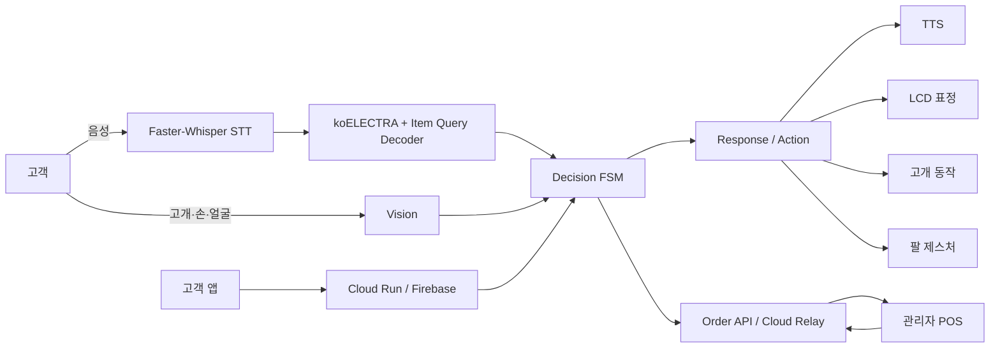
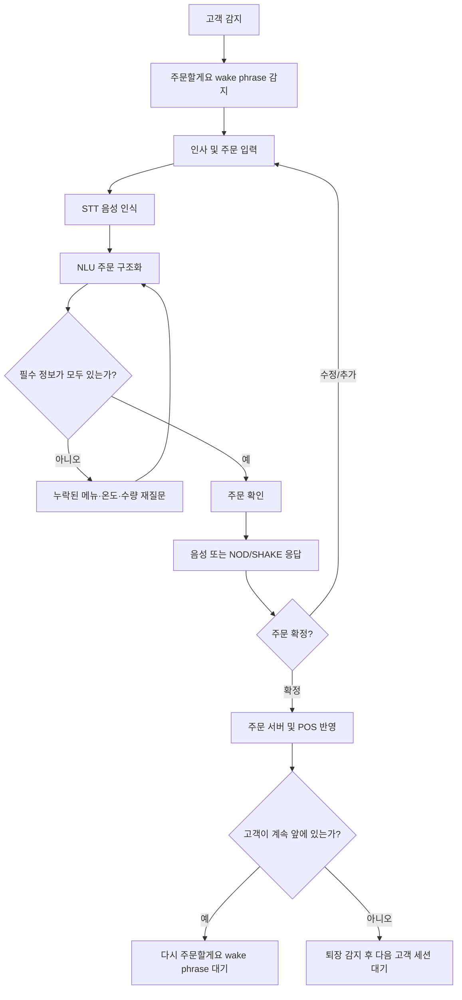
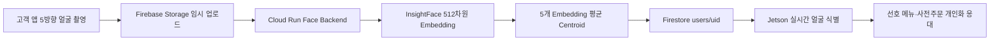

# 🤖 디지털 소외계층을 위한 Physical AI 무인매장 응대 로봇

 
> 복잡한 키오스크 조작 대신 **음성·비언어 표현·얼굴 인식**을 활용해 자연스럽게 주문하고 안내받을 수 있는 ROS2 기반 Physical AI 카페 응대 로봇입니다.

---

## **💡1. 프로젝트 개요**

### **1-1. 프로젝트 소개**

- **프로젝트 명** : 디지털 소외계층을 위한 Physical AI 무인매장 응대 로봇
- **프로젝트 정의** : 사용자의 음성, 고개 움직임, 손 제스처, 얼굴 정보를 인식하고 현재 대화 상태를 판단하여 주문·안내·개인화 서비스를 제공하는 Physical AI 기반 무인매장 응대 시스템
- **핵심 목표** : 무인 매장이 가지는 운영 효율성은 유지하면서, 사람의 친근함과 융통성을 함께 제공


### **1-2. 개발 배경 및 필요성**

1) **개발 배경**
- 무인매장은 언택트 구매에 대한 니즈, 최저임금 및 임대료 상승의 매장 운영 비용 부담 등 다양한 원인으로 점차 증가하고 있다.
- 키오스크를 활용한 무인 주문 방식은 인력 부담을 줄이고 매장 운영 효율성을 높일 수 있어 무인매장의 주요 주문 방식으로 사용되고 있다.

2) **제작 동기 및 문제점**
- 디지털 소외 문제: 키오스크는 정보격차 심화로 인해 장애인 및 고연령층 등의 디지털 소외 계층의 무인매장 이용에 불편을 야기한다.
- 획일화된 무인매장 응대: 키오스크 중심의 무인매장은 모든 고객에게 동일한 방식으로 서비스를 제공하기 때문에 매장의 차별성을 만들기에 한계가 있다.
- 이에 무인매장이 가지는 가격 경쟁력과 운영 효율성을 유지하면서, 사람 직원이 제공하는 친근함과 융통성을 함께 제공하고자 한다.

3) **제작 목적**
- 디지털 소외 문제 해결: 고객이 대화를 통해 주문할 수 있도록 함으로써 누구나 보다 쉽게 주문할 수 있는 환경을 구현하고자 한다.
- 획일적인 무인매장 응대를 보완: 얼굴 인식을 활용하여 등록된 단골 고객을 식별하고 해당 , 고객의 선호 메뉴를 기억하여 개인화된 응대를 제공한다.


### **1-3. 프로젝트 특장점**

- **비언어적 표현 기반 자연스러운 응대** : 음성 응답과 함께 얼굴 표정, 고개 움직임, 팔 제스처를 출력해 주문 상태와 로봇의 반응을 직관적으로 전달
- **얼굴 인식 기반 단골 고객 개인화** : 등록된 얼굴 특징 벡터로 고객을 식별하고, 선호 메뉴와 주문 정보를 활용해 개인화된 인사와 메뉴 추천 제공
- **인식–판단–행동이 연결된 Physical AI** : 음성·얼굴·고개 움직임을 인식하고 NLU와 현재 주문 상태를 바탕으로 판단한 뒤, 음성·표정·물리 동작으로 반응
- **자체 NLU 기반 Edge AI** : 외부 생성형 AI API에 의존하지 않고 자체 학습한 NLU 모델을 Jetson Orin Nano에서 직접 추론하여 API 비용과 인터넷 의존도 절감

### **1-4. 주요 기능**

- **음성 주문·안내 시스템** : 사용자의 음성을 인식하여 주문 정보를 추출하고, 주문 확인·수정·추가 및 필요한 안내를 음성으로 제공
- **사용자 감지 및 비언어적 표현 인식** : 카메라로 사용자의 존재를 감지하고, NOD/SHAKE 및 손 제스처를 인식하여 주문 대화의 입력으로 활용
- **얼굴 인식 기반 단골 고객 응대** : 등록 고객의 얼굴을 식별하여 선호 메뉴와 사전주문 정보를 연동하고 개인화된 응대 및 픽업 안내 제공
- **고객 앱 사전주문 서비스** : 고객이 앱에서 메뉴를 사전주문하고 얼굴 및 선호 정보를 등록·관리할 수 있는 기능 제공
- **고객 화면 및 관리자 POS 연동** : 고객 화면에서 주문 내용과 진행 상태를 실시간으로 제공하고, POS에서 주문 접수부터 픽업까지 상태를 통합 관리
- **로봇 물리적 상호작용** : LCD 표정, 2축 목 움직임, 다관절 팔 제스처를 연동하여 주문·안내 상황에 맞는 시각적·물리적 반응 제공

### **1-5. 기대 효과 및 활용 분야**

- **기대 효과**
  - 디지털 기기 사용에 익숙하지 않은 사용자의 무인매장 접근성 향상
  - 음성과 비언어 표현을 함께 활용한 자연스러운 주문 경험 제공
  - 반복적인 주문·안내 업무를 자동화하여 매장 운영 부담 완화
  - 고객 앱과 얼굴 인식을 연계한 개인화 서비스 제공

- **활용 분야**
  - 무인 카페 및 프랜차이즈 매장
  - 베이커리·편의점 등 반복적인 고객 응대가 필요한 리테일 매장
  - 도서관·병원·주민센터·터미널 등 공공시설 안내 서비스

### **1-6. 기술 스택**

| 구분 | 기술 |
|---|---|
| **Edge / Robot** | NVIDIA Jetson Orin Nano, ROS2 Humble, Python |
| **STT / TTS** | Faster-Whisper, VAD, eSpeak-NG |
| **NLU** | koELECTRA-small, PyTorch, Item Query Transformer Decoder |
| **Vision** | OpenCV, MediaPipe, InsightFace `buffalo_l` |
| **Robot UI / Control** | ESP32 LCD, Head Motion, Arm Gesture, ROS2 Topic |
| **Customer App** | React Native, Expo, TypeScript |
| **POS Web** | React, Vite, Express |
| **Backend / Cloud** | FastAPI, Google Cloud Run, Firebase Authentication, Firestore, Firebase Storage |
| **Data / Service** | Menu Catalog, Order API, Cloud Relay |

---

## **💡2. 팀원 소개**

<table>
  <tr>
    <td align="center" width="25%">
      
    </td>
    <td align="center" width="25%">
      
    </td>
    <td align="center" width="25%">
      
    </td>
    <td align="center" width="25%">
      
    </td>
  </tr>

  <tr>
    <td align="center"><b>멘티1</b></td>
    <td align="center"><b>멘티2</b></td>
    <td align="center"><b>멘티3</b></td>
    <td align="center"><b>멘토</b></td>
  </tr>

  <tr>
    <td align="center">
      AI·NLU 개발<br>
      주문 데이터·대화 로직
    </td>
    <td align="center">
      Vision·비언어 인식<br>
      ROS2 로봇 통합
    </td>
    <td align="center">
      하드웨어·모터 제어<br>
      App·Cloud·POS 연동
    </td>
    <td align="center">
      프로젝트 멘토<br>
      기술 자문
    </td>
  </tr>
</table>

---

## **💡3. 시스템 구성도**

### **3-1. 서비스 전체 구성**



### **3-2. 주문 처리 흐름**



### **3-3. 얼굴 등록 및 개인화 흐름**



---

## **💡4. 작품 소개영상**

[](https://youtu.be/Mvfm7oixeZE?si=AmzJ6K4wyu5zOT1B)

---

## **💡5. 핵심 소스코드**

### **5-1. 한국어 NLU — Item Query Decoder 기반 주문 정보 추출**

- **소스 위치** : [`nlu/model.py`](nlu/model.py)
- **설명** : koELECTRA Encoder로 주문 문장의 문맥 특징을 추출하고, 학습 가능한 Item Query를 Transformer Decoder에 입력하여 복수 주문의 **메뉴·온도·수량을 항목별로 구조화**합니다.
- **핵심 처리** : 한 문장에 여러 메뉴가 포함되어 있어도 각 주문 항목을 개별적으로 분리하여 추출합니다.

```python
self.item_queries = nn.Parameter(
    torch.randn(max_items, hidden_size) * 0.02
)

self.item_decoder = nn.TransformerDecoder(
    decoder_layer,
    num_layers=2,
)

self.menu_head = nn.Linear(
    hidden_size,
    label_count(label_maps, "menu"),
)
self.temperature_head = nn.Linear(
    hidden_size,
    label_count(label_maps, "temperature"),
)
self.quantity_head = nn.Linear(
    hidden_size,
    label_count(label_maps, "quantity"),
)
```

### **5-2. 주문 대화 판단 — FSM 및 누락 Slot 처리**

- **소스 위치** : [`ros2_ws/src/robot_controller/robot_controller/decision_node.py`](ros2_ws/src/robot_controller/robot_controller/decision_node.py)
- **설명** : NLU가 추출한 주문 정보와 이전 대화에서 저장된 주문 정보를 병합한 뒤, 주문 유효성과 누락된 메뉴·온도·수량을 검사하여 다음 대화 상태를 결정합니다.
- **핵심 처리** : 누락 정보가 있으면 해당 정보만 다시 질문하고, 모든 필수 정보가 채워지면 주문 확인 단계로 전환합니다.

```python
order = self.order_manager.build_order(
    nlu_result=nlu_result,
    items=merged_items,
    session_id=self.session_id,
)

self.current_order = order
self.state = "SLOT_CHECK"

if order["order_status"] == "INVALID":
    self.state = "OUT_OF_POLICY"
    self.current_order = None
    return self.order_decision(
        "OUT_OF_POLICY",
        "invalid_order",
        "invalid_order",
        order,
        nlu_result,
    )

waiting_for = self.next_missing_target(order["items"])

if waiting_for is not None:
    self.waiting_for = waiting_for
    slot = str(waiting_for["slot"])
    self.state = self.SLOT_STATES[slot]
    return self.order_decision(
        self.state,
        f"ask_{slot}",
        f"missing_{slot}",
        order,
        nlu_result,
    )

self.state = "ORDER_CONFIRM"
return self.order_decision(
    "CONFIRM_ORDER",
    "confirm_order",
    "all_slots_filled",
    order,
    nlu_result,
)
```

### **5-3. 단골 얼굴 인식 — Embedding 유사도 비교**

- **소스 위치** : [`ros2_ws/src/robot_controller/robot_controller/realtime_face_recognition.py`](ros2_ws/src/robot_controller/robot_controller/realtime_face_recognition.py)
- **설명** : Jetson 카메라에서 추출한 512차원 얼굴 임베딩과 Firestore에 등록된 고객 임베딩을 **Cosine Similarity**로 비교하여 고객을 식별합니다.
- **핵심 처리** : 단일 프레임 결과만 사용하지 않고 반복 인식 결과를 안정화하여 등록 고객을 판별합니다.

```python
faces = self.analyzer.get(frame)

if len(faces) != 1:
    self.stabilizer.add(None)
    return None

embedding = getattr(faces[0], "normed_embedding", None)

best_customer = None
best_similarity = -1.0

for customer in self.cache.customers:
    similarity = cosine_similarity(
        embedding,
        customer.vector,
    )
    if similarity > best_similarity:
        best_customer = customer
        best_similarity = similarity

candidate_id = (
    best_customer.customer_id
    if best_customer is not None
    and best_similarity >= self.threshold
    else None
)

confirmed_id = self.stabilizer.add(candidate_id)
```

### **5-4. 확정 주문 Cloud 전송**

- **소스 위치** : [`ros2_ws/src/robot_controller/robot_controller/order_submission_node.py`](ros2_ws/src/robot_controller/robot_controller/order_submission_node.py)
- **설명** : Decision Node에서 확정된 주문을 세션 단위로 저장하고, 주문 종료 이벤트가 발생하면 최종 주문만 Cloud Relay API로 전송합니다.
- **핵심 처리** : 세션 ID를 기준으로 중복 전송을 방지하고, 수정·추가 주문이 반영된 최종 주문만 서버에 저장합니다.

```python
if decision_name == "ORDER_CONFIRMED":
    order = decision.get("order")
    if session_id and isinstance(order, dict):
        with self._lock:
            self._candidate_orders[session_id] = order
    return

if (
    decision_name != "NEXT_CUSTOMER_READY"
    or str(decision.get("semantic_event") or "").upper()
    != "ORDER_FINISHED"
):
    return

with self._lock:
    if (
        finished_session_id in self._submitted_sessions
        or finished_session_id in self._inflight_sessions
    ):
        return

created = self.client.submit_confirmed_order(
    self._confirmed_order(session_id, raw_order)
)
```

---

## **📚 전체 파일 가이드**

현재 `main` 브랜치에서 Git이 추적하는 **507개 파일 전체**를 폴더별로 정리했습니다. 파일명을 누르면 실제 소스로 이동합니다.

<details>
<summary><strong>최상위(root)/</strong> — 저장소 전체 설정·실행 환경·최상위 문서 (13개)</summary>

| 파일 | 역할 | 크기 |
|---|---|---:|
| [`.dockerignore`](.dockerignore) |  프로젝트 소스·설정·데이터 파일입니다. | 97 B |
| [`.gitignore`](.gitignore) |  프로젝트 소스·설정·데이터 파일입니다. | 1.2 KB |
| [`Dockerfile`](Dockerfile) | Dockerfile 프로젝트 소스·설정·데이터 파일입니다. | 325 B |
| [`Dockerfile.face`](Dockerfile.face) | Dockerfile 프로젝트 소스·설정·데이터 파일입니다. | 946 B |
| [`firebase.json`](firebase.json) | firebase 설정 또는 구조화 데이터 파일입니다. | 56 B |
| [`firestore.rules`](firestore.rules) | firestore 프로젝트 소스·설정·데이터 파일입니다. | 547 B |
| [`JETSON_RUNTIME_README.md`](JETSON_RUNTIME_README.md) | JETSON RUNTIME README 관련 프로젝트 문서입니다. | 3.1 KB |
| [`pixi.lock`](pixi.lock) | pixi 프로젝트 소스·설정·데이터 파일입니다. | 514.6 KB |
| [`pixi.toml`](pixi.toml) | pixi 프로젝트 소스·설정·데이터 파일입니다. | 1.6 KB |
| [`README.md`](README.md) | 한이음 제출용 프로젝트 소개, 실행 흐름, 주요 코드와 전체 파일 가이드입니다. | 125.6 KB |
| [`requirements-face-recognition.txt`](requirements-face-recognition.txt) | requirements face recognition 프로젝트 소스·설정·데이터 파일입니다. | 279 B |
| [`requirements.txt`](requirements.txt) | requirements 프로젝트 소스·설정·데이터 파일입니다. | 205 B |
| [`run_customer_mobile_windows.cmd`](run_customer_mobile_windows.cmd) | run customer mobile windows 프로젝트 소스·설정·데이터 파일입니다. | 339 B |

</details>
