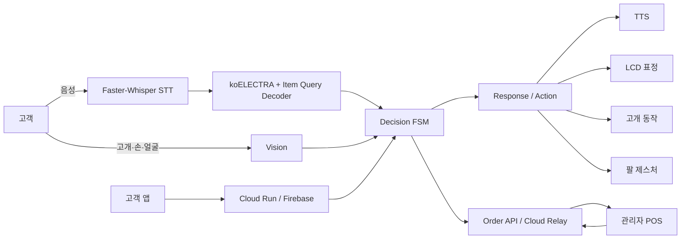
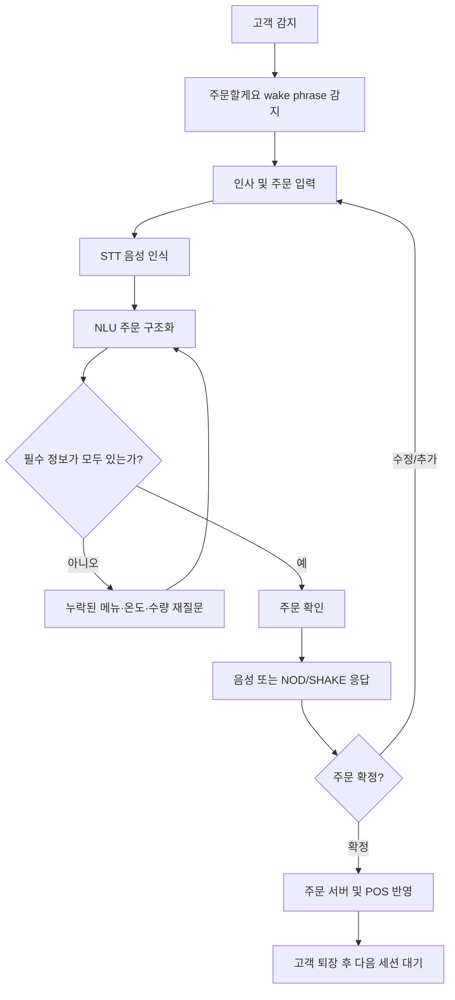
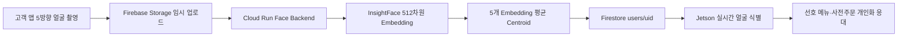

# 🎃 디지털 소외계층을 위한 Physical AI 무인매장 응대 로봇

 
> 복잡한 키오스크 조작 대신 **음성·비언어 표현·얼굴 인식**을 활용해 자연스럽게 주문하고 안내받을 수 있는 ROS2 기반 Physical AI 카페 응대 로봇입니다.

---

## **💡1. 프로젝트 개요**

### **1-1. 프로젝트 소개**

- **프로젝트 명** : 디지털 소외계층을 위한 Physical AI 무인매장 응대 로봇
- **프로젝트 정의** : 사용자의 음성, 고개 움직임, 손 제스처, 얼굴 정보를 인식하고 현재 대화 상태를 판단하여 주문·안내·개인화 서비스를 제공하는 Physical AI 기반 무인매장 응대 시스템
- **핵심 목표** : 무인 매장이 가지는 운영 효율성은 유지하면서, 사람의 친근함과 융통성을 함께 제공


### **1-2. 개발 배경 및 필요성**

무인매장의 키오스크는 빠르고 효율적이지만, 화면 구성과 단계별 조작에 익숙하지 않은 사용자에게는 주문 과정 자체가 진입 장벽이 될 수 있습니다. Pumpkin은 이러한 문제를 줄이기 위해 사용자가 복잡한 UI를 직접 조작하지 않아도 **말하고, 끄덕이고, 손으로 표현하는 자연스러운 방식**으로 주문할 수 있도록 설계했습니다.

또한 단순 음성 주문에 그치지 않고, 주문 정보가 부족하면 다시 질문하고, 고객의 비언어적 반응을 현재 대화 맥락과 함께 해석하며, 로봇의 LCD 표정·고개·팔 동작과 고객 앱·POS까지 하나의 서비스 흐름으로 연결하는 것을 목표로 합니다.

### **1-3. 프로젝트 특장점**

- **멀티모달 상호작용** : 음성, NOD/SHAKE, 손 제스처를 하나의 주문 대화에서 함께 활용
- **자체 주문 NLU** : 직접 구축한 한국어 주문 데이터와 `koELECTRA + Item Query Decoder`를 이용해 복수 메뉴의 메뉴·온도·수량을 항목별로 구조화
- **FSM 기반 대화 제어** : 누락된 주문 정보를 임의로 채우지 않고 필요한 항목만 재질문하며, 현재 상태에 맞는 입력만 허용
- **Physical Interaction** : TTS뿐 아니라 LCD 표정, 고개 방향 전환, NOD/SHAKE, 팔 제스처를 함께 출력
- **얼굴 인식 기반 개인화** : 등록 고객을 실시간 식별하고 선호 메뉴 및 사전주문 정보를 연계
- **서비스 통합** : 고객 앱, Cloud Run/Firebase, Jetson 로봇, 관리자 POS의 주문 상태를 하나의 흐름으로 연결

### **1-4. 주요 기능**

- **일반 음성 주문** : Faster-Whisper STT와 NLU를 이용해 자연어 주문 인식
- **복수 주문 구조화** : 한 문장 안의 여러 메뉴를 각각의 메뉴·온도·수량으로 분리
- **누락 정보 재질문** : 메뉴, 온도, 수량 중 필요한 정보가 빠진 경우 해당 항목만 다시 질문
- **주문 확인·수정·취소** : FSM을 이용해 주문 확인, 수정, 추가 주문, 취소 흐름 관리
- **비언어 입력** : 주문 확인 단계의 NOD/SHAKE, 수량 질문 단계의 손가락 제스처를 실제 입력으로 사용
- **공간 안내** : 화장실·픽업대 등 위치를 음성과 고개·팔 동작으로 함께 안내
- **단골 고객 개인화** : 얼굴 임베딩 기반 고객 식별 후 선호 주문 제안
- **사전주문 픽업** : 앱 사전주문 상태를 조회하고 준비 완료 주문의 픽업 위치 안내
- **관리자 POS 연동** : `RECEIVED → PREPARING → READY → PICKED_UP` 주문 상태 관리

### **1-5. 기대 효과 및 활용 분야**

- **기대 효과**
  - 디지털 기기 사용에 익숙하지 않은 사용자의 무인매장 접근성 향상
  - 음성과 비언어 표현을 함께 활용한 자연스러운 주문 경험 제공
  - 반복적인 주문·안내 업무를 자동화하여 매장 운영 부담 완화
  - 고객 앱과 얼굴 인식을 연계한 개인화 서비스 제공

- **활용 분야**
  - 무인 카페 및 프랜차이즈 매장
  - 베이커리·편의점 등 반복적인 고객 응대가 필요한 리테일 매장
  - 도서관·병원·주민센터·터미널 등 공공시설 안내 서비스

### **1-6. 기술 스택**

| 구분 | 기술 |
|---|---|
| **Edge / Robot** | NVIDIA Jetson Orin Nano, ROS2 Humble, Python |
| **STT / TTS** | Faster-Whisper, VAD, eSpeak-NG |
| **NLU** | koELECTRA, PyTorch, Item Query Transformer Decoder |
| **Vision** | OpenCV, MediaPipe, InsightFace `buffalo_l` |
| **Robot UI / Control** | ESP32 LCD, Head Motion, Arm Gesture, ROS2 Topic |
| **Customer App** | React Native, Expo, TypeScript |
| **POS Web** | React, Vite, Express |
| **Backend / Cloud** | FastAPI, Google Cloud Run, Firebase Authentication, Firestore, Firebase Storage |
| **Data / Service** | Menu Catalog, Order API, Cloud Relay |

---

## **💡2. 팀원 소개(이름 기재 X)**

> 개인정보를 기재하지 않고 프로젝트의 주요 역할 영역을 중심으로 정리했습니다.

| 역할 영역 | 주요 담당 |
|---|---|
| **AI / NLU** | 주문 데이터 구축·전처리, koELECTRA 학습, Item Query Decoder, 주문 슬롯 검증 |
| **Robot / ROS2** | Decision FSM, Action Node, TTS/LCD/고개·팔 동작 통합, 실물 로봇 시연 |
| **Vision / Personalization** | 사람·고개·손 제스처 인식, 얼굴 임베딩 등록·식별, 개인화 응대 |
| **App / Cloud / POS** | 고객용 사전주문 앱, Firebase·Cloud Run 연동, 관리자 POS 및 주문 상태 관리 |
| **Mentoring** | 시스템 설계 및 기술 자문 |

---

## **💡3. 시스템 구성도**

### **3-1. 서비스 전체 구성**



### **3-2. 주문 처리 흐름**



### **3-3. 얼굴 등록 및 개인화 흐름**



---

## **💡4. 작품 소개영상**

[](https://youtu.be/Mvfm7oixeZE?si=AmzJ6K4wyu5zOT1B)

---

## **💡5. 핵심 소스코드**

### **5-1. FSM 기반 비언어 응답 처리**

- **소스 위치** : [`ros2_ws/src/robot_controller/robot_controller/decision_node_order_handoff.py`](ros2_ws/src/robot_controller/robot_controller/decision_node_order_handoff.py)
- **설명** : 사용자의 NOD/SHAKE를 항상 주문 입력으로 사용하는 것이 아니라, 주문 확인과 같은 **확인 상태에서만** 각각 `AFFIRM` / `DENY` 입력으로 변환합니다. 이를 통해 자연스러운 몸동작이 주문 흐름을 잘못 변경하는 것을 방지합니다.

```python
def make_user_gesture_decision(self, gesture: str):
    normalized = str(gesture or "").strip().upper()

    if normalized not in self.USER_GESTURES:
        return None
    if self.state not in self.CONFIRMATION_STATES:
        return None

    synthetic_input = {
        "intent": "AFFIRM" if normalized == "NOD" else "DENY",
        "input_modality": "VISION_GESTURE",
        "user_gesture": normalized,
        "confidence": 1.0,
    }

    if normalized == "NOD":
        return self.handle_affirm_intent(synthetic_input)
    return self.handle_deny_intent(synthetic_input)
```

### **5-2. 주문 NLU 모델**

- **비교 실험 및 재현 코드** : [`experiments/nlu/kips_2026_item_query/`](experiments/nlu/kips_2026_item_query/)
- **현재 추론 코드** : [`nlu/`](nlu/)
- **설명** : koELECTRA Encoder가 문장의 문맥 특징을 추출하고, 학습 가능한 Item Query를 Transformer Decoder에 입력하여 복수 주문의 **메뉴·온도·수량을 항목별로 예측**합니다.

### **5-3. 얼굴 등록 및 실시간 식별**

- **고객 앱** : [`apps/customer-mobile/`](apps/customer-mobile/)
- **Face Backend** : [`face_backend/`](face_backend/)
- **Jetson 실시간 인식** : [`ros2_ws/src/robot_controller/robot_controller/realtime_face_recognition.py`](ros2_ws/src/robot_controller/robot_controller/realtime_face_recognition.py)
- **설명** : 앱에서 촬영한 5방향 얼굴을 Cloud Run에서 512차원 임베딩으로 변환하고 평균 centroid를 Firestore에 저장합니다. Jetson은 실시간 얼굴 임베딩과 등록 정보를 비교하여 고객을 식별합니다.

---

## **📁 주요 디렉터리**

```text
pumpkin_public/
├── api/             # FastAPI 주문·고객·얼굴 API
├── apps/
│   ├── customer-mobile/  # 고객 앱
│   ├── pos-web/          # 관리자 POS
│   └── monitor-web/      # 로봇 5인치 고객 화면
├── cloud_relay/     # Cloud Run 주문 Relay
├── config/          # 메뉴 카탈로그 및 공통 설정
├── data/            # 제출본에 필요한 학습·테스트 데이터
├── experiments/     # KIPS NLU 비교 실험 및 TOD SLM 학습·평가
├── face_backend/    # 얼굴 임베딩 Cloud Run Backend
├── nlu/             # 현재 NLU 추론 코드
├── robot_face/      # ESP32 LCD 및 얼굴 표시 제어
├── ros2_ws/         # ROS2 기반 로봇 통합 Runtime
└── scripts/         # 실행·테스트·시연 스크립트
```

---

## **🔎 프로젝트 핵심 흐름 요약**

```text
고객 음성 / 비언어 입력
→ STT / Vision
→ NLU
→ FSM 기반 대화 상태 판단
→ TTS + LCD + 고개·팔 동작
→ 주문 서버 / POS

고객 앱 얼굴 등록 / 사전주문
→ Firebase / Cloud Run
→ Jetson 얼굴 인식 및 고객 식별
→ 개인화 주문 제안 / 사전주문 픽업 안내
```


---

## **🚀 실물 로봇 시연 실행**

Jetson Orin Nano에서 5인치 고객 화면과 ROS2 로봇 파이프라인을 함께 실행하는 최종 시연 진입점입니다.

```bash
cd ~/pumpkin
bash scripts/run_robot_with_monitor.sh
```

현재 production runtime은 STT, Vision, NLU, Decision FSM, TTS, LCD 표정, 고개·팔 제어를 ROS2로 통합합니다.
