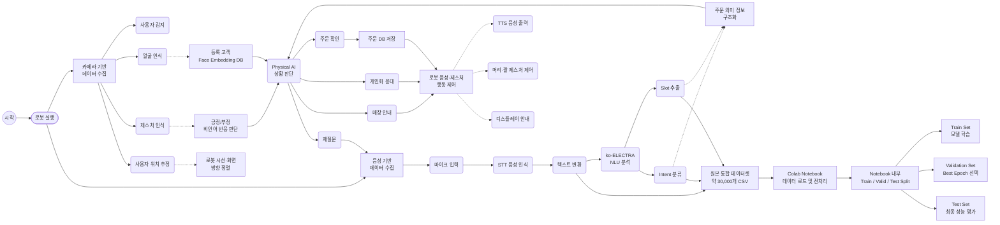

# 데이터 수집·처리 흐름도

본 문서는 **디지털 소외계층을 위한 Physical AI 무인매장 응대 로봇** 프로젝트의 데이터 수집 및 처리 흐름을 정리한 문서이다.

본 프로젝트의 데이터는 크게 **음성으로 시작되는 데이터 수집 과정**과 **카메라로 시작되는 데이터 수집 과정**으로 나뉜다. 음성 데이터는 STT와 ko-ELECTRA 기반 NLU 모델을 거쳐 주문 의도와 의미 정보를 추출하는 데 사용되며, 카메라 데이터는 사용자 감지, 얼굴 인식, 제스처 인식, 사용자 위치 추정에 사용된다.

또한 NLU 학습 데이터셋은 처음부터 `train.csv`, `valid.csv`, `test.csv`로 나뉘어 있지 않고, 약 30,000개 샘플로 구성된 하나의 통합 CSV 데이터셋을 Colab Notebook(`.ipynb`) 내부에서 split하여 학습·검증·평가 데이터로 사용한다.

---

## 1. 데이터 수집·처리 흐름도



---

## 2. 그림 설명

본 시스템은 로봇 실행 이후 음성 기반 데이터와 카메라 기반 데이터를 병렬적으로 수집한다.

음성 데이터는 마이크를 통해 입력된 뒤 STT를 통해 텍스트로 변환된다. 변환된 텍스트는 ko-ELECTRA 기반 NLU 모델에 입력되어 사용자의 의도(Intent)와 슬롯(Slot) 정보를 추출한다. 예를 들어 “아이스 아메리카노 한 잔 주세요”라는 발화에서는 주문 의도와 함께 메뉴, 온도, 수량 정보가 추출된다.

카메라 데이터는 사용자 감지, 얼굴 인식, 제스처 인식, 사용자 위치 추정에 활용된다. 얼굴 인식 결과는 등록 고객 식별 및 개인화 응대에 사용되며, 제스처 인식 결과는 고개 끄덕임이나 고개 좌우 흔들기와 같은 비언어적 긍정·부정 반응 판단에 활용된다.

음성 기반 NLU 결과, 얼굴 인식 결과, 제스처 인식 결과, 대화 맥락은 Physical AI 상황 판단 모듈로 전달된다. 해당 모듈은 주문 확인, 재질문, 매장 안내, 개인화 응대 등 로봇의 후속 행동을 결정한다. 이후 로봇은 TTS 음성 출력, 디스플레이 안내, 머리 및 팔 제스처 제어를 통해 사용자에게 응답한다.

---

## 3. 학습 데이터셋 구성 방식

본 프로젝트의 NLU 학습 데이터셋은 처음부터 학습용, 검증용, 평가용 파일로 분리하지 않는다. 약 30,000개 발화 샘플이 포함된 하나의 통합 CSV 파일을 구성한 뒤, Colab Notebook 내부에서 일정 비율로 `train`, `validation`, `test` 데이터로 분할한다.

| 데이터 | 설명 |
|---|---|
| 원본 통합 CSV | 약 30,000개 발화 샘플을 포함하는 전체 NLU 데이터셋 |
| Train Split | Notebook 내부에서 생성되는 모델 학습용 데이터 |
| Validation Split | Notebook 내부에서 생성되는 best epoch 및 하이퍼파라미터 판단용 데이터 |
| Test Split | Notebook 내부에서 생성되는 최종 성능 평가용 데이터 |

모델 간 성능 비교의 공정성을 확보하기 위해 모든 Notebook은 동일한 원본 데이터셋, 동일한 split 비율, 동일한 random seed를 사용한다. 따라서 모델 구조가 달라져도 학습·검증·평가에 사용되는 데이터 분포는 동일하게 유지된다.

---

## 4. 음성 기반 데이터 수집 과정

```text
고객 음성 입력
→ 마이크 수집
→ STT 변환
→ 텍스트 정규화
→ ko-ELECTRA NLU 분석
→ Intent 분류 및 Slot 추출
→ 주문 확인 또는 재질문
→ 주문 DB 저장 및 로봇 응답
```

### 예시

| 고객 발화 | Intent | Slot 정보 |
|---|---|---|
| 아이스 아메리카노 한 잔 주세요 | ORDER | 메뉴: 아메리카노, 온도: ICE, 수량: 1 |
| 따뜻한 라떼 두 잔 주세요 | ORDER | 메뉴: 카페라떼, 온도: HOT, 수량: 2 |
| 화장실 어디예요 | ASK_LOCATION | 장소: 화장실 |
| 네 맞아요 | CONFIRM_YES | 긍정 확인 |
| 아니요 하나만 주세요 | MODIFY_ORDER | 수량 수정: 1 |

---

## 5. 카메라 기반 데이터 수집 과정

```text
카메라 입력
→ 사용자 감지
→ 얼굴 인식 또는 제스처 인식
→ 사용자 위치 추정
→ 비언어적 반응 분석
→ 음성 대화 흐름과 통합
→ 로봇 행동 결정
```

### 예시

| 카메라 입력 | 인식 결과 | 시스템 행동 |
|---|---|---|
| 고객이 로봇 앞에 섬 | 사용자 접근 감지 | 인사 및 주문 안내 시작 |
| 고객이 고개를 끄덕임 | 긍정 반응 | 주문 확정 |
| 고객이 고개를 좌우로 흔듦 | 부정 반응 | 재질문 수행 |
| 등록 고객 얼굴 인식 | 단골 고객 식별 | 선호 메뉴 기반 개인화 응대 |
| 고객 위치가 오른쪽에 있음 | 사용자 위치 추정 | 로봇 시선 및 화면 방향 조정 |

---

## 6. 데이터 활용 목적

| 데이터 종류 | 활용 목적 |
|---|---|
| STT 변환 텍스트 | ko-ELECTRA 기반 NLU 모델 입력 |
| Intent 라벨 | 주문, 수정, 취소, 확인, 안내 요청 등 의도 분류 |
| Slot 라벨 | 메뉴명, 온도, 수량, 사이즈, 옵션, 장소 정보 추출 |
| 얼굴 인식 결과 | 등록 고객 식별 및 개인화 응대 |
| 제스처 인식 결과 | 긍정·부정 반응 보조 판단 |
| 주문 로그 | 주문 처리 성공률 및 오류 분석 |
| 시스템 로그 | STT/NLU/비전 모델 개선 및 성능 평가 |
