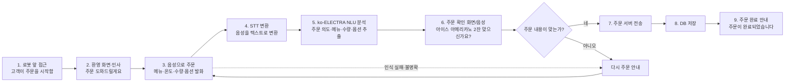
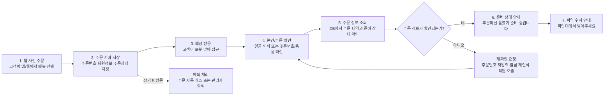
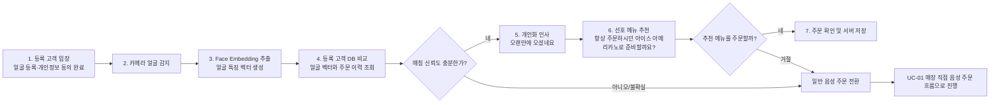

# 한이음 Physical AI 무인매장 응대 로봇 - 사용 시나리오 흐름도

본 문서는 무인 커피 매장 로봇의 핵심 사용 시나리오를 처음 보는 사람도 이해할 수 있도록 정리한 흐름도입니다.

## UC-01 매장 직접 음성 주문

### UC-01 핵심 설명

- 고객이 로봇 앞에 접근하면 로봇이 인사하고 주문을 요청합니다.
- 고객은 음성으로 메뉴, 온도, 수량, 옵션을 말합니다.
- STT가 음성을 텍스트로 변환하고, ko-ELECTRA 기반 NLU가 주문 정보를 추출합니다.
- 로봇은 주문 확인 화면과 음성으로 내용을 재확인합니다.
- 사용자가 맞다고 답하면 주문을 서버/DB에 저장하고 완료 안내를 제공합니다.
- 인식 실패 또는 주문 내용 불일치 시 다시 주문하도록 안내합니다.

## UC-02 웹 사전 주문 고객 안내

### UC-02 핵심 설명

- 고객이 웹에서 메뉴를 사전 주문합니다.
- 주문 정보는 주문 서버와 DB에 저장됩니다.
- 고객이 매장에 방문하면 로봇이 얼굴 인식, 주문번호, 음성 확인 등으로 주문을 조회합니다.
- 주문 정보가 확인되면 음료 준비 상태와 픽업 위치를 안내합니다.
- 주문 확인이 실패하면 주문번호 재입력, 얼굴 재인식, 직원 호출 등 재확인 절차를 진행합니다.
- 장시간 고객이 방문하지 않으면 주문 상태를 자동 갱신하거나 관리자에게 알립니다.

## UC-03 얼굴 인식 기반 단골 고객 응대

### UC-03 핵심 설명

- 사전에 얼굴 등록과 개인정보 활용 동의를 완료한 고객이 매장에 입장합니다.
- 로봇 카메라가 얼굴을 감지하고 Face Embedding을 추출합니다.
- 등록 고객 DB와 비교하여 매칭 신뢰도가 충분한지 판단합니다.
- 신뢰도가 충분하면 주문 이력과 선호 메뉴를 기반으로 개인화 인사와 추천 주문을 제공합니다.
- 고객이 추천 메뉴를 수락하면 주문 확정 절차로 이어집니다.
- 신뢰도가 낮거나 고객이 거절하면 일반 음성 주문 흐름으로 전환합니다.

## 설계 기준

- 주문 오류를 줄이기 위해 모든 주문은 확인 단계를 거칩니다.
- 얼굴 인식 결과가 불확실하면 개인화 응대를 하지 않고 일반 주문으로 전환합니다.
- 사용자가 처음 보더라도 `고객 행동 → 로봇 인식 → AI 판단 → 안내/주문 처리 → 예외 처리` 흐름을 이해할 수 있도록 구성했습니다.
