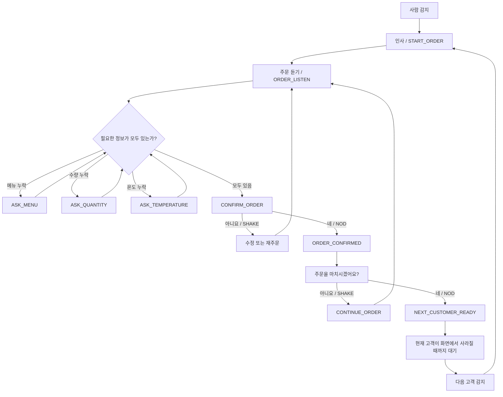

# Pumpkin 주문 상호작용 전체 흐름

> **기준 브랜치: `main`**  
> 이 문서는 Pumpkin 로봇이 주문을 받을 때 **사용자가 무엇을 말하면 → 로봇이 어떻게 판단하고 → 어떤 말을 하고 → 어떤 표정과 고개 동작을 하며 → 다음에 무엇을 기다리는지**를 처음 보는 사람도 이해할 수 있도록 한곳에 정리한 문서이다.
>
> 실제 동작 기준은 아래 코드이다.
>
> - 대화/FSM: `robot_controller/decision_node.py`, `decision_node_order_handoff.py`
> - 로봇 대사: `robot_controller/response_manager.py`
> - 표정·고개·팔 결정: `robot_controller/action_node.py`, `action_node_order_handoff.py`
> - 고개 실행: `robot_controller/head_motion_node.py`
> - 3.5인치 얼굴 LCD 실행: `robot_controller/face_display_node.py`

---

## 1. 먼저 알아둘 것

Pumpkin의 주문 처리는 한 코드가 모든 것을 직접 하는 구조가 아니다.

```text
사용자 음성 / 사용자 고개 제스처
        ↓
STT / Vision
        ↓
NLU
- ORDER, MODIFY, AFFIRM, DENY, CANCEL, GUIDE, UNKNOWN 등 의미 분석
        ↓
Decision Node
- 지금 주문 단계가 어디인지 판단
- 주문 정보 저장
- 다음 질문 결정
        ↓
Response Manager
- 실제로 사용자에게 말할 한국어 문장 생성
        ↓
Action Node
- 표정
- 가슴 화면 상태
- 고개 동작
- 팔 동작
  을 결정
        ↓
TTS / 3.5인치 얼굴 LCD / 고개 모터 / 향후 팔
```

즉 같은 `ORDER`라는 NLU 결과라도 현재 FSM 상태에 따라 로봇의 다음 행동은 달라질 수 있다.

---

## 2. 화면 관련 용어 구분

코드에는 `face`와 `display`가 따로 있다.

### `face`

로봇 머리에 있는 **3.5인치 ESP32 LCD 표정**을 의미한다.

현재 지원 표정은 다음 5개이다.

```text
NEUTRAL
SMILE
HAPPY
QUESTION
ERROR
```

### `display`

`GREETING`, `ASK_MENU`, `ORDER_CONFIRM` 같은 **화면 상태 이름**이다.

현재 주문 흐름에서는 Action 결과에 포함되지만, 얼굴 표정과는 별개이다. 향후 가슴의 별도 화면 UI가 연결되면 이 값을 기준으로 화면을 구성할 수 있다.

따라서 이 문서에서 `표정`은 **3.5인치 얼굴 LCD**, `화면`은 **별도 UI 상태**를 뜻한다.

---

## 3. 한눈에 보는 정상 주문 흐름



핵심은 **주문 내용 확인**과 **주문 종료 확인**이 서로 다른 단계라는 점이다.

```text
1차 확인: "지금 주문 내용이 맞나요?"
2차 확인: "이제 주문 자체를 마치시겠어요?"
```

---

## 4. 정상 주문 단계별 로봇 반응

아래 표는 가장 일반적인 주문 흐름 기준이다.

| 단계 | 사용자 상황 | Decision | 로봇이 하는 말 | 표정 | 고개 | 팔 | 다음 단계 |
|---|---|---|---|---|---|---|---|
| 고객 접근 | 카메라에 새 고객이 감지됨 | `START_ORDER` | `안녕하세요. 주문 도와드릴게요.` | `SMILE` | `NOD` | `WELCOME` | 주문 입력 대기 |
| 메뉴 질문 | 주문에서 메뉴가 빠짐 | `ASK_MENU` | `어떤 메뉴로 주문하시겠어요?` | `QUESTION` | `CENTER` | `WAIT` | 메뉴 응답 대기 |
| 수량 질문 | 수량이 빠짐 | `ASK_QUANTITY` | `{메뉴}는 몇 잔 주문하시겠어요?` | `QUESTION` | `CENTER` | `WAIT` | 수량 응답 대기 |
| 온도 질문 | ICE/HOT 선택이 필요한 메뉴의 온도가 빠짐 | `ASK_TEMPERATURE` | `{메뉴}는 아이스로 드릴까요, 따뜻하게 드릴까요?` | `QUESTION` | `CENTER` | `WAIT` | 온도 응답 대기 |
| 주문 확인 | 필요한 정보가 모두 채워짐 | `CONFIRM_ORDER` | 예: `아이스 아메리카노 2잔, 따뜻한 카페라떼 1잔 맞으신가요?` | `SMILE` | `CENTER` | `WAIT` | YES/NO 대기 |
| 주문 내용 승인 | 확인 질문에 `네` 또는 고객의 끄덕임 | `ORDER_CONFIRMED` | `주문을 마치시겠어요?` | `HAPPY` | `DOUBLE_NOD` | `THANKS` | 주문 종료 여부 YES/NO 대기 |
| 추가 주문 | `주문을 마치시겠어요?`에 `아니요` 또는 좌우 흔들기 | `CONTINUE_ORDER` | `추가 주문을 말씀해 주세요.` | `QUESTION` | `CENTER` | `WAIT` | 다시 주문 입력 대기 |
| 최종 종료 | `주문을 마치시겠어요?`에 `네` 또는 끄덕임 | `NEXT_CUSTOMER_READY` | `주문이 완료되었습니다. 감사합니다.` | `NEUTRAL` | `CENTER` | `WAIT` | 현재 고객 퇴장 대기 |
| 다음 고객 | 기존 고객이 사라진 뒤 새 고객이 감지됨 | 다시 `START_ORDER` | `안녕하세요. 주문 도와드릴게요.` | `SMILE` | `NOD` | `WELCOME` | 새 세션 시작 |

> `WELCOME`, `THANKS`, `WAIT` 같은 팔 값은 현재 **추상 행동 명령**이다. 팔 하드웨어 구현 상태와 별개로 Action 결과에는 포함될 수 있다.

---

## 5. 실제 예시 1 — 한 번에 완전하게 주문한 경우

### 사용자

```text
아이스 아메리카노 두 잔 주세요.
```

NLU가 다음처럼 주문을 완성했다고 가정한다.

```text
메뉴 = 아메리카노
온도 = ICE
수량 = 2
```

그러면 추가 슬롯 질문 없이 바로 주문 확인으로 간다.

### 로봇

```text
"아이스 아메리카노 2잔 맞으신가요?"
```

```text
표정 = SMILE
고개 = CENTER
```

사용자가 `네`라고 하면:

```text
"주문을 마치시겠어요?"

표정 = HAPPY
고개 = DOUBLE_NOD
```

여기서 다시 `네`라고 하면:

```text
"주문이 완료되었습니다. 감사합니다."

표정 = NEUTRAL
고개 = CENTER
```

이후 로봇은 현재 고객이 카메라 화면에서 실제로 사라지는 것을 기다린 뒤 다음 고객을 받는다.

---

## 6. 실제 예시 2 — 온도가 빠진 경우

### 사용자

```text
아메리카노 한 잔 주세요.
```

아메리카노는 ICE/HOT 둘 다 가능하므로 온도를 임의로 채우지 않는다.

### 로봇

```text
"아메리카노는 아이스로 드릴까요, 따뜻하게 드릴까요?"

표정 = QUESTION
고개 = CENTER
```

### 사용자

```text
아이스로요.
```

그 후 주문 정보가 완성되면:

```text
"아이스 아메리카노 1잔 맞으신가요?"

표정 = SMILE
고개 = CENTER
```

---

## 7. 실제 예시 3 — 여러 메뉴 주문

### 사용자

```text
아메리카노랑 카페라떼 하나씩 주세요.
```

두 메뉴 모두 ICE/HOT 선택이 필요한 경우 각 item을 구분해서 필요한 정보를 질문한다.

예:

```text
로봇: 아메리카노는 아이스로 드릴까요, 따뜻하게 드릴까요?
사용자: 따뜻하게요.

로봇: 카페라떼는 아이스로 드릴까요, 따뜻하게 드릴까요?
사용자: 아이스로요.

로봇: 따뜻한 아메리카노 1잔, 아이스 카페라떼 1잔 맞으신가요?
```

질문 중인 항목은 `waiting_for.item_id`와 `waiting_for.slot`로 저장되므로 `아이스로요`, `두 잔이요`처럼 짧게 답해도 **현재 질문 중인 메뉴에만** 적용할 수 있다.

---

## 8. 메뉴와 온도는 말했지만 수량이 없는 경우의 ITEM 확인

현재 `order_handoff` 흐름에는 수량 질문 전에 item 자체를 한 번 확인하는 동작이 들어갈 수 있다.

예를 들어 사용자가:

```text
아이스 아메리카노요.
```

처럼 **메뉴와 온도는 확실하지만 수량만 없는 경우**, 바로 `몇 잔이요?`라고 하지 않고 먼저:

```text
"아이스 아메리카노 맞으신가요?"
```

라는 `CONFIRM_ITEM` 단계로 갈 수 있다.

### 사용자가 네 / NOD

```text
→ ASK_QUANTITY
→ "아이스 아메리카노는 몇 잔 주문하시겠어요?"
```

### 사용자가 아니요 / SHAKE

```text
→ 현재 입력을 버리고 ORDER_LISTEN으로 복귀
→ "무엇을 주문하시겠어요?"
```

`CONFIRM_ITEM`의 기본 동작은:

```text
표정 = SMILE
고개 = CENTER
팔 = WAIT
```

이다.

---

## 9. 주문 확인에서 사용자가 "아니요"라고 한 경우

주문 전체 내용을 확인하는 `ORDER_CONFIRM`에서 사용자가 부정하면 수정 흐름으로 들어간다.

예:

```text
로봇: 아이스 아메리카노 2잔 맞으신가요?
사용자: 아니요.
```

이후 로봇은 수정 내용을 받도록 전환된다.

수정 요청 시 대표 응답은:

```text
"어떤 부분을 바꿀까요? 메뉴, 온도 또는 수량을 말씀해 주세요."
```

`MODIFY_ORDER` 동작:

```text
표정 = QUESTION
고개 = SHAKE
팔 = WAIT
```

사용자가 수정 내용을 말하면 기존 주문에 반영한 후 다시 주문 확인 단계로 간다.

예:

```text
사용자: 두 잔 말고 세 잔으로 바꿔주세요.

→ 수량 수정
→ 다시 CONFIRM_ORDER
```

---

## 10. 확인 질문에서 자연스럽게 바로 정정하는 경우

사용자가 꼭 `수정`, `변경`, `바꿔`라는 단어를 말해야 하는 것은 아니다.

예:

```text
로봇: 아이스 아메리카노 1잔 맞으신가요?
사용자: 아이스 아메리카노 두 잔이요.
```

현재 `order_handoff` Decision은 **기존 주문에 존재하는 메뉴를 사용자가 정확히 다시 말했고, 수량 또는 온도가 실제로 달라진 경우** 안전한 동일-item 정정으로 처리할 수 있다.

주변 대화의 우연한 숫자 때문에 주문이 바뀌지 않도록 이 경로는 일부러 좁게 제한되어 있다.

---

## 11. 주문을 더 할지, 정말 끝낼지 확인하는 단계

주문 내용에 `네`라고 답했다고 바로 고객 세션이 끝나는 것은 아니다.

### 1단계 — 주문 내용 확인

```text
로봇: 아이스 아메리카노 1잔 맞으신가요?
사용자: 네.
```

### 2단계 — 주문 종료 확인

```text
로봇: 주문을 마치시겠어요?
```

여기서 의미가 중요하다.

| 사용자 응답 | 의미 | 결과 |
|---|---|---|
| `네` / `NOD` | 이제 주문을 끝냄 | `NEXT_CUSTOMER_READY` |
| `아니요` / `SHAKE` | 아직 더 주문함 | `CONTINUE_ORDER` → `ORDER_LISTEN` |

따라서 이 질문 문구를 반대로 바꾸면 AFFIRM/DENY의 의미가 뒤집히므로 주의해야 한다.

---

## 12. 고객의 끄덕임/좌우 흔들기 사용 범위

현재 고객의 고개 제스처는 `/user/head_gesture`로 들어온다.

지원 값:

```text
NOD
SHAKE
```

매핑은 다음과 같다.

```text
고객 NOD   → AFFIRM과 같은 의미
고객 SHAKE → DENY와 같은 의미
```

단, **아무 상태에서나 사용하지 않는다.**

현재 다음 확인 상태에서만 인정한다.

```text
ITEM_CONFIRM
ORDER_CONFIRM
WAIT_NEXT_CUSTOMER
```

즉 로봇이 메뉴를 묻고 있는데 사용자가 우연히 고개를 끄덕였다고 해서 주문이 확정되지는 않는다.

또 음성 입력과 비전 제스처가 동시에 들어오는 경우, 비전 확인이 먼저 turn을 완료하면 Action 쪽에서 진행 중인 STT를 취소하도록 되어 있다.

---

## 13. 주문 취소

현재 취소 정책은 **부분 취소가 아니라 전체 주문 취소**이다.

예:

```text
취소할게요.
주문 취소해주세요.
그만할게요.
```

대표 응답:

```text
"주문을 취소했어요."
```

동작:

```text
표정 = NEUTRAL
고개 = CENTER
팔 = WAIT
```

현재 주문과 대화 상태를 초기화한다.

> `라떼만 빼주세요`처럼 특정 item 하나만 삭제하는 부분 취소는 현재 운영 정책에 포함하지 않는다.

---

## 14. 처음부터 다시 주문

사용자가 명시적으로 처음부터 다시 하겠다고 하면 기존 주문을 이어 수정하는 것이 아니라 새 주문 흐름으로 돌아간다.

예:

```text
다시 주문할게요.
처음부터 할게요.
새로 주문할게요.
```

대표 응답:

```text
"좋아요. 새 주문을 말씀해 주세요."
```

이후 `ORDER_LISTEN`으로 돌아간다.

---

## 15. GUIDE 안내

현재 Action Node가 직접 이해하는 GUIDE 행동은 방향 기준이다.

### LEFT가 들어온 경우

```text
로봇 대사: "왼쪽 방향으로 안내해드릴게요."
표정: SMILE
고개: TURN_LEFT
팔: POINT_LEFT
화면: GUIDE_LEFT
```

### RIGHT가 들어온 경우

```text
로봇 대사: "오른쪽 방향으로 안내해드릴게요."
표정: SMILE
고개: TURN_RIGHT
팔: POINT_RIGHT
화면: GUIDE_RIGHT
```

방향을 말하는 동안 고개는 LEFT/RIGHT 방향을 유지하고, **TTS가 끝나면 다시 `CENTER`로 돌아온다.**

### 중요한 현재 상태

현재 코드에는 `LEFT/RIGHT`에 대한 행동은 구현되어 있지만, 이 문서 작성 시점의 `main` 기준으로는 **`화장실 = LEFT`, `픽업대 = RIGHT`처럼 장소와 방향을 1:1로 고정하는 매핑은 확인되지 않는다.**

따라서 화장실과 픽업대의 실제 좌/우 대응을 확정할 때는 별도 정책/매핑을 코드에 명시해야 한다.

---

## 16. 이해하지 못했을 때

### NLU 재질문

대표 문장:

```text
"죄송해요. 다시 한 번 말씀해 주시겠어요?"
```

기본 동작:

```text
표정 = QUESTION
고개 = CENTER
팔 = WAIT
```

### STT 재시도

대표 문장:

```text
"잘 못 들었어요. 다시 한 번 말씀해 주세요."
```

동작:

```text
표정 = QUESTION
고개 = LIGHT_SHAKE
팔 = WAIT
```

### STT 최종 실패

대표 문장:

```text
"주문을 잘 듣지 못했어요. 화면을 확인하거나 다시 시도해 주세요."
```

동작은 오류 계열로 처리된다.

```text
표정 = ERROR
고개 = LOOK_USER → 실제 head executor에서는 CENTER alias
팔 = WAIT
```

---

## 17. 현재 로봇 고개가 지원하는 출력 명령

로봇 자신의 고개 출력은 다음 명령을 지원한다.

| 명령 | 의미 |
|---|---|
| `CENTER` | 정면/중앙 |
| `NOD` | 끄덕임 |
| `DOUBLE_NOD` | 두 번 끄덕임 |
| `SHAKE` | 좌우 흔들기 |
| `LIGHT_SHAKE` | 가벼운 좌우 흔들기 |
| `TURN_LEFT` | 왼쪽을 바라봄 |
| `TURN_RIGHT` | 오른쪽을 바라봄 |

`LOOK_FORWARD`, `LOOK_USER`, `LOOK_SCREEN` 같은 과거 추상 값은 현재 Head Motion에서 `CENTER`로 정규화된다.

---

## 18. Decision별 표정/고개 빠른 참조표

| Decision | 표정 | 고개 | 대표 의미 |
|---|---|---|---|
| `START_ORDER` | `SMILE` | `NOD` | 고객 인사 |
| `ASK_MENU` | `QUESTION` | `CENTER` | 메뉴 질문 |
| `ASK_QUANTITY` | `QUESTION` | `CENTER` | 수량 질문 |
| `ASK_TEMPERATURE` | `QUESTION` | `CENTER` | 온도 질문 |
| `CONFIRM_ITEM` | `SMILE` | `CENTER` | 한 item 확인 |
| `CONFIRM_ORDER` | `SMILE` | `CENTER` | 전체 주문 확인 |
| `ORDER_CONFIRMED` | `HAPPY` | `DOUBLE_NOD` | 주문 내용 승인 후 종료 여부 질문 |
| `MODIFY_ORDER` | `QUESTION` | `SHAKE` | 수정 내용 요청 |
| `REORDER_REQUEST` | `QUESTION` | `CENTER` | 주문 다시 입력 요청 |
| `CONTINUE_ORDER` | `QUESTION` | `CENTER` | 추가 주문 대기 |
| `NEXT_CUSTOMER_READY` | `NEUTRAL` | `CENTER` | 현재 고객 주문 완전 종료 |
| `CANCEL_ORDER` | `NEUTRAL` | `CENTER` | 전체 주문 취소 |
| `GUIDE_CUSTOMER + LEFT` | `SMILE` | `TURN_LEFT` | 왼쪽 방향 안내 |
| `GUIDE_CUSTOMER + RIGHT` | `SMILE` | `TURN_RIGHT` | 오른쪽 방향 안내 |
| `STT_RETRY` | `QUESTION` | `LIGHT_SHAKE` | 잘 못 들었을 때 재시도 |
| `STT_FAILED` | `ERROR` | `CENTER` | 음성 인식 반복 실패 |
| `UNKNOWN` | `QUESTION` | `CENTER` | 지원 범위 밖/불명확 |

---

## 19. 로봇 대사 빠른 참조표

| 상황 | 현재 대표 문장 |
|---|---|
| 주문 시작 | `안녕하세요. 주문 도와드릴게요.` |
| 주문 요청 | `무엇을 주문하시겠어요?` |
| 메뉴 누락 | `어떤 메뉴로 주문하시겠어요?` |
| 수량 누락 | `{메뉴}는 몇 잔 주문하시겠어요?` |
| 온도 누락 | `{메뉴}는 아이스로 드릴까요, 따뜻하게 드릴까요?` |
| item 확인 | `{온도+메뉴} 맞으신가요?` |
| 전체 주문 확인 | `{주문 요약} 맞으신가요?` |
| 주문 내용 승인 후 | `주문을 마치시겠어요?` |
| 추가 주문 | `추가 주문을 말씀해 주세요.` |
| 최종 완료 | `주문이 완료되었습니다. 감사합니다.` |
| 수정 요청 | `어떤 부분을 바꿀까요? 메뉴, 온도 또는 수량을 말씀해 주세요.` |
| 처음부터 다시 | `좋아요. 새 주문을 말씀해 주세요.` |
| 취소 | `주문을 취소했어요.` |
| NLU 재질문 | `죄송해요. 다시 한 번 말씀해 주시겠어요?` |
| STT 재시도 | `잘 못 들었어요. 다시 한 번 말씀해 주세요.` |
| STT 실패 | `주문을 잘 듣지 못했어요. 화면을 확인하거나 다시 시도해 주세요.` |

실제 주문 확인 문장은 현재 주문에 들어 있는 item을 순서대로 조합하여 동적으로 생성된다.

예:

```text
아이스 아메리카노 2잔, 따뜻한 카페라떼 1잔 맞으신가요?
```

---

## 20. 구현 파일을 직접 확인하고 싶을 때

### 대화/FSM

```text
ros2_ws/src/robot_controller/robot_controller/decision_node.py
ros2_ws/src/robot_controller/robot_controller/decision_node_order_handoff.py
```

`decision_node_order_handoff.py`는 기본 Decision 위에 다음을 추가한다.

- item 확인 단계
- 주문 종료 여부 확인
- 현재 고객 퇴장 후 다음 고객 인계
- 확인 상태에서 고객의 NOD/SHAKE 입력
- 확인 중 엉뚱한 ORDER가 주문에 붙는 것을 방지하는 보호 로직

### 실제 대사

```text
ros2_ws/src/robot_controller/robot_controller/response_manager.py
```

한국어 문장을 바꾸고 싶다면 우선 이 파일을 확인한다.

### 표정·고개·팔 매핑

```text
ros2_ws/src/robot_controller/robot_controller/action_node.py
ros2_ws/src/robot_controller/robot_controller/action_node_order_handoff.py
```

`action_node_order_handoff.py`는 기본 Action 위에 `CONTINUE_ORDER`, `NEXT_CUSTOMER_READY` 등의 고객 인계 동작을 추가한다.

### 실제 고개 실행

```text
ros2_ws/src/robot_controller/robot_controller/head_motion_node.py
```

### 3.5인치 얼굴 LCD 실행

```text
ros2_ws/src/robot_controller/robot_controller/face_display_node.py
```

---

## 21. 이 문서를 수정해야 하는 경우

다음 중 하나를 바꾸면 이 문서도 함께 업데이트하는 것을 권장한다.

- `response_manager.py`의 실제 대사 변경
- `action_node.py`의 표정/고개/팔 매핑 변경
- 새로운 얼굴 표정 추가
- GUIDE 장소와 LEFT/RIGHT 매핑 확정
- 팔 하드웨어 연결 후 실제 제스처 확정
- 주문 완료/추가 주문 FSM 변경
- 사용자의 비언어 제스처 종류 추가

이 문서의 목적은 **코드를 열어보지 않아도 팀 전체가 현재 주문 시연 흐름을 동일하게 이해하도록 만드는 것**이다.
